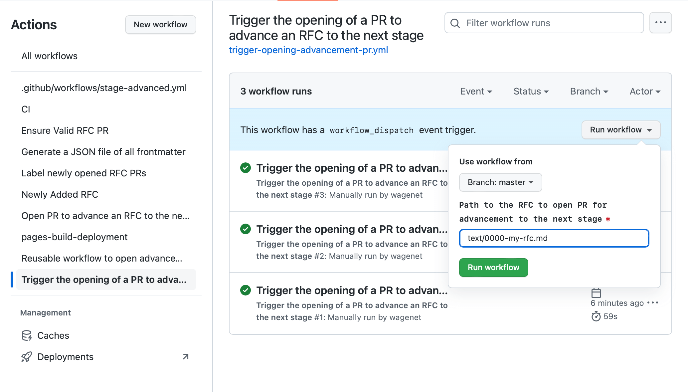

# emberjs/rfcs automation

## Workflows

### newly-added-rfc.yml

This workflow runs on pull requests. The jobs gate on the first job which determines
if the pull request adds a new RFC.

This has various checks to ensure new the RFC has correct metadata, filename, etc.

This should be tested when updating actions/find-added-or-modified-rfcs or any of
the actions used within that action. See [testing](#testing).

#### Testing Steps

- [ ] Adding a new RFC. A new pull request should be opened with a new RFC, the
  first job should correctly determine that an RFC has been added and the other
  jobs should run.
- [ ] Modifying an RFC. A new pull request that modifies an existing RFC, the
  first job should correctly determine that an RFC has not been added and the other
  jobs should not run.

### ci.yml

This workflow runs on all pull requests and pushes to the primary branch. It
lints the frontmatter of all RFCs in the repository.

### label-opened-new-rfc-prs.yml

This workflow runs on pull requests. The jobs gate on the first job which determines
whether the pull request adds a new RFC. If it does, it labels the pull request with
'S-Proposed' as it is a newly proposed RFC.

This should be tested when updating actions/find-added-or-modified-rfcs or any of
the actions used within that action. See [testing](#testing).

#### Testing Steps

- [ ] Adding a new RFC. A new pull request should be opened with a new RFC, the
  first job should correctly determine that an RFC has been added and the other
  jobs should run. The label `S-Proposed` should be added.
- [ ] Modifying an RFC. A new pull request that modifies an existing RFC, the
  first job should correctly determine that an RFC has not been added and the other
  jobs should not run. No label should be added.

### advance-rfc.yml

This workflow runs on pushes to the primary branch. The jobs gate on the first job
which determines if the push added an RFC or modified the stage of a previously-merged
RFC.

Due to constraints in determining RFCs that have been modified, this workflow will
fail if the push modifies more than one RFC. If the push didn't modify the stage
of any of the modified RFCs, this can be completely okay.

If an RFC stage was modified, this triggers the open-advancement-pr.yml workflow.

This should be tested when updating actions/find-added-or-modified-rfcs or any of
the actions used within that action. See [testing](#testing).

#### Testing Steps

- [ ] Adding a new RFC. Merging a pull request that adds an RFC should open a
  pull request to advance to the next stage using the correct template.
- [ ] Updating an RFC stage. Merging a pull request that modifies an existing RFC's
  stage to something other than the last stage should open a pull request to
  advance to the next stage using the correct template.
- [ ] Updating an RFC stage to the last stage. Merging a pull request that modifies
  an existing RFC's stage to the final stage should NOT open a pull request.
- [ ] Modifying an RFC in any way that is not updating the stage. Merging a pull
  request that does this should NOT open a pull request.

### trigger-opening-advancement-pr.yml

This workflow runs on workflow_dispatch and can be triggered from the GitHub UI.
It takes a path to an RFC and will open a PR to advance it to the next stage, if
applicable.

RFCs that already existed before the implementation of
[Staged RFCs](https://github.com/emberjs/rfcs/blob/master/text/0617-rfc-stages.md)
did not get advancement PRs to their next stage. To create an advancement PR you
can manually run the workflow from the Github UI.

#### Testing Steps

- [ ] In the UI, on this workflow, trigger with a path of an existing RFC. A pull
  request should be opened to advance the RFC to the next stage.
- [ ] In the UI, on this workflow, trigger with a path of an existing RFC at the
  final stage. A pull request should NOT be opened.

### open-advancement-pr.yml

This workflow is used by the advance-rfc.yml workflow to open a pull request to
advance to the next stage. It is also used by the trigger-opening-advancement-pr.yml
workflow.

This also generates an artifact named `advancement-prs` with files named `advance-rfc-XYX.json`.
There should be at most one file per RFC. The file contains the latest PR to
advance that RFC, along with other metadata.

## generate-rfc-frontmatter-json.yml

This workflow runs on pushes to the primary branch. It generates a JSON file with
all RFC frontmatter and is uploaded to an artifact named `rfc-data`.

## Actions

### find-added-or-modified-rfcs

Gathers info about RFCs that have been added or modified in a pull request or push
(depending on inputs passed).

### setup-rfcs-tooling

Reusable action to checkout the rfcs-tooling repo and set it up for use.

## PULL_REQUEST_TEMPLATE

Directory of templates for use in opening stage advancement pull requests.

## Testing
[Testing]: #testing

Testing is primarily done by copying these actions and workflows to a test
repository and running the workflows
(see [kategengler/playground-ghs](https://github.com/kategengler/playground-ghas)).
