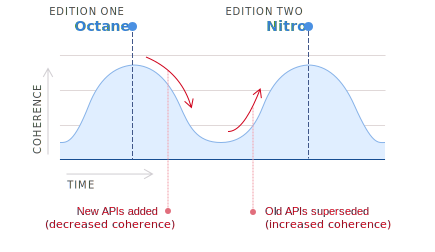

- Start Date: 2018-09-04
- RFC PR:
- Ember Issue:

# Editions

## Summary

Introduce a new type of Ember release, called an _edition_. Periodically, we will declare a new edition of Ember that bundles up accumulated incremental improvements into a cohesive package.

Editions give us an opportunity to bring our documentation and marketing up-to-date to reflect the improvements we’ve made since the previous edition. They are also the time to synchronize Ember and the wider ecosystem, including updating default settings, blueprints, addons, and more.

Editions also help ensure that Ember users are getting a cohesive, polished experience. The right time to declare a new edition is when:

- A significant, coherent set of new features and APIs have all landed in the stable channel.
- Error messages and the developer ergonomics of those new features have been fully polished.
- Tooling (the Ember Inspector, blueprints, codemods, etc.) has been updated to work with these new features.
- API documentation, guides, tutorials, and example code has been updated to incorporate the new features.

## Motivation

Ember's release process is optimized for stability. Every six weeks, we release a new version of Ember. Following [Semantic Versioning (SemVer)][sem-ver], because the new release does not make any incompatible API changes, we increment the minor version (e.g. we go from 3.1 to 3.2).

[sem-ver]: https://semver.org/

Every year or so, we release a new major version (e.g. we go from 2.18 to 3.0), which allows us to make breaking API changes. Ember follows even stricter rules than required by SemVer, though, and new major versions don't add new features; instead, they only _remove_ deprecated APIs. In other words, new features land incrementally in minor versions and don't require apps to deal with breaking API changes to take advantage of them.

For existing Ember users, this release process is easier to keep up with than splashy, big-bang releases that mix breaking changes and new features together. However, the steady stream of small changes comes with some downsides:

- For Ember users, it’s hard to keep track of evolving best practices, and understand how new features are supposed to work together.
- For non-Ember users, it’s not obvious what has changed and whether Ember is worth another look.
- For Ember contributors, it’s not clear when to update documentation and marketing, because there are always more features in the pipeline.

This RFC proposes a new release concept called “editions”, which provides a lens through which to view these accumulated changes. It also marks an opportunity to synchronize the wider ecosystem with the latest changes to Ember, including updates to defaults, documentation, addons, and more.

## Detailed design

### Edition Names
Each edition should be assigned a new name to help distinguish it from other editions. Names give us an opportunity to create fun, memorable nicknames that communicate the benefits of a new set of improvements in Ember. A new name also clearly communicates to developers outside the Ember community that significant changes have occurred and that it is a good time to re-evaluate Ember.

Editions should be referred to by prefixing their name with "Ember." For example, if we declared an edition named "Octane," we would refer to it in documentation and marketing material as "Ember Octane."

In cases where both the edition and version number are needed, the version number should precede the edition name, e.g. "Ember 3.12 Octane". Using the edition name alone is preferred unless the version number is relevant to the context.

### Editions & Versions
An edition is **not a new version of Ember** and editions do not affect the current system of six-week releases and stable, beta, canary and LTS channels. 

We will propose a new edition whenever a set of related new features and APIs are ready to be used together. Because Ember incrementally lands new features, by the time a new edition is declared, all of the features needed to support it should already have been included in a stable release.

You can think of an edition as a range of Ember versions. When a new edition is declared, that edition covers the current stable version of Ember as well as all subsequent versions, until it is replaced by a new edition.

As an example, imagine we declare a new edition, named Octane, and Ember 3.8.0 is the current stable release. We would say that the Octane edition starts with the next stable release, Ember 3.9.0. When we release the subsequent stable version, Ember 3.10.0, it becomes the latest "Octane edition" release. This would continue through 3.11, 3.12, and so on: each new version is considered to be part of the most recent edition.

If we declare a new edition, called Nitro, the next stable version to be released (3.13, in this example) would be the first version to be considered part of the Nitro edition.

Editions are decoupled from version numbers. That means that an edition _may_ cross major version boundaries. For example, if Ember 3.13 becomes the first Nitro edition release, and we subsequently release Ember 4.0 (without declaring a new edition), Ember 4.0 would still be considered part of Nitro.

Note that this doesn't mean that editions _will_ cross major version boundaries. The two concepts are just fundamentally separable, so we have the flexibility to pair editions with new major versions, or not, as circumstances require.

Editions are not about communicating API changes, like versions. They're about clearly communicating when a set of new APIs that unlock a new _programming model_ have landed.

### What is "The Programming Model"?
Applied to Ember, the phrase "programming model" refers to the idiomatic set of abstractions an Ember developer uses to build web applications. These abstractions (and the mental models that go with them) are designed to complement each other. When combined as intended, they should yield code that is fast, consistent, and maintainable.

Concretely, “Ember’s programming model” encompasses how components, templates, helpers, services, controllers, actions, etc. behave and interact, and how they should be used in combination to solve common problems.

As we improve our collective understanding of web application architecture, we sometimes need to change the programming model. Usually these are small tweaks, but occasionally even the most foundational abstractions need to change. Perhaps the best example of this is the shift from two-way bindings in Ember 1.x to the “Data Down, Actions Up” unidirectional data flow of the Ember 2.x era. This change touched almost every facet of how we build Ember apps.

Ember uses release channels and Semantic Versioning to communicate stability. As soon as a new API lands in a stable release, it’s safe to adopt, in the sense that we have committed to not making any breaking changes. 

Sometimes, though, we introduce new APIs to support a change to the programming model. Often, a new feature isn’t very useful by itself. Instead, its benefit comes from being used in conjunction with _other_ new APIs that haven’t landed yet.

Users may try to adopt this new API right away and run into painful edge cases inter-operating with the older programming model. Even worse, without the bigger picture, it’s easy for people to feel like the Ember core teams are prioritizing unimportant features, or changing things for superficial reasons.

Editions are intended to mitigate these problems by giving a clear signal to the community about programming model changes. The build up towards a new edition helps us put new features in context, ensure APIs work together cohesively, and update our documentation and marketing material.

The release of an edition signals to users that it’s a good time to start adopting new features, and they’ll have a good experience because guides and other documentation have been updated to put all of these changes into context.

### Coherence and Incoherence
One way to think about editions is their relationship to the “coherence” of Ember. Over time, we incrementally introduce new APIs that work differently than previous APIs. As we do this, we say Ember becomes less _coherent_, because not everything needed to fully adopt the new programming model has landed yet.

Over time, we land more and more related APIs while deprecating APIs that aren’t aligned with the new model. As this happens, we say the framework becomes more coherent.

Editions, then, are regular snapshots of the framework at its most coherent, when everything needed to adopt the new programming model is in place.
It may sound scary to hear that Ember is sometimes "incoherent"! But incoherence, in this context, is not bad or undesirable. It's simply a by-product of how Ember achieves stability without stagnation, by landing features incrementally.

Editions touch several parts of the Ember ecosystem, and generally tie together a set of incremental changes with a unifying theme. Most of these changes should come from existing community processes (i.e. RFCs), with editions serving as a higher level conceptual grouping.

### Proposing Editions
Each edition is proposed via a RFC, which should describe in detail important changes to the programming model, and how to communicate those changes to Ember users. An edition RFC should also include the proposed edition name, as well as any changes in how we talk about and market Ember.

### Features
Editions mark an opportunity to focus on shipping a set of thematically related feature work. For example, the first edition, Ember Octane, focuses on “performance and productivity”. It includes a few larger features as well as several smaller ones, all focused on delivering that theme.

The features that make up an edition should be accompanied by their own RFC, and should land in Ember as soon as they are ready via the feature flag system. Because we don't make breaking API changes outside of major new versions, landing new, edition-focused features should have no negative impact on existing users, documentation, blueprints, etc.

### Documentation
Documentation is often a developer’s first encounter with a framework, and editions offer a chance to revisit that experience with fresh eyes in light of that edition’s theme and programming model. The guides, tutorials, and related documentation should be updated where needed to address the themes of the edition, and to ensure that all new APIs and features are fully incorporated.

### Blueprints & Defaults
Editions offer an opportunity to reassess the defaults of the Ember ecosystem. For example, it’s a good time reassess the set of addons included by default in the Ember CLI application blueprint, or to change the defaults of [optional features][optional-features].

[optional-features]: https://guides.emberjs.com/release/configuring-ember/optional-features/

To facilitate early testing and feedback, we will create a new, experimental Ember CLI blueprint for each edition. As new features land behind flags in Ember, this blueprint will be updated to make sure that defaults and generators are updated to reflect the latest best practices. Once the final feature set of an edition is determined and the edition is declared, we will update Ember CLI to use the new edition blueprint as the default when generating a new application.

### Addons
A core concept of editions is that they offer a chance to refocus the community as a whole around a set of shared goals. That includes the rich addon ecosystem that Ember offers. Addon authors are encouraged to consider the goals of upcoming editions, and update their addons, where appropriate, to align with those goals.

## What Editions are Not
It’s important to note that editions are not:

- **SemVer major releases**. Ember uses SemVer for it’s versioning strategy, and major releases are usually just removing features deprecated in previous minor versions. Editions allow us to decouple the technical details of SemVer compliance from the overall marketing and developer experience efforts
- **A different version of Ember**. There is only one edition of Ember active at any one time. We expect existing apps to "update" to the new edition right away, because it's no different than the normal Ember upgrade process.

## How we teach this

Editions are, in large part, a teaching tool. They serve as a rallying point for updates to the documentation and overall developer experience.

To new Ember users, they may not see many references to an edition by name during the learning process, but the documentation they consume, the features they use, the marketing they see, etc., will all be focused through the lens of the current Ember edition.

For existing users, editions become a way to mark the larger progress of Ember, especially for those users that don’t follow the minor releases closely.

For contributors, addon authors, and core team / subteam members, editions are a rallying point to focus a consolidate group effort around, and a tool to help ensure a cohesive developer experience.

## Drawbacks

Editions introduces more conceptual overhead to understanding Ember - now, in addition to individual releases & release channels, there’s a third vehicle for understanding Ember milestones, which does not necessarily correlate to major semver versions as some developers might expect.

## Alternatives

- Don’t do editions at all
- Editions are purely marketing focused, i.e. the now withdrawn Marketing Releases RFC

## Unresolved questions

- What to call these? “Editions” is a good candidate, but might introduce confusion vs. releases (as evidenced by the comment thread on the 2018 Roadmap RFC). “Epochs” was also proposed as it better captures the duration aspect (“edition” sounds like a moment in time, whereas this concept spans multiple releases), but is confusing for most people to pronounce and might present difficulties for non-native English speakers. Perhaps there’s a better word to adopt for this concept?

## Prior Art

Much of the edition concept outlined in this RFC borrows heavily from the Rust language community's concept of editions (previously called epochs). For more background, check out the [RFC itself](https://github.com/rust-lang/rfcs/blob/master/text/2052-epochs.md) as well as [the discussion thread](https://internals.rust-lang.org/t/evolving-rust-through-epochs/5475)
