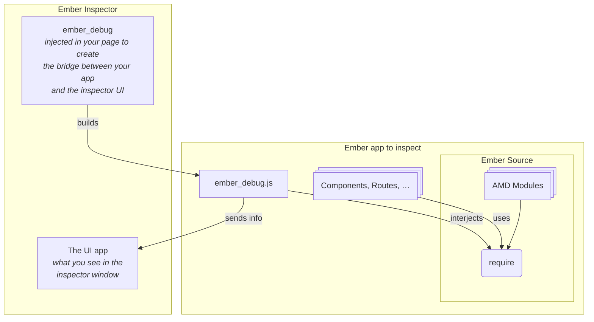

<!--- 
Directions for above: 

stage: Leave as is
start-date: Fill in with today's date, 2032-12-01T00:00:00.000Z
release-date: Leave as is
release-versions: Leave as is
teams: Include only the [team(s)](README.md#relevant-teams) for which this RFC applies
prs:
  accepted: Fill this in with the URL for the Proposal RFC PR
project-link: Leave as is
suite: Leave as is
-->

<!-- Replace "RFC title" with the title of your RFC -->

# Inspector API

## Summary

Define how Ember should should expose state to external debugging tools like the Ember Inspector in a way that's compabtible with the wider ecosystem.

## Motivation

The Ember Inspector is a browser extension that extends the capacity of regular debuggers for Ember specifically. It allows developers to inspect their Ember apps and view information like the version of Ember and Ember Data running, the components render tree, the data loaded on the page, the state of the different Ember object instances like services, controllers, routes and more. It's a practical and popular extension, widely used in the Ember community. Unfortunately, it’s incompatible with modern Ember apps building with Vite. We also need to account for a future where multiple apps can coexist in a single context.

To achieve this, we need to rethink how `ember.js` exposes objects, structure, and application state in a new way without breaking compatiblity.

## Detailed design

### Current architecture

The purpose of the Inspector is to display information about the Ember app running on the page. To do so, it needs to retrieve this information somehow. The architecture involves both the Inspector itself and the inspected Ember app that depends on a version of ember-source:



The Inspector is composed of two main pieces:

1. The UI is an Ember app that displays the content of the Inspector window when it runs.
2. The folder _ember_debug_ is built into a script _ember_debug.js_. The Inspector injects this script into the page to connect to the inspected Ember app.

The incompatibility with Vite apps lies in how _ember_debug.js_ interacts with `ember-source`. For a long time, `ember-cli` expressed all the modules using AMD (Asynchronous Module Definition) and `requirejs` `define()` statements. Addons and applications could rely on AMD loading to use these modules. This is what the Inspector does. This means there is no support for modules in the the Inspector. It was designed to work with the AMD approach and breaks when we move to ESM. We do have `@embroider/legacy-inspector-support` to bridge the gap, but its a temporary measure that was never meant as a permanent solution.

#### Why we need a new approach

One important underlying problem with the current architecture is that most of the logic in _ember_debug.js_ is the consequence of Ember not providing an API for tools like the Inspector. There's no Ember function that returns _the description of the application_ as structured data, so the _ember_debug.js_ script creates its own description using the AMD modules available, with downsides:

- Since Ember doesn't expose a public API, Ember doesn't have any legitimate responsibility about what modules are available or not. If Ember code is reorganized and a module used by the Inspector has its path changed, there's no signal to tell the Inspector will break: it's the Inspector's problem to be presented with a fait accompli and align with the latest released version of Ember.

- The Inspector's code contains complex conditional pieces to support different Ember versions as the framework internals evolve. What piece of code supports what version is not explicitly indicated and the code is hard to maintain overall. Also, it happens that latest changes in the framework are not reflected, and tests are not always able to catch the issues (e.g. in Ember Inspector 4.13.1, most services are marked as computed properties because the execution path that marks services is no longer taken).

- New concepts such as renderComponent which might not require an app at all are currently not covered by the Inspector, making it impossible to to debug or interact with them in a meaningful way.

- There is no clear way to extend the Inspector with custom functionality while we also face a lot of entanglement. E.g. Ember Data evolved into Warpdrive. Inspector has no good answer to this.

- We want to integrate with the wider ecosystem, allowing us to work across framework boundaries.

## Updated architecture

The new approach features three main aspects. 

1. A new and consistent global registry object living on `globalThis`
2. A new async inspection module which is shipped with every app by default
3. A consistent API for registering inspectable apps

While some of these do exist in one form or another in the old setup, new names were chosen to separate this new API from the previous setup. The existing `@embroider/legacy-inspector-support` could be used to provide a compat integration. 

### Global debug registry

Replaces: `globalThis.emberInspectorApps`, `globalThis.emberInspector` (and potentially more)

```js
globalThis.__EMBER_DEBUG__ = {
    entries: [], // stores references to inspectable applications
    clients: [], // stores references to attached Inspectors
};
```

Each entry in the list is an object which provides meta data and a way for a debug client to load the modules provided by Ember. Here is potential implementation stub:

```js
class DebugEntry {
    static PACKAGE = 'ember-source';
    static VERSION = '7.0.0';
    
    constructor(reference, importCallback = () => import('@ember/debug/inspect')) {
        this.id = `entry-${globalThis.__EMBER_DEBUG__.entries.length}`;
        this.reference = reference;
        this.importCallback = importCallback;
        
        globalThis.__EMBER_DEBUG__.entries.push(this);
        globalThis.dispatchEvent?.(new CustomEvent('EMBER_DEBUG.boot', { detail: this.id }));
    }
    
    async modules() {
        this._promise ??= this.importCallback();
        return this._promise;
    }
}
```

Each client object is defined in a similar way. This is created by code injected into the page by the bookmarklet / web extension. It encapsulates the data transport and acts as intermediary. Instanciating a new client starts fetching the debug modules for each entry.

```js
class DebugClient {
    static PACKAGE = '@ember-inspector/bookmarklet';
    static VERSION = '5.0.0';
    
    constructor(reference) {
        this.id = `client-${globalThis.__EMBER_DEBUG__.clients.length}`;
        
        globalThis.__EMBER_DEBUG__.clients.push(this);
        globalThis.addEventListener('EMBER_DEBUG.boot', this.connect);
    }
    
    async connect() {
        globalThis.__EMBER_DEBUG__.entries.forEach(entry => etry.modules());
    }
}
```

### `@ember/debug/inspect`

This new module encapsulates methods necessary for an Inspector to inspect all aspects of an app without having to inject or load Ember internals. The methods return both machine and human readable information. This is most important change to the current Inspector workflow: All necessary information is provided by the app and Ember source. Future Inspectors are mostly user interfaces that display the provided data prepared by an app.

The methods become part of the module hierarchy within the page, allowing the DebugClient instances injected into the page to interact with objects on that page. 

#### `inspectProperty()`

Get information about a property of an object including user-readable labels.

For this to work, we will have to amend parts of the Ember codebase to attach markers to the descriptors used for things like `@tracked`. These markers can be short human readable strings, which makes them light weight in regards to the build size.

```js
function inspectProperty(object, name) {
    const prototype = Object.getPrototypeOf(object);
    const descriptor = Object.getOwnPropertyDescriptor(prototype, name);
    
    if (descriptor.get.__descriptor__ === "decorator:tracked") {
        return '@tracked'
    }
    // ...
    
    return (typeof descriptor.value);
}

class Foo {
    @tracked foo;
}

inspectProperty(new Foo(), 'foo') === '@tracked';
```

#### `inspectIdentity()`

List relevant information for a single object. This should be the place to deal with specialized behavior for things like mixins.

{TBD}

```js
function inspectIdentity(object) {
    // based on existing similar code within ember_debug moved into ember-source
}

inspectIdentity()
```

#### `inspectAncestors()`

Provides a list of structured objects describing the lineage of an object. 

{TBD}


## How we teach this

The implementation is intimate API. It will be documented within the code. It could be made public at a later stage.

## Drawbacks

Replacing the existing system does require extensive refactoring.

## Alternatives

### Keep the current approach

Keeping the current adapter in place is not viable as the current implementation is tied to details in the Ember codebase that will become obsolete at some point.

For instance Mixins are currently being deprecated (see [#1111 to #1117](https://github.com/emberjs/rfcs/pulls?q=is%3Apr+author%3Awagenet+created%3A%3E2025-06-01+)). Removing the mixins is a breaking change that would likely be released in Ember 7. However, the compat API above imports mixins because the Inspector currently use them. If we can't get the long-term API ready for Ember 7, then removing the mixins from the compat API and defining a macro condition to have them in 6+ would be part of [#1111 to #1117](https://github.com/emberjs/rfcs/pulls?q=is%3Apr+author%3Awagenet+created%3A%3E2025-06-01+) implementation.

### [Vite DevTools Kit](https://devtools.vite.dev/kit/)

The vision of DevTools Kit is to provide a unified foundation for building custom developer tools that integrate seamlessly with Vite and frameworks built on top of it. It's still in an experimental stage. It only covers parts of what we need. 


## Unresolved questions

- How do we communicate available application which is not tied to the current render tree?
