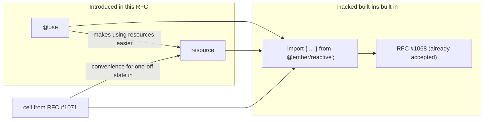

# Add Resources as a low-level Reactive Primitive

## Summary

Resources are a reactive primitive that enables managing stateful processes with cleanup logic as reactive values. They unify concepts like custom helpers, modifiers, components, and services by providing a consistent pattern for expressing values that have lifecycles and may require cleanup when their owner is destroyed.


> [!NOTE]
> This RFC has some dependencies / relation with other RFCs



## Motivation

Ember's current Octane programming model provides excellent primitives for reactive state (`@tracked`), declarative rendering (templates), and component lifecycle, but it lacks a unified primitive for managing stateful processes that need cleanup. This fragmentation has created a complex ecosystem where different concepts each require their own approach to lifecycle management, leading to scattered patterns and cognitive overhead.

### Lifecycle Management

Today, Ember developers must be aware of multiple systems for managing setup and teardown:

<details><summary>Components</summary>

have lifecycle hook: `willDestroy()`:
```js
export default class TimerComponent extends Component {
  @tracked time = new Date();
  timer = null;

  constructor() {
    super(...arguments);
    this.timer = setInterval(() => this.time = new Date(), 1000);
  }

  willDestroy() {
    if (this.timer) clearInterval(this.timer); // Easy to forget!
  }
}
```

</details>

<details><summary>Modifiers</summary>

two different approaches from `ember-modifier` for class-based and function based modifiers.

class-based:
```js
import Modifier from 'ember-modifier';

class foo extends Modifier {
  constructor() {
    super(...arguments);
    registerDestructor(this, cleanup); 
  }
}
```

function-based:
```js
import { modifier } from 'ember-modifier';

const foo = modifier((element) => {

  return () => {
    /* this is the destructor */
  }
})
```

the function-based modifier here is _almost_ like a resource.

There is a another modifier implementation availabel from a community library, [reactiveweb](https://github.com/universal-ember/reactiveweb), 
which looks like this:

```js
import { resource } from 'ember-resources';
import { modifier } from 'reactiveweb/resource/modifier';

const wiggle = modifier((element, arg1, arg2, namedArgs) => {
    return resource(({ on }) => {
        let animation = element.animate(/* ... */);

        on.cleanup(() => animation.cancel());
    });
});
```

The downside to this approach is, of course, 2 imports, and it doesn't solve the problem of function based modifiers not supporting generics.

If resources were formally supported by the framework, the wrapper function would not be needed, and we could gain generics support (more on that later)

</details>

<details><summary>Helpers</summary>

```js
export default class DataHelper extends Helper {
  willDestroy() {
    this.abortController?.abort(); // Another lifecycle hook
  }
}

// Function helpers have no cleanup mechanism at all
export default helper(() => {
  // No way to clean up side effects!
});
```

</details>


<details><summary>Services</summary>

Services have `willDestroy`, but because they are only able to be classes, `registerDestructor` may also be used. This gives us two ways to do things, which can add to decision fatigue like all the other multi-option scenarios above.

```js
export default class WebSocketService extends Service {
  constructor(...args) {
    super(...args);

    registerDestructor(this, () => this.otherSocket?.close());
  }

  willDestroy() {
    this.socket?.close(); 
  }
}
```

</details>

### The Destructor API

The `registerDestructor()` API ([RFC #580](https://github.com/emberjs/rfcs/pull/580)) improved destruction in general by providing a unified way to register cleanup functions:

```js
import { registerDestructor } from '@ember/destroyable'; // Additional import required

class MyComponent extends Component {
  constructor() {
    // Setup happens here
    let timeoutId = setTimeout(() => console.log('hello'), 1000);
    
    // Cleanup requires manual registration
    registerDestructor(this, () => clearTimeout(timeoutId));
  }
}
```

While this remains useful as a low-level tool, and essential for adding destruction in custom classes today, it's not the most ergonomic for the common use case:

- `registerDestructor()` requires an additional import, adding friction to every file that needs cleanup logic.
- Understanding when and how to use `associateDestroyableChild()` (see the [link RFC #1067](https://github.com/emberjs/rfcs/pull/1067))
- Different patterns for different types of objects / classes / lifecycles

### Outside of cleanup

There isn't a cohesive / consistent way to encapsulate state with cleanup. This leads to:
- Logic scattered across multiple lifecycle hooks
- Difficulty extracting and reusing patterns
- Not knowing how to properly associate children with `associateDestroyableChild()`
- Memory leaks from forgotten cleanup

### A unified approach to lifecycle management in one package (function)

Resources solve these problems by providing a **single, consistent container for setup and teardown logic** that works across all contexts. Instead of learning multiple[^14-competing-standards] lifecycle patterns, developers work with one unified primitive:

```js
const Clock = resource(({ on }) => {
  const time = cell(new Date());
  
  // Setup and cleanup co-located
  const timer = setInterval(() => time.set(new Date()), 1000);
  on.cleanup(() => clearInterval(timer));
  
  return time;
});
```

[^14-competing-standards]: This is "yet another competing standard", but over time we can unify on this concept -- but the plan for doing so is out of scope for this RFC. This RFC is focused on unifying low-level concepts, and end-users of the framework may choose to continue not using resources directly. See also [XKCD 927](https://xkcd.com/927/).

**Resources unify all existing concepts** by providing:

1. **A Standard Container**: One primitive that works for components, helpers, modifiers, services, and custom logic (more on this later)
2. **Co-located Setup/Teardown**: No more spreading logic across constructors, lifecycle hooks, and destructor registrations  
3. **Hierarchical Cleanup**: Automatic owership linkage and disposal and child management without manual `associateDestroyableChild()` + `registerDestructor` (also with a way to manually link, similar to [RFC #1067](https://github.com/emberjs/rfcs/pull/1067))

Resources don't replace existing patterns. Resources unify those patterns under a single abstraction that eliminates the need to choose between different lifecycle approaches or remember multiple APIs.

### Examples

To illustrate how resources unify existing concepts, here are small examples showing how traditional Ember constructs could be reimagined using resources. Note that **classes are user-defined** while **resources are framework-internal** - this separation allows resources to wrap and manage existing class-based patterns.

<details><summary>Services</summary>

Using existing services, keeping the same behavior:

```js
// User-defined Service class (unchanged)
class SessionService extends Service {
  @tracked currentUser = null;
  
  willDestroy() {
    this.logout(); // Manual cleanup
  }
  
  login(credentials) {
    return authenticate(credentials).then(user => this.currentUser = user);
  }
  
  logout() {
    this.currentUser = null;
  }
}

// Framework-internal resource wrapper
const SessionServiceResource = resource(({ on, owner }) => {
  const service = new SessionService(owner);
  
  // Framework manages lifecycle via resource pattern
  on.cleanup(() => service.willDestroy());
  
  return service;
});
```

A hypothetical new way to use services without the string registry (exact details and implementation is outside the scope of this RFC)

```js
class Storage {
  foo = 2;
}

// Usage
class MyComponent extends Component {
  storage = service(this, Storage);

  get data() {
    // no proxy
    return this.storage.current.foo;
    // with proxy
    return this.storage.foo;
  }
}

// where service is
function service(context, klass) {
  const manager = resource(({ on, link, owner }) => {
    let instance = new klass(owner);
    // sets up destroyable linking to the owner
    // without passing owner, the instance would be linked to the lifetime of the context (the component in this example)
    link(instance, owner);
    // not needed due to `link`. Any registerDestructor setup in the passed klass will just work
    on.cleanup(() => /* call wilLDestroy? */)

    return instance;
  });

  return use(context, manager);
}
```
however, without using a proxy to kick off all the instantiation of the service (since we still want service instantiation to be lazy), it may be better to support something like this:


```js
class MyComponent extends Component {
  // the use decorator turns the property in to a cached getter that is lazily evaluated upon access -- the only requirement
  // is that the right-hand side has a registered helper manager
  // 
  // in addition, @use also has access to the instance / this. So passing to `service` is not needed. 
  //
  // NOTE: TypeScript still does not allow decorators (even the decorators that are landing in browsers) to alter the type on the right-hand side of the equals
  @use accessor storage = service(Storage);

  get data() {
    return this.storage.foo;
  }
}
```

See also: [RFC: #502 | Explicit Service Injection](https://github.com/emberjs/rfcs/pull/502)

</details>

<details><summary>Components, Routes, Services, (anything with willDestroy)</summary>

```gjs
class Demo extends Component {
  <template>hello</template>
}

// Framework-internal resource wrapper
function InternalInvoker(Component, argsProxy) {
  return resource(({ on, owner, link }) => {
    const instance = new Component(owner, argsProxy);

    link(instance);
    
    if ('willDestroy' in instance) {
      on.cleanup(() => instance.willDestroy());
    }
    
    return instance;
  });
}
```

</details>


<details><summary>Helpers</summary>

Resources _are_ helpers, so while this is not needed exactly (as we have the helper manager), we could look at helpers like this:

```js
// User-defined Helper class (unchanged)
class FormatDateHelper extends Helper {
  @service intl;
  
  compute([date]) {
    return this.intl.formatDate(date);
  }
}
```

an equiv resource-based helper would look like this:
```js
function formatDate(date) {
  return resource(({ on, owner }) => {
    let intl = owner.lookup('service:intl');

    return () => 
      intl.formatdate(date);
  });
}
```

</details>

<details><summary>DOM Rendering</summary>


Instead of the VM, we could use resources to manage the insertion and removal of known dynamic nodes in the DOM:

```gjs
// Let's pretend we are rendering a simple counter:
const count = cell(0);
const increment = () => count.current++;

<template>
    {{count.current}}
    <button onclick={{increment}}>++</button>
    {{#if (isEven count.current)}}EVEN!{{/if}}
</template>

// render could be responsible for directly managing the create/destroy 
// / invocation/cleanup
// each node in this array will be wrapped in a resource if cleanup is possibly needed, such as the case of if blocks    
export default component([
    () => count.current,
    [createElement, 'button' { 
        // the arrow function is for the chance that the value might by reactive
        onclick: () => increment,
    }, ["++"]],
    [condition, () => isEven(count.current), ['EVEN!']],
]);

// a hypothetical component()
function component(instructions) {
    return resource(({ on, use }) => {
        let fragment = document.createDocumentFragment();

        on.cleanup() => fragment.remove();

        // iterate over instructions,
        // if any instructions are resoures, they'll be `use`d.
        // each `use`d thing has its own cache / begin/end tracking frame pair.

        // caller of component() will append fragment
        return fragment;
    })
}

// a hypothetical if evaluator
function condition(evaluate, whenTrue, whenFalse) {
    return resource(({ on, use }) => {
        let fragment = document.createDocumentFragment();

        on.cleanup() => fragment.remove();

        return () => {
            let contents = evalute() ? whenTrue() : whenFalse();
            fragment.append(contents);
            return fragment;
        }
    });
}
```

> [!NOTE] these examples are are hypothetical and non-functional today. They are strictly for illustration.

</details>


This unification hopefully will lead to simplification of the implmentation of all our concepts. 

## Detailed design

### Overview

A **resource** is a reactive function that represents a value with lifecycle and optional cleanup logic. Resources are created using the `resource()` function and automatically manage their lifecycle through Ember's existing destroyable system, though the exact implementation could change at any time (to be simpler) as we work at simplifying a bunch of internals.

```gjs
import { cell, resource } from '@ember/reactive';

const Clock = resource(({ on }) => {
  const time = cell(new Date());
  
  const timer = setInterval(() => {
    time.set(new Date());
  }, 1000);

  on.cleanup(() => clearInterval(timer));

  return time;
});

<tmelptae>
  {{Clock}}
</template>
```

<details><summary>Ignoring the Value, using for the lifecycle management -- synchronizing external state</summary>

```gjs
import { cell, resource } from '@ember/reactive';

function addScript(url) {
  return resource(({ on }) => {
    let el = document.createElement('script');

    on.cleanup(() => el.remove());

    Object.assign(el, { src: url });
  });
}

<template>
  {{#if @useBootStrap}}
    {{addScript "https://some.cdn.com/bootstrap/v5/bootstrap.js"}}
  {{/if}}
</template>
```

</details>

### Core API

The `resource()` function takes a single argument: a function that receives a ResourceAPI object and returns a reactive value.

```ts
interface ResourceAPI {
  on: {
    cleanup: (destructor: () => void) => void;
  };
  use: <T>(resource: T) => ReactiveValue<T>;
  link: (obj: unknown, parent?: obj: unknown) => void;
  owner: Owner;
}

type ResourceFunction<T> = (api: ResourceAPI) => T;

function resource<T>(fn: ResourceFunction<T>): Resource<T>
```

#### `on.cleanup`


#### `use`

#### `link`


#### `owner`


### Resource Creation and Usage

Resources can be used in several ways:

**1. In Templates (as helpers)**
```js
import { cell, resource } from '@ember/reactive';

const Clock = resource(({ on }) => {
  const time = cell(new Date());
  const timer = setInterval(() => time.set(new Date()), 1000);
  on.cleanup(() => clearInterval(timer));
  return time;
});

// In template
<template>Current time: {{Clock}}</template>
```

**2. With the `@use` decorator**
```js
import { use } from '@ember/reactive';

export default class MyComponent extends Component {
  @use clock = Clock;
  
  <template>Time: {{this.clock}}</template>
}
```

The `@use` decorator is an ergonomic shorthand that automatically invokes any value with a registered helper manager. This means that `Clock` (which has a resource helper manager) gets automatically invoked when accessed, eliminating the need to call it explicitly or access `.current`. This works for resources, but also for any other construct that has registered a helper manager via `setHelperManager` from RFC 625 and RFC 756.

**Convention: Function Wrapping for Clarity**

While `@use clock = Clock` works, assigning a value via `@use` can look unusual since no invocation is apparent. By convention, it's more appropriate to wrap resources in a function so that the invocation site clearly indicates that behavior:

```js
// Preferred: Clear that invocation/behavior is occurring
@use clock = Clock()

// Works but less clear: Looks like simple assignment
@use clock = Clock
```

This convention makes the code more readable and aligns with the expectation that decorators like `@use` are performing some active behavior rather than passive assignment.

#### Helper Manager Integration and the `@use` Decorator

The `@use` decorator builds upon Ember's existing helper manager infrastructure (RFC 625 and RFC 756) to provide automatic invocation of values with registered helper managers. When a resource is created with `resource()`, it receives a helper manager that makes it invokable in templates and enables the `@use` decorator's automatic behavior.

Here's how it works:

```js
// A resource has a helper manager registered
const Clock = resource(({ on }) => {
  // ... resource implementation
});

// The @use decorator detects the helper manager and automatically invokes it
@use clock = Clock; // Equivalent to: clock = Clock()

// Without @use, you need explicit invocation or .current access
clock = use(this, Clock); // Returns object with tracked property: clock.current
```

The `@use` decorator pattern extends beyond resources to work with any construct that has registered a helper manager. This means that future primitives that integrate with the helper manager system (like certain kinds of computed values, cached functions, or other reactive constructs) will automatically work with `@use` without any changes to the decorator itself.

**Helper Manager vs Direct Invocation:**

When using resources in templates directly (e.g., `{{Clock}}`), the helper manager handles the invocation automatically. The `@use` decorator brings this same ergonomic benefit to class properties, bridging the gap between template usage and class-based usage patterns.

**3. With the `use()` function**
```js
export default class MyComponent extends Component {
  clock = use(this, Clock);
  
  <template>Time: {{this.clock.current}}</template>
}
```

The `use()` function provides manual resource instantiation when you need more control over the lifecycle or want to avoid the automatic invocation behavior of `@use`.

**4. Manual instantiation (for library authors)**
```js
const clockBuilder = resource(() => { /* ... */ });
const owner = getOwner(this);
const clockInstance = clockBuilder.create();
clockInstance.link(owner);
const currentTime = clockInstance.current;
```

### Resource API Details

**`on.cleanup(destructor)`**

Registers a cleanup function that will be called when the resource is destroyed. This happens automatically when:
- The owning context (component, service, etc.) is destroyed
- The resource re-runs due to tracked data changes
- The resource is manually destroyed

```js
const DataLoader = resource(({ on }) => {
  const controller = new AbortController();
  const state = cell({ loading: true });

  on.cleanup(() => controller.abort());

  fetch('/api/data', { signal: controller.signal })
    .then(response => response.json())
    .then(data => state.set({ loading: false, data }))
    .catch(error => state.set({ loading: false, error }));

  return state;
});
```

**`use(resource)` - Resource Composition**

The `use()` method within a resource function allows composition of resources by consuming other resources with proper lifecycle management. This is different from the top-level `use()` function and the `@use` decorator:

```js
const Now = resource(({ on }) => {
  const time = cell(new Date());
  const timer = setInterval(() => time.set(new Date()), 1000);
  on.cleanup(() => clearInterval(timer));
  return time;
});

const FormattedTime = resource(({ use }) => {
  const time = use(Now);
  return () => time.current.toLocaleTimeString();
});
```

### Key Differences Between Usage Patterns

**Understanding `@use` as an Ergonomic Shorthand**

The `@use` decorator is fundamentally an ergonomic convenience that builds upon Ember's helper manager infrastructure. When you apply `@use` to a property, it doesn't assign the value directly—instead, like `@tracked`, it replaces the property with a getter that provides lazy evaluation and automatic invocation.

```js
export default class MyComponent extends Component {
  // This:
  @use clock = Clock;
  
  // Is equivalent to defining a getter that automatically invokes
  // any value with a registered helper manager:
  get clock() {
    // Detect helper manager and invoke automatically
    if (hasHelperManager(Clock)) {
      return invokeHelper(this, Clock);
    }
    return Clock;
  }
}
```

This getter-based approach enables several key benefits:
- **Lazy instantiation**: The resource is only created when first accessed
- **Automatic lifecycle management**: The resource is tied to the component's lifecycle
- **Transparent integration**: Works seamlessly with any construct that has a helper manager

**`@use` decorator vs resource `use()` vs top-level `use()`:**

1. **`@use` decorator** - An ergonomic shorthand that leverages Ember's helper manager system:
   - Replaces the property with a getter (like `@tracked`) for lazy access
   - Automatically invokes values with registered helper managers (RFC 625/756)
   - Works with resources, but also any construct that has a helper manager
   - Returns the "unwrapped" value directly (no `.current` needed)
   - Best for when you want the simplest possible API with automatic lifecycle management

2. **Resource `use()` method** - For resource composition within resource functions:
   - Available only within the resource function's API object
   - Manages lifecycle and cleanup of nested resources automatically
   - Returns a reactive value that can be consumed with `.current`
   - Essential for building complex resources from simpler ones
   - Enables hierarchical resource composition with proper cleanup chains

3. **Top-level `use()` function** - For manual control:
   - Requires explicit owner/context management
   - Returns a reactive value requiring `.current` access
   - Useful when you need fine-grained control over instantiation timing
   - Primarily for library authors or advanced use cases where automatic behavior isn't desired

**`owner`**

Provides access to the Ember owner for dependency injection:

```js
const UserSession = resource(({ owner }) => {
  const session = owner.lookup('service:session');
  const router = owner.lookup('service:router');
  
  return () => ({
    user: session.currentUser,
    route: router.currentRouteName
  });
});
```

### Resource Lifecycle

1. **Creation**: When a resource is first accessed, its function is invoked
2. **Reactivity**: If the resource function reads tracked data, it will re-run when that data changes
3. **Cleanup**: Before re-running or when destroyed, all registered cleanup functions are called
4. **Destruction**: When the owning context is destroyed, the resource and all its cleanup functions are invoked

### Type Definitions

```ts
interface ResourceAPI {
  on: {
    cleanup: (destructor: () => void) => void;
  };
  use: <T>(resource: T) => ReactiveValue<T>;
  owner: Owner;
}

type ResourceFunction<T> = (api: ResourceAPI) => T;

interface Resource<T> {
  create(): ResourceInstance<T>;
}

interface ResourceInstance<T> {
  current: T;
  link(context: object): void;
}

function resource<T>(fn: ResourceFunction<T>): Resource<T>;
function use<T>(context: object, resource: Resource<T>): ReactiveValue<T>;
function use<T>(resource: Resource<T>): PropertyDecorator;
```

### Relationship to the Cell Primitive

While the `cell` primitive ([RFC #1071](https://github.com/emberjs/rfcs/pull/1071)) is not strictly required for resources to function, resources are significantly more ergonomic and powerful when used together with `cell`. Resources can work with Ember's existing `@tracked` properties, but `cell` provides several advantages:

**Without `cell` (using `@tracked`):**
```js
import { resource } from '@ember/reactive';
import { tracked } from '@glimmer/tracking';

// Must create a separate class to hold tracked state
class ClockState {
  @tracked time = new Date();
}

const Clock = resource(({ on }) => {
  const state = new ClockState();
  
  const timer = setInterval(() => {
    state.time = new Date();
  }, 1000);

  on.cleanup(() => clearInterval(timer));

  return () => state.time;
});

// Usage requires property access
<template>Current time: {{Clock}}</template>
```

**With `cell` (more ergonomic):**
```js
import { cell, resource } from '@ember/reactive';

const Clock = resource(({ on }) => {
  const time = cell(new Date());
  
  const timer = setInterval(() => {
    time.set(new Date());
  }, 1000);

  on.cleanup(() => clearInterval(timer));

  return time; // Consumer gets the cell directly
});

// Usage is more direct
<template>Current time: {{Clock}}</template>
```

**Key advantages of using `cell` with resources:**

1. **Simpler State Management**: No need to create wrapper classes for tracked properties
2. **Direct Value Returns**: Resources can return cells directly rather than objects with tracked properties
3. **Cleaner APIs**: Consumers get more intuitive interfaces without property access
4. **Better Composition**: Resources that return cells compose more naturally with other resources

While resources provide significant value on their own by solving lifecycle management and cleanup, the combination with `cell` creates a more complete and developer-friendly reactive primitive system.

### Integration with Existing Systems

**Helper Manager Integration**

Resources integrate with Ember's existing helper manager system. The `resource()` function returns a value that can be used directly in templates through the helper invocation syntax.

**Destroyable Integration**

Resources automatically integrate with Ember's destroyable system via `associateDestroyableChild()`, ensuring proper cleanup when parent contexts are destroyed.

**Ownership Integration**

Resources receive the owner from their parent context, enabling dependency injection and integration with existing Ember services and systems.

**Relationship to the Cell Primitive**

While this RFC does not strictly depend on the `cell` primitive from RFC 1071, resources become significantly more ergonomic when used together with `cell`. Resources can work with any reactive primitive, including existing `@tracked` properties and `@cached` getters, but `cell` provides several advantages:

1. **Function-based APIs**: Resources are function-based, and `cell` provides a function-based reactive primitive that composes naturally
2. **Encapsulated state**: Unlike `@tracked` which requires classes, `cell` allows creating reactive state without class overhead
3. **Immediate updates**: `cell` provides both getter and setter APIs (`cell.current` and `cell.set()`) that work well in resource contexts

Without `cell`, developers would need to either:
- Use classes with `@tracked` properties (heavier abstraction)
- Manually manage reactivity with lower-level tracking APIs
- Return functions from resources that close over mutable state

Example comparison:

```js
// With cell (ergonomic)
const Clock = resource(({ on }) => {
  const time = cell(new Date());
  const timer = setInterval(() => time.set(new Date()), 1000);
  on.cleanup(() => clearInterval(timer));
  return time;
});

// Without cell (more verbose)
const Clock = resource(({ on }) => {
  let currentTime = new Date();
  const timer = setInterval(() => {
    currentTime = new Date();
    // Manual invalidation needed
  }, 1000);
  on.cleanup(() => clearInterval(timer));
  
  return () => currentTime; // Must return function for reactivity
});
```

Therefore, while `cell` is not a hard dependency, implementing both RFCs together would provide the best developer experience.

### Advanced Reactive Concepts

Ember's resource primitive embodies several advanced reactivity concepts that position it as a modern, best-in-class reactive abstraction. Understanding these concepts helps developers leverage resources most effectively and appreciate how they fit into the broader reactive ecosystem.

#### Evaluation Models: Lazy by Default, Scheduled When Needed

Resources follow a **lazy evaluation model** by default, meaning they are only created and evaluated when their value is actually consumed. This aligns with the principle that expensive computations should only occur when their results are needed:

```js
const ExpensiveComputation = resource(({ on }) => {
  console.log('This only runs when accessed'); // Lazy evaluation
  const result = cell(performExpensiveCalculation());
  return result;
});

// Resource not created yet
@use expensiveData = ExpensiveComputation; 

// Only now is the resource created and evaluated
<template>{{this.expensiveData}}</template>
```

However, certain types of resources benefit from **scheduled evaluation**, particularly those that involve side effects or async operations:

```js
const DataFetcher = resource(({ on }) => {
  const state = cell({ loading: true });
  
  // Side effect happens immediately (scheduled evaluation)
  // to avoid waterfalls when multiple async resources are composed
  fetchData().then(data => state.set({ loading: false, data }));
  
  on.cleanup(() => {
    // Cleanup logic
  });

  return state;
});
```

This hybrid approach—lazy by default, scheduled when beneficial—provides optimal performance while avoiding common pitfalls like request waterfalls in async scenarios.

#### Reactive Ownership and Automatic Disposal

Resources implement **reactive ownership**, a pattern pioneered by fine-grained reactive systems, which enables automatic memory management without manual disposal:

```js
const ParentResource = resource(({ use, on }) => {
  // Child resources are automatically owned by parent
  const child1 = use(SomeChildResource);
  const child2 = use(AnotherChildResource);
  
  // When ParentResource is destroyed, all children are automatically cleaned up
  // This creates a disposal tree similar to component hierarchies
  
  return () => ({
    data1: child1.current,
    data2: child2.current
  });
});
```

The ownership model ensures that:
- **No Memory Leaks**: Child resources are automatically disposed when parents are destroyed
- **Hierarchical Cleanup**: Disposal propagates down through the resource tree
- **Automatic Lifecycle**: No manual `willDestroy` or cleanup management needed
- **Composable Boundaries**: Resources can create isolated ownership scopes

#### Push-Pull Reactivity and Glitch-Free Consistency

Resources participate in Ember's **push-pull reactive system**, which combines the benefits of both push-based (event-driven) and pull-based (demand-driven) reactivity:

```js
const DerivedValue = resource(({ use }) => {
  const source1 = use(SourceA);
  const source2 = use(SourceB);
  
  // This derivation is guaranteed to be glitch-free:
  // When SourceA changes, this won't re-run with stale SourceB data
  return () => source1.current + source2.current;
});
```

**Push Phase**: When tracked data changes, notifications propagate down the dependency graph, marking potentially affected resources as "dirty."

**Pull Phase**: When a value is actually consumed (in templates, effects, etc.), the system pulls fresh values up the dependency chain, ensuring all intermediate values are consistent.

This approach guarantees **glitch-free consistency**—user code never observes intermediate or inconsistent states during reactive updates.

#### Phased Execution and Ember's Rendering Lifecycle

Resources integrate seamlessly with Ember's three-phase execution model:

1. **Pure Phase**: Resource functions run and compute derived values
2. **Render Phase**: Template rendering consumes resource values
3. **Post-Render Phase**: Effects and cleanup logic execute

```js
const UIResource = resource(({ on, use }) => {
  // PURE PHASE: Calculations and data preparation
  const data = use(DataSource);
  const formattedData = () => formatForDisplay(data.current);
  
  // RENDER PHASE: Template consumes formattedData
  
  // POST-RENDER PHASE: Side effects via cleanup
  on.cleanup(() => {
    // Analytics, logging, or other side effects
    trackResourceUsage('UIResource', data.current);
  });
  
  return formattedData;
});
```

This phased approach ensures predictable execution order and enables advanced features like React's concurrent rendering patterns.

#### The Principle: "What Can Be Derived, Should Be Derived"

Resources embody the fundamental reactive principle that **state should be minimized and derived values should be maximized**. This leads to more predictable, testable, and maintainable applications:

```js
// AVOID: Manual state synchronization
const BadPattern = resource(({ on }) => {
  const firstName = cell('John');
  const lastName = cell('Doe');
  const fullName = cell(''); // Redundant state!
  
  // Manual synchronization - error prone
  on.cleanup(() => {
    // Complex logic to keep fullName in sync...
  });
  
  return { firstName, lastName, fullName };
});

// PREFER: Derived values
const GoodPattern = resource(() => {
  const firstName = cell('John');
  const lastName = cell('Doe');
  
  // Derived value - always consistent
  const fullName = () => `${firstName.current} ${lastName.current}`;
  
  return { firstName, lastName, fullName };
});
```

Resources make it natural to follow this principle by:
- **Encouraging functional composition** through the `use()` method
- **Making derivation explicit** through return values
- **Automating consistency** through reactive dependencies
- **Eliminating manual synchronization** through automatic re-evaluation

#### Async Resources and Colorless Async

For async operations, resources support **colorless async**—patterns where async and sync values can be treated uniformly without pervasive `async`/`await` coloring:

```js
const AsyncData = resource(({ on }) => {
  const state = cell({ loading: true, data: null, error: null });
  const controller = new AbortController();
  
  on.cleanup(() => controller.abort());
  
  fetchData({ signal: controller.signal })
    .then(data => state.set({ loading: false, data, error: null }))
    .catch(error => state.set({ loading: false, data: null, error }));
  
  return state;
});

// Usage is the same whether data is sync or async
const ProcessedData = resource(({ use }) => {
  const asyncData = use(AsyncData);
  
  return () => {
    const { loading, data, error } = asyncData.current;
    if (loading) return 'Loading...';
    if (error) return `Error: ${error.message}`;
    return processData(data);
  };
});
```

This approach avoids the "function coloring problem" where async concerns leak throughout the application, instead containing them within specific resources while maintaining uniform composition patterns.

These advanced concepts work together to make resources not just a convenience feature, but a foundational primitive that enables sophisticated reactive architectures while remaining approachable for everyday use. By implementing these patterns, Ember's resource system positions itself at the forefront of modern reactive programming, providing developers with tools that are both powerful and intuitive.

### .current Collapsing and Function Returns

A key ergonomic feature of resources is **automatic `.current` collapsing** in templates and with the `@use` decorator. When a resource returns a `cell` or reactive value, consumers don't need to manually access `.current`:

```js
const Time = resource(({ on }) => {
  const time = cell(new Date());
  const timer = setInterval(() => time.set(new Date()), 1000);
  on.cleanup(() => clearInterval(timer));
  return time; // Returns a cell
});

// Template usage - .current is automatic
<template>Current time: {{Time}}</template>

// @use decorator - .current is automatic
export default class MyComponent extends Component {
  @use time = Time;
  
  <template>Time: {{this.time}}</template> // No .current needed
}

// Manual usage - .current is explicit
export default class MyComponent extends Component {
  time = use(this, Time);
  
  <template>Time: {{this.time.current}}</template> // .current needed
}
```

**Alternative Pattern: Function Returns**

Resources can also return functions instead of cells, which provides a different composition pattern:

```js
const FormattedTime = resource(({ use }) => {
  const time = use(Time);
  
  // Return a function that computes the formatted time
  return () => time.current.toLocaleTimeString();
});

// Usage is identical regardless of return type
<template>Formatted: {{FormattedTime}}</template>
```

Function returns are particularly useful for:
- **Derived computations** that transform reactive values
- **Conditional logic** that depends on multiple reactive sources
- **Complex formatting** or data transformation
- **Memoization patterns** where you want to control when computation occurs

The choice between returning cells and returning functions depends on whether the resource primarily holds state (use cells) or computes derived values (use functions).

### Example Use Cases

**1. Data Fetching with Modern Async Patterns**
```js
const RemoteData = resource(({ on }) => {
  const state = cell({ loading: true, data: null, error: null });
  const controller = new AbortController();

  on.cleanup(() => controller.abort());

  // Scheduled evaluation - fetch starts immediately to avoid waterfalls
  fetch(this.args.url, { signal: controller.signal })
    .then(response => {
      if (!response.ok) {
        throw new Error(`HTTP ${response.status}: ${response.statusText}`);
      }
      return response.json();
    })
    .then(data => state.set({ loading: false, data, error: null }))
    .catch(error => {
      // Only update state if the request wasn't aborted
      if (!controller.signal.aborted) {
        state.set({ loading: false, data: null, error });
      }
    });

  return state;
});

// Composable data processing - avoids request waterfalls
const ProcessedData = resource(({ use }) => {
  const rawData = use(RemoteData);
  
  return () => {
    const { loading, data, error } = rawData.current;
    
    if (loading) return { status: 'loading' };
    if (error) return { status: 'error', message: error.message };
    
    return {
      status: 'success',
      processedData: data.map(item => ({
        ...item,
        timestamp: new Date(item.createdAt).toLocaleDateString()
      }))
    };
  };
});
```

**2. WebSocket Connection with Reactive State Management**
```js
const WebSocketConnection = resource(({ on, owner }) => {
  const notifications = owner.lookup('service:notifications');
  const connectionState = cell({ 
    status: 'connecting',
    lastMessage: null,
    errorCount: 0 
  });
  
  const socket = new WebSocket('ws://localhost:8080');
  
  socket.addEventListener('open', () => {
    connectionState.set({ 
      status: 'connected', 
      lastMessage: null, 
      errorCount: 0 
    });
  });
  
  socket.addEventListener('message', (event) => {
    const message = JSON.parse(event.data);
    connectionState.set({
      ...connectionState.current,
      lastMessage: message,
      status: 'connected'
    });
    notifications.add(message);
  });
  
  socket.addEventListener('error', () => {
    const current = connectionState.current;
    connectionState.set({
      ...current,
      status: 'error',
      errorCount: current.errorCount + 1
    });
  });
  
  socket.addEventListener('close', () => {
    connectionState.set({
      ...connectionState.current,
      status: 'disconnected'
    });
  });

  on.cleanup(() => {
    if (socket.readyState === WebSocket.OPEN) {
      socket.close();
    }
  });

  return connectionState;
});
```

**3. Reactive DOM Event Handling with Debouncing**
```js
const WindowSize = resource(({ on }) => {
  const size = cell({
    width: window.innerWidth,
    height: window.innerHeight,
    aspectRatio: window.innerWidth / window.innerHeight
  });

  // Debounced update to avoid excessive re-renders
  let timeoutId;
  const updateSize = () => {
    clearTimeout(timeoutId);
    timeoutId = setTimeout(() => {
      const width = window.innerWidth;
      const height = window.innerHeight;
      size.set({
        width,
        height,
        aspectRatio: width / height
      });
    }, 150);
  };

  window.addEventListener('resize', updateSize, { passive: true });
  
  on.cleanup(() => {
    window.removeEventListener('resize', updateSize);
    clearTimeout(timeoutId);
  });

  return size;
});

// Derived breakpoint resource
const BreakpointInfo = resource(({ use }) => {
  const windowSize = use(WindowSize);
  
  return () => {
    const { width } = windowSize.current;
    
    if (width < 768) return { breakpoint: 'mobile', isMobile: true };
    if (width < 1024) return { breakpoint: 'tablet', isMobile: false };
    return { breakpoint: 'desktop', isMobile: false };
  };
});
```

### Best Practices and Patterns

#### Resource Composition Patterns

**Hierarchical Composition**: Build complex resources from simpler ones using reactive ownership:

```js
const UserSession = resource(({ use, owner }) => {
  const auth = owner.lookup('service:auth');
  const currentUser = use(CurrentUser);
  const preferences = use(UserPreferences);
  
  return () => ({
    user: currentUser.current,
    preferences: preferences.current,
    isAdmin: auth.hasRole('admin', currentUser.current)
  });
});

const CurrentUser = resource(({ on, owner }) => {
  const session = owner.lookup('service:session');
  const userData = cell(session.currentUser);
  
  const handleUserChange = () => userData.set(session.currentUser);
  session.on('userChanged', handleUserChange);
  on.cleanup(() => session.off('userChanged', handleUserChange));
  
  return userData;
});
```

**Parallel Data Loading**: Avoid waterfalls by composing resources that fetch independently:

```js
const DashboardData = resource(({ use }) => {
  // All three resources start fetching in parallel
  const userData = use(UserData);
  const analytics = use(AnalyticsData);
  const notifications = use(NotificationData);
  
  return () => ({
    user: userData.current,
    analytics: analytics.current,
    notifications: notifications.current,
    // Derived state based on all three
    hasUnreadNotifications: notifications.current.unreadCount > 0
  });
});
```

#### Error Handling and Resilience

**Graceful Degradation**: Design resources to handle errors gracefully:

```js
const ResilientDataLoader = resource(({ on }) => {
  const state = cell({ 
    status: 'loading',
    data: null,
    error: null,
    retryCount: 0 
  });
  
  const maxRetries = 3;
  const backoffDelay = (attempt) => Math.min(1000 * Math.pow(2, attempt), 10000);
  
  const fetchWithRetry = async (attempt = 0) => {
    try {
      const response = await fetch('/api/critical-data');
      if (!response.ok) throw new Error(`HTTP ${response.status}`);
      
      const data = await response.json();
      state.set({ status: 'success', data, error: null, retryCount: attempt });
    } catch (error) {
      if (attempt < maxRetries) {
        const delay = backoffDelay(attempt);
        setTimeout(() => fetchWithRetry(attempt + 1), delay);
        state.set({ 
          status: 'retrying', 
          data: null, 
          error, 
          retryCount: attempt + 1 
        });
      } else {
        state.set({ status: 'failed', data: null, error, retryCount: attempt });
      }
    }
  };
  
  fetchWithRetry();
  
  return state;
});
```

#### Performance Optimization

**Lazy Evaluation for Expensive Operations**:

```js
const ExpensiveComputation = resource(({ use }) => {
  const sourceData = use(SourceData);
  
  // Use function return to defer computation until needed
  return () => {
    const data = sourceData.current;
    
    // Only compute when actually accessed
    if (data.status !== 'success') {
      return { status: data.status };
    }
    
    return {
      status: 'computed',
      result: performExpensiveAnalysis(data.data)
    };
  };
});
```

**Memoization for Stable Results**:

```js
const MemoizedProcessor = resource(({ use }) => {
  const input = use(InputData);
  let lastInput = null;
  let cachedResult = null;
  
  return () => {
    const currentInput = input.current;
    
    // Memoize based on input identity/equality
    if (currentInput !== lastInput) {
      lastInput = currentInput;
      cachedResult = expensiveProcessing(currentInput);
    }
    
    return cachedResult;
  };
});
```

#### Testing Patterns

**Resource Testing in Isolation**:

```js
import { module, test } from 'qunit';
import { setupTest } from 'ember-qunit';
import { cell } from '@ember/reactive';

module('Unit | Resource | timer', function(hooks) {
  setupTest(hooks);

  test('timer updates every second', async function(assert) {
    const TestTimer = resource(({ on }) => {
      const time = cell(new Date('2023-01-01T00:00:00'));
      let interval = 0;
      
      const timer = setInterval(() => {
        interval += 1000;
        time.set(new Date('2023-01-01T00:00:00').getTime() + interval);
      }, 100); // Faster for testing
      
      on.cleanup(() => clearInterval(timer));
      return time;
    });

    const instance = TestTimer.create();
    instance.link(this.owner);
    
    const initialTime = instance.current.current;
    
    await new Promise(resolve => setTimeout(resolve, 250));
    
    const laterTime = instance.current.current;
    assert.ok(laterTime > initialTime, 'Timer advances');
    
    instance.destroy();
  });
});
```

#### Integration Patterns

**Service Integration**:

```js
const ServiceAwareResource = resource(({ owner }) => {
  const session = owner.lookup('service:session');
  const router = owner.lookup('service:router');
  const store = owner.lookup('service:store');
  
  // Resource can depend on and coordinate multiple services
  return () => ({
    currentUser: session.currentUser,
    currentRoute: router.currentRouteName,
    // Reactive query based on current context
    relevantData: store.query('item', {
      userId: session.currentUser?.id,
      route: router.currentRouteName
    })
  });
});
```

**Cross-Resource Communication**:

```js
const NotificationBus = resource(({ on }) => {
  const subscribers = cell(new Map());
  const messages = cell([]);
  
  const subscribe = (id, callback) => {
    const current = subscribers.current;
    const newMap = new Map(current);
    newMap.set(id, callback);
    subscribers.set(newMap);
  };
  
  const publish = (message) => {
    messages.set([...messages.current, message]);
    
    // Notify all subscribers
    subscribers.current.forEach(callback => {
      callback(message);
    });
  };
  
  const unsubscribe = (id) => {
    const current = subscribers.current;
    const newMap = new Map(current);
    newMap.delete(id);
    subscribers.set(newMap);
  };
  
  return { subscribe, publish, unsubscribe, messages };
});
```

These patterns demonstrate how resources can be composed to build sophisticated reactive architectures while maintaining clarity, testability, and performance.

## Drawbacks

- The function coloring problem, described here [TC39 Signals Issue#30](https://github.com/tc39/proposal-signals/issues/30).
  This problem is not new to us -- nor is it new to resources or JavaScript in general -- odds are ember developers have to deal with this already. The most common analogy here is that if one function goes from sync to async, all the functions higher in the callstack also need to convert from sync to async if they weren't async already, _and then_ developers also may need to be concerned with the varying states of async (error, load, cache, etc).

- [ember-resources](https://github.com/NullVoxPopuli/ember-resources) has been around a while, and there has been _some_ over use. The most common thing folks have accidentaly assumed (which could have been a documentation issue!) is that resources were a blessed pathway to side-effecting code. This is not the case (as of this RFC, anyway). There are future plans for an `on.sync()` later, but it needs more planning, and some deep work in the rendering and reactivity handling layers of ember. `on.sync()` is called such because the intent is no "syrchronize external state". There are other utilities folks can use for this purpose though that don't require framework integration. There is `{{ (functianCallHere) }}`, and with test-waiter-integration in [reactiveweb](https://reactive.nullvoxpopuli.com/modules/effect.html) (a community library) and also [`sync`](https://reactive.nullvoxpopuli.com/functions/sync.sync.html).

- Another thing that has come up with resources being in library land so far is managing when reactivity occurs. In templates, we have a lot of implicit laziness -- but in JavaScript we don't have that. For example

## Alternatives

- We _could_ do nothing and just encourage [standard explicit resources management](https://v8.dev/features/explicit-resource-management) everywhere -- though they have more limitide functionality, and probably would still want a wrapper to make accessing the owner and handling linkage nicer.  Note that that we absolutely should just make explicit resource management work everywhere anyway. It likely would not even need an RFC, as we could treat those as a limited version of the Resource proposed in this RFC, with the same timing, etc.  When to support this is maybe more of a question of our browser support policy however. Polyfills work in userland, but as a framework we need access to the _same_ `Symbol.dispose` (and `Symbol.asyncDispose`) that userland folks would have access to.

- for the Async / intermediate state / function coloring problem, we could build and design a babel plugin (similar to ember-concurrency that automatically wraps async resource usage and correctly forwards intermediary state in resource definitions, but this may require TypeScript lies, which are not desirable)

## Unresolved questions

n/a

## References

- Other low-level primitives
  - [RFC #1071: cell](https://github.com/emberjs/rfcs/pull/1071)
  - [RFC #1067: link](https://github.com/emberjs/rfcs/pull/1067) 
- Related(ish) / would be influenced by resources
  - [RFC #502: Explicit Service Injection](https://github.com/emberjs/rfcs/pull/502)
