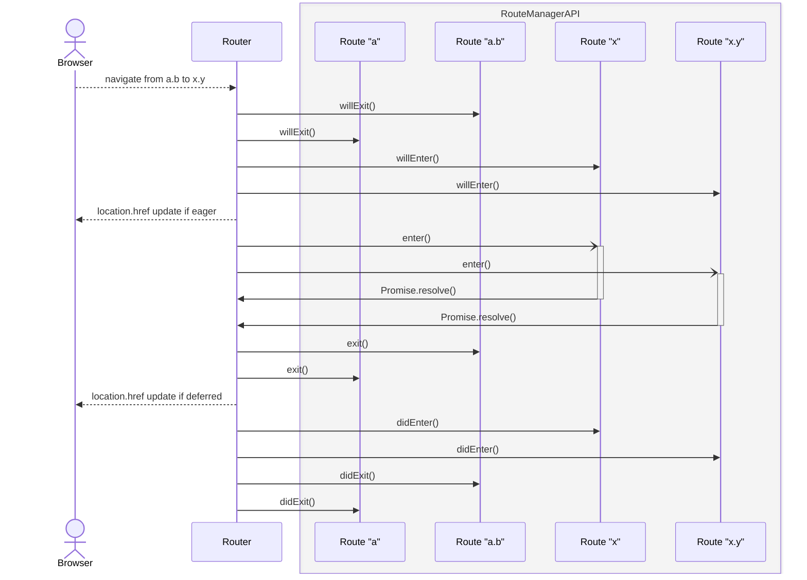
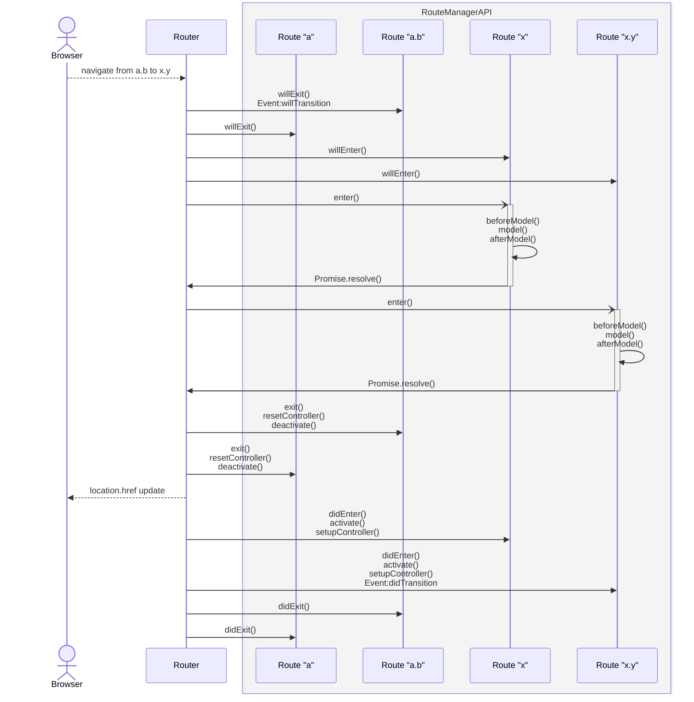

<!--- 
Directions for above: 

stage: Leave as is
start-date: Fill in with today's date, 2032-12-01T00:00:00.000Z
release-date: Leave as is
release-versions: Leave as is
teams: Include only the [team(s)](README.md#relevant-teams) for which this RFC applies
prs:
  accepted: Fill this in with the URL for the Proposal RFC PR
project-link: Leave as is
suite: Leave as is
-->

<!-- Replace "RFC title" with the title of your RFC -->

# Route Manager API

## Summary

Define a generic Route Manager concept that can be used to implement new Route base classes as a stepping stone towards a new router.

## Motivation

The intent of this RFC is to implement a generic Route Manager concept so that we’re able to provide room for experimentation and migration to a new router solution. It aims to provide a well-defined interface between the Router and Route concepts. Well-defined in this case means both API and lifecycle.

This will unlock the possibility of implementing new Route base classes while also making it easier to replace the current router.

A concrete example: since it’s the Route that brings in the Controller, it will also, for example, become possible to implement a Route Manager that exposes a Routable Component without the need for a Controller.

This RFC is **not** intended to describe APIs that Ember app developers would generally use, but it describes the low-level API intended for framework developers to develop next generation routing and for the rare ecosystem developer wanting to write their own Route base classes with an accompanying Route Manager implementation.


## Detailed design

### Route Manager basics

The minimal API for a Route Manager consists of `capabilities`, `createRoute` and a `getDestroyable` method.

```typescript
interface RouteManager {
	capabilities: Capabilities;

	// Responsible for the creation of a RouteStateBucket. Returns a RouteStateBucket, defined by the manager implementation.
	createRoute: (factory, args: CreateRouteArgs) => RouteStateBucket;

	// Returns the destroyable (if any) for the RouteStateBucket
	getDestroyable: (bucket: RouteStateBucket) => Destroyable | null;
}

interface CreateRouteArgs {
	// By convention this is currently the dot separated route path.
	name: typeof RouteInfo.name 
}
```

#### `createRoute`

The `createRoute` method on the Route Manager is responsible for taking the Route’s factory and arguments and based on that return a `RouteStateBucket` .

***Note:** It is up to the manager to decide whether or not this method actually instantiates the factory or if that happens at a later time, depending on the specific lifecycle the manager implementation wants to provide.*

#### `RouteStateBucket`

The `RouteStateBucket` is a stable reference provided by the manager’s `createRoute` method. All interaction through the Route Manager API will require passing this same stable reference as an argument. The shape and contents of `RouteStateBucket` is defined by the specific Route Manager implementation.

#### `getDestroyable`

The `getDestroyable` method takes a `RouteStateBucket` and will return the `Destroyable` if applicable. This can be used by the manager implementation to wire up the lifetime of the route.

### Determining which route manager to use

This follows the same pattern as existing manager implementations. This method will be used by the framework for the Route Base Classes it provides as well as by non-framework code wanting to provide their own Route Manager implementation.

```typescript
// Takes a Factory function for the Manager with an Owner argument and
// the Route base object/class/function for which the manager applies.
setRouteManager: (
	createManager: (owner: Owner) => MyRouteManager,
	definition: object
) => void
```

### NavigationState interface

The NavigationState is an interface for the router to pass information to the manager methods. This interface can be extended with capabilities in the future.

```typescript
// Passed in to the lifecycle methods
interface NavigationState {
	from: RouteInfo | undefined;
	to: RouteInfo;
}

// Classic interoperability, only provided if manager requests classicInterop capability
interface NavigationStateWithTransition = NavigationState & {
	transition: Transition;
}
```

The `RouteInfo` classes refer to the existing public API `RouteInfo` as specified in [the Ember API documentation](https://api.emberjs.com/ember/6.10/classes/routeinfo).

### NavigationActions interface

The `NavigationActions` interface defines any actions that some of the manager hooks are allowed to call. For now this is just the `cancel` action which stops the current navigation. The implementation details are left to the router, but will at least need to abort the `signal` defined in the [`AsyncNavigationState` interface](#asyncnavigationstate-interface).

```typescript
interface NavigationActions {
	// Cancels the current navigation
	cancel: () => void;
}
```

### AsyncNavigationState interface

The `AsyncNavigationState` interface allows Route Managers to have a certain amount of control over the navigation.

The `signal` is an `AbortSignal` provided by the Router which can be used to react to a cancellation of the current navigation. It can be passed to, for example, a `fetch` call.

`ancestorPromises` allows you to tie in to the asynchronous lifecycle of ancestor Routes. This opens the possibility for a RouteManager implementation for parallel resolution of the asynchronous lifecycle. The Classic Route Manager will rely on this behaviour to implement the current waterfall lifecycle.

In addition, the Router will need to provide a method to the Route Managers to retrieve the [`resolvedContext`](#resolvedcontext) of a Route based on its `RouteInfo`.

```typescript
// Exposes API used to interact with the active navigation, like awaiting ancestor's async behaviour.
interface AsyncNavigationState  {
	// Signal for the current navigation
	signal: AbortSignal;
	
	// A WeakMap of ancestor promises that can be used to await async ancestor behaviour.
	ancestorPromises: WeakMap<RouteInfo, ReturnType<RouteManager.enter | RouteManager.update>>
	
	// Retrieve the resolvedContext of an ancestor route.
	getResolvedContext: (routeInfo: RouteInfo) => ReturnType<RouteManager.resolvedContext> | undefined;
}
```

Since `RouteManager.resolvedContext` is part of an optional capability for Route Manager implementations, `getResolvedContext` could return `undefined`.

### Route lifecycle

This RFC proposes 3 groups of hooks for lifecycle management of a Route.

- `enter` - called when a route is visited.
- `update` - called when the input for a route has changed, think dynamic segment or query param.
- `exit` - called when a route is exited.

The main lifecycle methods are accompanied by synchronous will*/did* methods. This gives the possibility of implementing lifecycle features like cancelling/preventing a route change, cleaning up after a route branch was fully exited. `update` and `enter` are promise-aware and will be awaited. These methods give the option to do asynchronous work that needs to happen before rendering.

```typescript

interface RouteManager {
	// Lifecycle hook called when the Route is about to be entered.
	willEnter: (bucket: RouteStateBucket, args: NavigationState & NavigationActions) => void;
	// Main asynchronous entry point
	enter: (bucket: RouteStateBucket, args: NavigationState & NavigationActions & AsyncNavigationState) => Promise<void>;
	// Called after all `enter` hooks for the current Route hierarchy have succesfully resolved.
	didEnter: (bucket: RouteStateBucket, args: NavigationState) => void;

	// Similar to willEnter, but called on a Route that was also part of the previous navigation.
	willUpdate: (bucket: RouteStateBucket, args: NavigationState & NavigationActions) => void;
	// Called when the dynamic segments (and in the case of the classic router query parameters as well) for the Route have been updated.
	update: (bucket: RouteStateBucket, args: NavigationState & NavigationActions & AsyncNavigationState) => Promise<void>;
	// Called when all updating Routes have updated.
	didUpdate: (bucket: RouteStateBucket, args: NavigationState) => void;

	// Called when the Route is about to be exited.
	willExit: (bucket: RouteStateBucket, args: NavigationState & NavigationActions) => void;
	// Called when the Route is exited.
	exit: (bucket: RouteStateBucket, args: NavigationState) => void;
	// Called when all exiting routes have exited
	didExit: (bucket: RouteStateBucket, args: NavigationState) => void;
}
```

We strongly considered not adding the `update` hooks, but decided against it for ergonomics and simplicity reasons. Not adding it would minimise the Route Manager API surface, but make implementing different behaviour significantly less ergonomic for most Route Manager implementations, whereas implement the `update` hooks with the same behaviour as `exit` + `enter` is simply calling those methods within the manager.

The lifecycle of an example navigation between two nested routes looks as follows:



### Capabilities

Route Managers are required to have a `capabilities` property.  This property must be set to the result of calling the `capabilities` function provided by Ember.

Any time the Classic Router interfaces with the RouteManager in a way we do not want in the future, we will shield this behind an optional capability. This capability or capabilities will at some point in the future be turned off by default through a deprecation.

#### resolvedContext

A separate optional capability will be introduced to access the last resolved value of the model hook (equivalent). This leaves open the possibility of asynchronous lifecycle combined with routes accessing ancestor model data through use of the `getResolvedContext` method. A route manager may choose not to implement this capability.

```typescript
interface RouteManagerWithResolvedContext = RouteManager & {
	// Get the current resolved context (a.k.a. model) from the RouteStateBucket
	resolvedContext(bucket: RouteStateBucket) => unknown;
}
```

#### Classic Router interoperability

When the `classicInterop` capability is set to `true` the Route Manager will have to provide an implementation for the methods that cross the Route Manager boundary to recreate the current Classic Router behaviour. The following list is a best-effort to find those methods, but it may need to change during implementation. The capability that opts in to these functions is not intended to be implemented by any other future Route Manager.

```typescript
// Classic Router interoperability
interface RouteManagerWithClassicInterop = RouteManager & {
	getRouteName(bucket: RouteStateBucket) => string;
	getFullRouteName(bucket: RouteStateBucket) => string;
	
	// Query Parameter handling
	stashNames(bucket: RouteStateBucket, routeInfo: ExtendedInternalRouteInfo<Route>, dynamicParent: ExtendedInternalRouteInfo<Route>) => void;
	qp(bucket: RouteStateBucket): it's complicated
	
	serializeQueryParam(bucket: RouteStateBucket, value: unknown, urlKey: string, defaultValueType: string);
	deserializeQueryParam(bucket: RouteStateBucket, value: unknown, urlKey: string, defaultValueType: string);
	
	// Actions/event handlers
	queryParamsDidChange(bucket: RouteStateBucket, changed: {}, totalPresent: unknown, removed: {}) => boolean | void;
	finalizeQueryParamChange(bucket: RouteStateBucket, params: Record<string, string | null | undefined>, finalParams: {}[], transition: Transition) => boolean | void;
}
```

The necessary state will be taken from and stored in the passed `RouteStateBucket`.

### Rendering

With the Classic Router, rendering is handled through `RenderState` objects combined with a (scheduled once) call to `router._setOutlets` which updates the render state tree with the new `RenderState` objects from the current routes. This looks something like:

```typescript
let render: RenderState = {
    owner,
    name,
    controller: undefined, // aliased as @controller argument
    model: undefined, // aliased as @model argument
    template, // template factory or component reference
  };
```

For the Route Manager API we will rework this structure to a generic invokable. This way the manager implementation can decide how render happens and what arguments are passed. Deferring render while waiting on asynchronous behaviour (like the Classic Route model hooks) will be a Route Manager concern.

The return value of `getInvokable` is an object that needs to have an associated `ComponentManager`.

```typescript
interface RouteManager {
	getInvokable: (bucket: RouteStateBucket) => object;
}
```

## How we teach this

Since this is not an Ember app developer facing feature the guides don’t need adjustment. Documentation will live in the API docs.

## Drawbacks

TBD

## Alternatives

TBD

## Unresolved questions

TBD

## Addenda

### #1 What Classic Routes look like implemented with the Route Manager API

The existing `@ember/route`  Route base class will be referred to as Classic Route. Below is a description of how the current Classic Route implementation could be supported by the proposed Route Manager API.

#### Hooks & events

Below an example of how the Classic Route class could map to manager events. **All** the classic hooks need access to the relevant `Transition` object.

The model hooks are an RSVP Promise chain handled by router_js. We can put them in `enter` which is Promise-aware.

---

#### Switching between routes:

`willExit`:

- `willTransition` event (currently sync), bubbles through RouteInfos as long as true is returned or no handler is present. **NOTE: THESE BUBBLE BOTTOM UP!**
- `routeWillChange` event (currently sync), router service event.

`enter`:

- `beforeModel` hook
- `model` hook
- `afterModel` hook

`exit`:

- `resetController` hook
- `deactivate` hook

`didEnter`:

- `activate` hook
- `setupController` hook
- `didTransition` event **NOTE: THESE BUBBLE BOTTOM UP!**
- `routeDidChange` event, router service event

---

#### Updating the model for an existing route mapped to manager hooks:

- `willUpdate` (leaf-most)
    - `willTransition` event
    - `routeWillChange` event, router service
- `update`
    - `beforeModel`
    - `model`
    - `afterModel`
- `didUpdate` (leaf-most)
    - `resetController` (conditionally, if model return value changed)
    - `setupController` (conditionally, if model return value changed)
    - `didTransition` (event, leafmost)
    - `routeDidChange` event, router service

#### Mapping of existing events and methods to the new API

