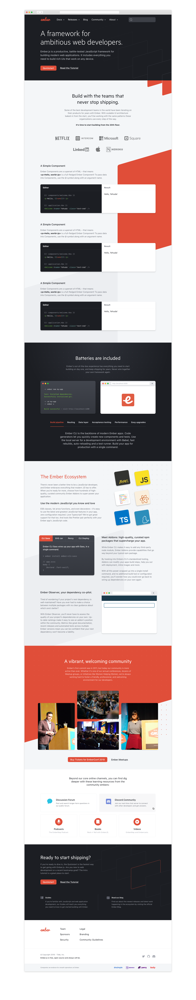
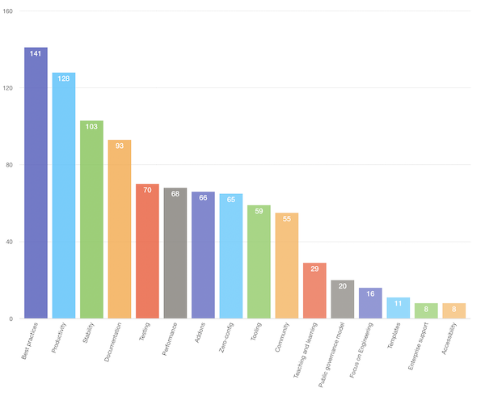

# Website Redesign

## Summary

The Ember homepage has been the same for a number of years, and while it's served us well in the past, it's been somewhat stale for a long time. For people who aren’t involved in the day-to-day of Ember development, it’s easy  to miss just how well the framework has kept up over the years. This redesign aims to modernize, update and improve all things website, so that the impression we give the general public matches reality.

Tremendous thank you to our friends at [EmberMap](http://www.embermap.com) for stepping up to fund and do the lion's share of the work, organizing and cat-herding on this one. The key folks involved in this throughout the lifecycle of our redesign efforts are @wycats, @tomdale, @wifelette, @samselikoff, @ryanto, @melsumner and @jenweber, with lots of other folks at intervals along the way.

## Motivation

Right now a developer visiting emberjs.com is presented with light information about the framework, but little about what it’s like to use modern Ember. The homepage is a very different experience from the programming model, the things we say and do in other RFCs, forward-looking conference talks and what it’s like to actively develop an Ember app in 2018. The design also hasn't changed significantly in years, so someone who comes back after two or three years away gets the impression nothing has changed, even if we've made slow and subtle updates to the copy, and dramatic improvements to Ember itself.

The primary goal of this redesign is to make our website match reality. Some of the secondary goals include reorganizing information on internal pages for generally better information architecture, improving accessibility, improving the discoverability of important project resources, and looking overall modern and current.

## Detailed design

A visual redesign is a bit different than most of the Code RFCs, so showing becomes more important than explaining. What follows is the proposed design  (comp) for the redesign of the primary homepage, and the intent is to approve the RFC with this, and then keep working on the dozens of internal pages in the general Ember project under this umbrella and using this design language.

Like any good design project, we expect changes along the way, but that these comps present the primary thrust and look/feel of the things that have not yet been designed.

Much of the copy is placeholder, but much of it represents concrete thought. A lot of that content was gleaned from a survey of about 200 of our most active users, who told us that they most value *clear best practices* and *productivity*.

[A significantly detailed write up of the survey results can be found here](../images/survey_results_analysis.pdf). Various team members reviewed the results, and then worked together [to outline copy for the website based on the feedback](../images/EmberJS_Homepage_Outline.pdf). The goal was to reach consensus on what the homepage should communicate, disregarding design, aesthetic, and code.

The hierarchy of the first comp that resulted from that outline was deliberate—for example, the Social Proof section comes first right after the Hero, since it’s the next most important section. This hierarchy will continue to be apparent in the final design. The general instructions provided to the designer was that a tone of "friendly professional" was ideal, building on Ember's deliberately optimistic and friendly look and feel (and mascot!) up until now.

There are still missing pieces in the current mockup—the final code examples, images used in the Community section, and a few other graphics and copy odds and ends—but these ought be considered implementation details for now in the interest of involving the community earlier rather than later.

## Drawbacks

It's clear that most community members agree that the website is out of date and needs a refresh. That said, design is highly subjective and really easy to endlessly bikeshed over. The primary *risk* of this redesign is that we get too lost in the weeds (with comments or objections like "I don't like that color purple," *literal* bikeshedding). Visual design is particularly vulnerable to that trap.

Change is also just difficult in general, and there will be a brief period of potentially frustrating transition where people look for things in places they're accustomed to, but don't find them there (see: improved IA). We expect this to be a brief irritation though, and that the new overall experience will be improved for new and old users alike.

To mitigate, we should be very clear that comments ought be structural, actionable and detailed. "I just don't like that" or "I'd prefer a different color" are unlikely to be useful; the first proposed designs have already been through several rounds like that and the comp here represents a palette and structure that improves upon the existing broad strokes, without being too dramatic a shift. It's moderate, in a way that ought help this go smoothly.

Comments like "have you considered that X would be more accessible Y way" and "there's an inconsistency between these two things" could be *very* helpful and potentially point out things we've missed. Questions like "X used to be on the homepage but isn't anymore, can you explain the motivation and where will it go?" could be thought-provoking and clarifying.

## Alternatives

Redesigning the Ember website has been a goal for several years now, always with the intent to get to a solid homepage comp and then share with the community pre-implementation for input and buy-in. There have been several attempts like this one that have failed along the way for various reasons. This is the first redesign that has achieved both internal consent *and* which hasn't fizzled out and died along the way, and represents the learnings of the failed previous attempts.

The alternative would be to *not* update the site, but that's not really an alternative. The website is our most public face, and every day that it doesn't represent *reality* is a day we're likely losing potential new Ember developers and users. The older site also makes it difficult for our current users to promote their technology choice, and to get their team members on board. We aim to improve all of the above and more.

## Unresolved questions

Even once more designs are completed, the new site will need to be implemented piece by piece, in a transitional way. The recent updates made to the current site by the Ember Learning Team prove that we're capable of digging in together and doing the incremental work to get us to larger, sweeping changes. That recent work gives us the confidence that we can accomplish this in an open, community-way, with help from new and old users alike.

The exact *plan* for this will have to be developed next, hence, unresolved.

## Other

Some areas of the primary comp came with more detailed design views. Those can be seen here:

* [Header Dropdowns](../images/website_2_header_dropdown.png)
* [URL Examples](../images/website_3_url_examples.png)
* [Button UI](../images/website_4-button_ui.png)
* [Scrolled Nav, Concept 1](../images/website_5_scrolled_nav.png)
* [Scrolled Nav, Concept 2](../images/website_6_nav_alt.png)
* [Pointer](../images/website_7_pointer.png)
