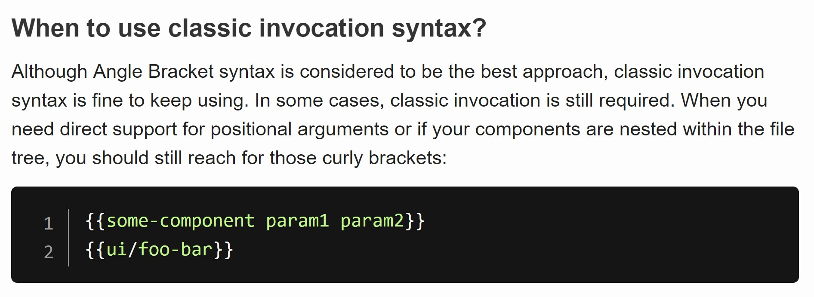
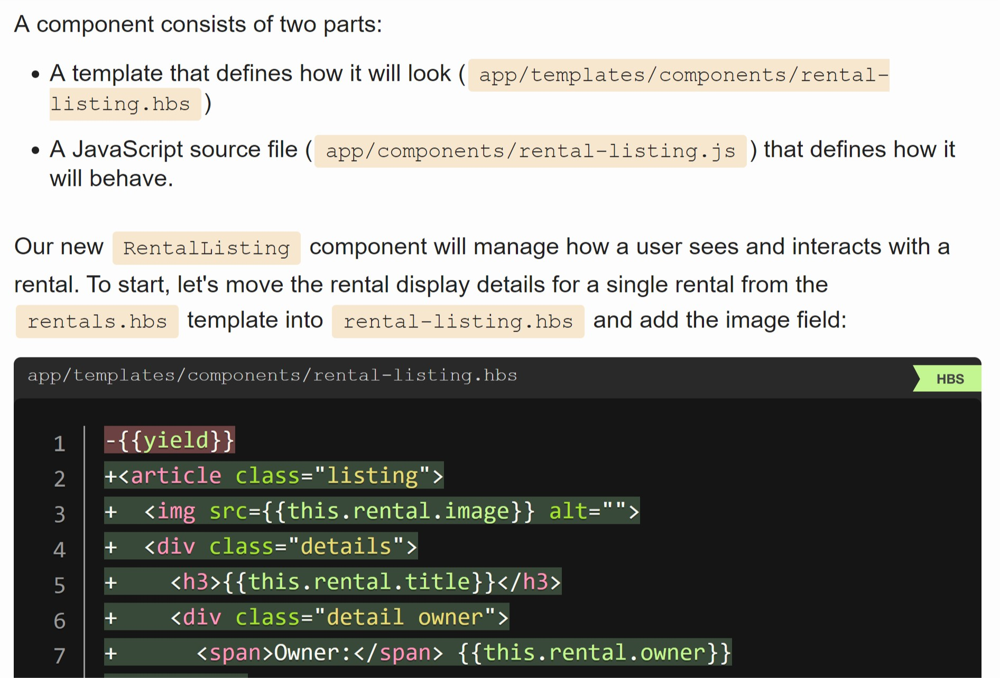
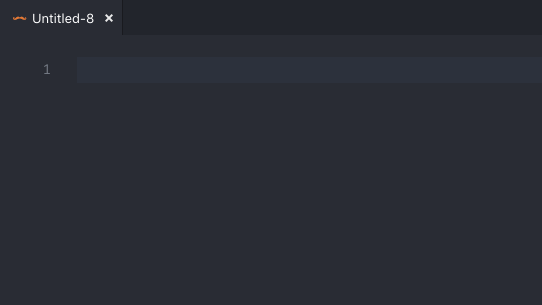

# Nested Invocations in Angle Bracket Syntax

## Summary

Create a syntax for invoking components nested inside of directories in angle-bracket syntax. The invocation `<AppIcons::Warning>` refers to the component `app/components/app-icons/warning.js` when using the default resolver, and looks up `component:app-icons/warning` in the container.

## Motivation

Today's angle-bracket syntax conversion guide says this:



This has been an acceptable interim step as we have worked on completing the work of revamping the component model, but it's a source of incoherence (and a reported adoption blocker for some apps) in the Ember design, and we need to eliminate this source of incoherence in order to recommend angle bracket components in the Octane edition.

For positional arguments, we recommend that add-on authors migrate to named arguments. There is one exception to this rule: addons that are mimicking control-flow syntax (like `liquid-if`). These addons should clearly document that they are meant to be used with curly syntax.

For components nested inside of directories, this RFC proposes a new syntax to allow users to migrate directly to angle bracket invocation.

## Detailed design

> Note: This RFC uses curly syntax without blocks for illustrative purposes. In all cases, adding a block doesn't change the normalization or lookup rules described here.

When using curly syntax, component invocation looks like this:

```hbs
{{some-component some=parameters}}
```

If `some-component` is not a local variable in scope, the semantics of this invocation are:

1. look up `component:some-component` in the container
2. look up `template:components/some-component` in the container
3. invoke the component with its template (using the relevant component manager semantics)

When using angle-bracket syntax, the equivalent invocation looks like this:

```hbs
<SomeComponent @some={{parameters}}>
```

The syntax means the same thing, with one additional step:

1. **normalize `SomeComponent` into `some-component` using the dasherization rule specified in [RFC #311][angle-bracket-dasherize]**
2. look up `component:some-component` in the container
3. look up `template:components/some-component` in the container
4. invoke the component with its template (using the relevant component manager semantics)

[angle-bracket-dasherize]: https://emberjs.github.io/rfcs/0311-angle-bracket-invocation.html#tag-name

Curly bracket syntax also allows the user to invoke a component nested inside of a directory. This syntax:

```hbs
{{app-icons/warning color="yellow"}}
```

has these semantics:

1. look up `component:app-icons/warning` in the container
2. look up `template:components/app-icons/warning` in the container
3. invoke the component with its template (using the relevant component manager semantics)

However, RFC #311 didn't specify an angle-bracket equivalent syntax for the same semantics.

This RFC proposes that the `::` separator serve the same purpose, with the same semantics, in angle-bracket notation:

```hbs
<AppIcons::Warning @color="yellow" />
```

---

This RFC is an extension to the **normalization** rules that already occur in angle bracket notation.

RFC #311 specified the normalization rules as:

> The tag name will be normalized using the dasherize function, which is the same rules used by existing use cases, such as service injections

This RFC amends the normalization rule by first replacing any occurrences of `::` in the tag name with a `/`, but otherwise doesn't change the semantics of RFC #311.

[RFC #143][module-unification], Module Unification, uses `::` as a package separator, but because of problems with scoped packages in npm, we no longer intend to use the `::` syntax in that way. Instead, we intend to allow templates to import components from other packages using import syntax, and the `::` syntax is therefore available for this purpose.

[module-unification]: https://emberjs.github.io/rfcs/0143-module-unification.html

## How we teach this

We currently don't cover directory nesting in the guides, and directory nesting is not an extremely early-stage Ember feature. That said, most Ember developers encounter a need or desire to group components together relatively quickly, and it does make sense to cover it.

RFC #311 introduced a normalization rule for angle bracket invocation, and the guides mention that `<NavBar>` invokes a component that appears in the file system as `nav-bar`.



After this RFC, the documentation should add a "Zoey says" sidebar that describes the rule in more detail, and mentions that you can refer to components nested in a directory with the `::` separator.

Finally, the goal of this RFC is to make it possible to recommend that users always use angle-bracket invocation for components other than control flow (`if`, `each`).

This means that we should update the syntax conversion guide to no longer say that `{{` syntax is sometimes required, and avoid recommending it.

We should also recommend that component authors who are using positional parameters (other than control flow components like `liquid-if`) should stabilize, document and recommend named argument for their parameters so that their users can uniformly use angle bracket invocation syntax.

## Drawbacks and Alternatives

This RFC introduces another normalization rule--Ember developers will need to understand that `::` refers to nested directories in the file system. It also introduces another divergence from the `{{` syntax, which already uses `/` for the same purpose.

Alternatively, we could use `/` as the separator for the same purpose. This would have the benefit of matching the idiomatic way that people describe file system nesting as well as matching the existing `{{` syntax.

On the other hand, it has poor syntax highlighting in virtually all existing highlighters:

```hbs
<AppIcons::Warning></AppIcons::Warning>
<AppIcons/Warning></AppIcons/Warning>
```

Additionally, some autocomplete systems assume that `<AppIcons/` is the beginning of a self-closing tag.



Another drawback of this proposal is that it uses `::` syntax for today's templates, and we don't expect that syntax to be relevant to templates using template imports. It's possible that we would want to use this syntax, which might be considered valuable, in templates using template imports. That said, there is no specific proposal for what we might want to use this syntax for, and we could compatibly reclaim it in the context of template imports, at the cost of some mental churn.

Another alternative is to recommend that people use `#let` with `(component)` in situations where nesting is required.

```hbs
{{#let (component 'app-icons/warning') as |Warning|}}
  <Warning></Warning>
{{/let}}
```

The primary drawback of this approach is that the need to group components together in directories comes up earlier in the typical Ember developer's experience than learning the ins and outs of `let` and the `component` helper. It seems likely that developers could encounter a desire to group components in directories even before they have a full understanding of `let` and block parameters.

Secondarily, this is a fairly verbose syntax that introduces a significant cliff from top-level components to grouped components.

Another alternative is to introduce a new non-block syntax for bringing components into scope, such as:

```hbs
{{resolve-component 'app-icons/warning' as Warning}}

<Warning></Warning>
```

This avoids introducing rightward drift, but it is still relatively verbose. It also creates a question that we would need to provide guidance on whether people should use this feature for all components or just nested ones (both sides have plausible arguments).

I also comes at the cost of creating a brand new way to bring variables into scope in Glimmer templates. Up to this point, we have carefully maintained the constraint that variables come into scope using nesting and `as |name|` syntax. While we might be willing to introduce new variable binding forms in the future, adding such a form to this proposal would significantly increase its design scope, and maintaining a small scope is a key goal of this RFC.

Another alternative is to avoid introducing a solution to this problem, and wait for the expected longer-term solution, template imports. While this is indeed expected to serve our longer-term goals, it would mean that Ember users couldn't use angle-bracket invocation, with all the benefits they bring, with nested components, or choose not to nest components at all.

On balance, it seems better to introduce an interim syntax that restores feature parity with curly invocation.
