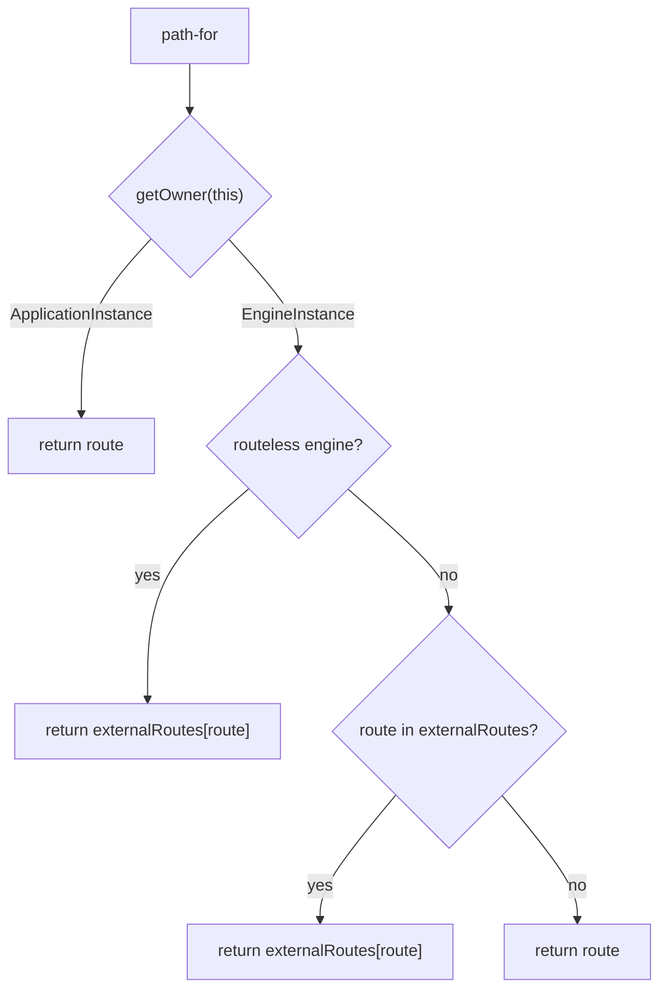

<!--- 
Directions for above: 

Stage: Leave as is
Start Date: Fill in with today's date, YYYY-MM-DD
Release Date: Leave as is
Release Versions: Leave as is
Relevant Team(s): Fill this in with the [team(s)](README.md#relevant-teams) to which this RFC applies
RFC PR: Fill this in with the URL for the Proposal RFC PR
-->

# Engine Router Helpers

## Summary

This RFC intends to:

- deprecate `<LinkToExternal />` component provided by `ember-engines` package.
- introduce a new template helper `{{path-for}}` provided by new `ember-engines-router-helpers` package.

## Motivation

`<LinkToExternal />` is the primary way to link to a path that isn't below the mount point of the Ember Engine.

`<LinkToExternal />` is a thin wrapper around `<LinkTo />` component and this worked well in Ember.js pre v4.
Extension of `<LinkTo />` component has been deprecated in 3.27.0 version of Ember.js per [RFC #0671](./0671-modernize-built-in-components-1.md) and removed in 4.0.0 hence we need a new approach.

There is another problem this RFC seeks to solve.
Large scale application authors often create an addon(s) to contain reusable components  that can be rendered either in the context of the host app or Ember Engine.
In such scenario an extra guard needs to be introduced as `<LinkToExternal />` component  available only in the context of Ember Engine and does not exist in the context of regular application, so it's common to see such pattern:

```hbs
{{#if @isEngine}}
  <LinkToExternal @route="contact">Contact Us</LinkToExternal>
{{else}}
  <LinkTo @route="contact">Contact Us</LinkTo>
{{/if}}
```

## Detailed design

Changes proposed in scope of this RFC span several packages:

* updates to `ember-engines`
* updates to `ember-source`
* introduction of new addon `ember-engines-router-helpers`

### `ember-engines-router-helpers` addon

This RFC proposes to introduce new addon `ember-engines-router-helpers` so the template helper `{{path-for}}` would be available for use within Ember Engine as well as in libraries with components that may be shared between conventional apps and Engines.

Template helper `{{path-for}}` should detect the execution context and return different value if the owner is an instance of the `ApplicationInstance` or `EngineInstance`.

If the owner is an instance of the `ApplicationInstance` class, the helper should return passed in route name "as is" without modification. This approach allows to safely use helper in shared libraries which may be used both in the conventional Ember app or Ember Engine.

If the owner is an instance of the `EngineInstance` class, and it's non routable engine, then return value from `externalRoutes` map.

If the owner is an instance of the `EngineInstance` class, and it's routable engine, then there are two scenarios:

* if provided route exists in `externalRoutes` map, then return value form the map.
* otherwise, prefix provided route with engine mount point, so it can be passed to `<LinkTo />` via `@route` argument.

The above described logic can be expressed via flowchart:



In order to differentiate "local" and "external" links withing the Ember Engine the `{{path-for}}` template helper should accept `external` named argument to designate if it's the link to the same Engine route or if it's an external link.

```handlebars
{{!-- This may be either internal or external link, detected at run-time. --}}
<LinkTo @route={{path-for "contact"}}>Contact Us</LinkTo>

{{!-- This is external link. --}}
<LinkTo @route={{path-for "contact" external=true}}>Contact Us</LinkTo>

{{!-- This is internal link. --}}
<LinkTo @route={{path-for "contact" external=false}}>Contact Us</LinkTo>
```

Argument `external` should be considered optional and only used for explicitness so engineers working with codebase can easily differentiate "local" routes from "external".

### `ember-source` package

There is no new functionality proposed to the `ember-source` package in scope of this RFC.

There are a couple of removals proposed to the `<LinkTo />` component.

1. Remove usage of `namespaceRoute()` method in favor of using `this.route` property.

    Currently `namespaceRoute()` method has the following logic:

    ```typescript
    class LinkTo extends Component {
      // ...
      private namespaceRoute(route: string): string {
        let { engineMountPoint } = this;

        if (engineMountPoint === undefined) {
          return route;
        } else if (route === 'application') {
          return engineMountPoint;
        } else {
          return `${engineMountPoint}.${route}`;
        }
      }
      // ...
    }
    ```

    Responsibility of namespacing moves to the `{{path-for}}` template helper hence it should be removed from `<LinkTo />` component.

3. Remove assertion about using `<LinkTo />` component in routeless engine.

   Currently `validateArguments()` method has the following logic:

   ```typescript
   class LinkTo extends Component {
     // ...
     validateArguments(): void {
       assert(
         'You attempted to use the <LinkTo> component within a routeless engine, this is not supported. ' +
         'If you are using the ember-engines addon, use the <LinkToExternal> component instead. ' +
         'See https://ember-engines.com/docs/links for more info.',
         !this.isEngine || this.engineMountPoint !== undefined
       );
     }
     // ...
   }
   ```

   Responsibility of namespacing moves to the `{{path-for}}` template helper hence `<LinkTo />` should not concern about the context where it's being used (app or engine).

### `ember-engines` package

Deprecate `<LinkToExternal />` component during `v0.18.x` cycle and remove in next (`v0.19.0` or `v1.0.0`) major release.

### Examples

Let's take a look at simple example where we have an application and routable engine.

Given an application with `contact` route and routable Ember Engine, the `test-app/app.js` file would look like:

```javascript
import Application from '@ember/application';
import Resolver from 'ember-resolver';
import loadInitializers from 'ember-load-initializers';
import config from 'test-app/config/environment';

export default class App extends Application {
  modulePrefix = config.modulePrefix;
  podModulePrefix = config.podModulePrefix;
  Resolver = Resolver;

  engines = {
    'routable-engine': {
      dependencies: {
        externalRoutes: {
          'contact': 'contact',
        },
      },
    },
  }
}

loadInitializers(App, config.modulePrefix);
```

one would need to write following code to render link to the `contact` route:
```handlebars
{{!-- within the app. --}}
<LinkTo @route="contact">Contact Us</LinkTo>

{{!-- within the engine. --}}
<LinkTo @route={{path-for "contact" external=true}}>Contact Us</LinkTo>
```

<!--- 
> This is the bulk of the RFC.

> Explain the design in enough detail for somebody
familiar with the framework to understand, and for somebody familiar with the
implementation to implement. This should get into specifics and corner-cases,
and include examples of how the feature is used. Any new terminology should be
defined here.
-->

## How we teach this

Ember Engines documentation provided in [ember-engines.com](https://ember-engines.com) should be updated with `{{path-for}}` template helper replacing all the references of `<LinkToExternal />` component.

Transition path needs to be published on [ember-engines.com](https://ember-engines.com) containing following steps:

1. Install `ember-engines-router-helpers` addon in every engine used in the app.
2. Replace use of `<LinkTo @route="inner-route" />` component with `<LinkTo @route={{path-for "inner-route"}} />` in every engine codebase.
3. Replace use of `<LinkToExternal @route="external-route" />` component with `<LinkTo @route={{path-for "external-route"}} />` in every engine codebase.
4. If there are any addons providing some shared code that is being used by engine, steps #2 and #3 needs to be applied to addons as well.

<!--- 
> What names and terminology work best for these concepts and why? How is this
idea best presented? As a continuation of existing Ember patterns, or as a
wholly new one?

> Would the acceptance of this proposal mean the Ember guides must be
re-organized or altered? Does it change how Ember is taught to new users
at any level?

> How should this feature be introduced and taught to the existing Ember users?
-->

## Drawbacks

> Why should we *not* do this? Please consider the impact on teaching Ember,
on the integration of this feature with other existing and planned features,
on the impact of the API churn on existing apps, etc.

> There are tradeoffs to choosing any path, please attempt to identify them here.

Changes proposed in this RFC span multiple existing packages and require users to install extra package.
Such churn deemed to be minor and codemode can be provided.

Users of Ember Engine would need to use more verbose syntax to achieve linking between routes of the same engine:

```handlebars
{{!-- Before. --}}
<LinkTo @route="contact">Contact Us</LinkTo>

{{!-- After. --}}
<LinkTo @route={{path-for "contact"}}>Contact Us</LinkTo>
```

This deemed to be minor inconvenience for the code bases using Ember Engines.

## Alternatives

* Utilize `@ember/legacy-built-in-components` to keep `<LinkToExternal />` a thin wrapper around legacy implementation of `<LinkTo />` component.

  As this may be considered temporary solution, this is not viable long term solution as any changes made to `<LinkTo />` component in the Ember.js codebase will need to be backported to `@ember/legacy-built-in-components` which is not planned to be done.

* Re-implement `<LinkTo />` functionality in `ember-engine`.

  This is not viable long term solution as any changes made to `<LinkTo />` component in the Ember.js codebase would need to be backported to `@ember/legacy-built-in-components` which is not planned to be done.

* Deprecate and remove `externalRoutes` mapping.

  This would require providing *full route name* to `<LinkTo />` component *including* engine mount point. This option is not viable as it breaks isolation principle of Ember Engines whereas every engine should be self-scoped micro-frontend.

* Bake in these implementation details into Ember.js codebase.

  Concerns discussed in this RFC are specific to Ember Engines and there is no need to ship this functionality to every user of Ember.js.

## Unresolved questions

None.
