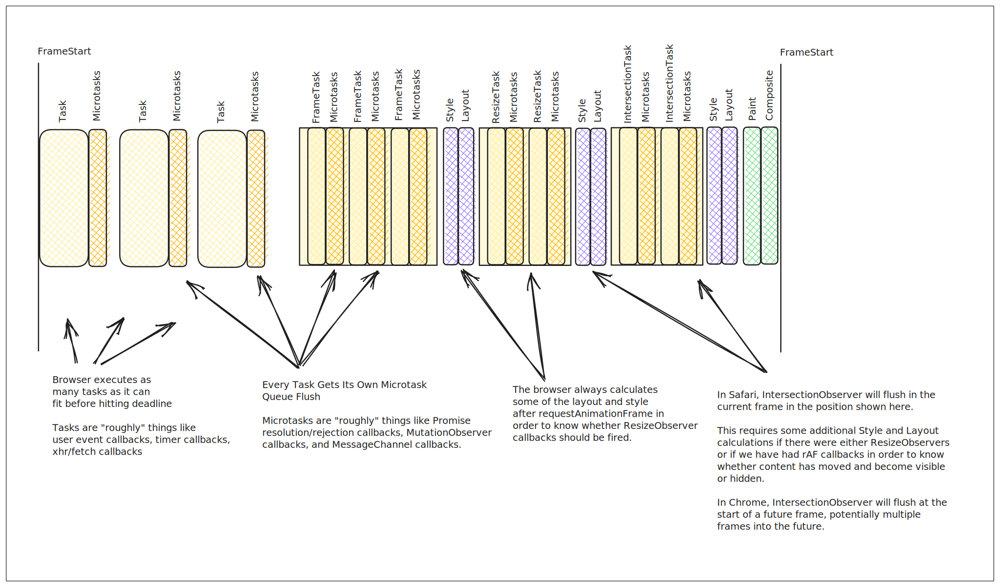

<!--- 
Directions for above: 

stage: Leave as is
start-date: Fill in with today's date, 2032-12-01T00:00:00.000Z
release-date: Leave as is
release-versions: Leave as is
teams: Include only the [team(s)](README.md#relevant-teams) for which this RFC applies
prs:
  accepted: Fill this in with the URL for the Proposal RFC PR
project-link: Leave as is
suite: Leave as is
-->

# Render Aware Scheduler Interface

## Summary

This RFC Proposes replacing `@ember/runloop` [Backburner.js](https://github.com/BackburnerJS/backburner.js)
with an [interface](https://www.typescriptlang.org/docs/handbook/interfaces.html) for common scheduling needs.

The interface describes *intent* for when work should be performed in relation to the native event queues
and render cycle of the browser. The details of *how* that work is scheduled and flushed are up to the specific
scheduler implementation, allowing for experiments in this space.

Additionally, this RFC proposes deprecations and alterations to associated async primitives such as RSVP to
support this exploration.

## Motivation

### The Short Answer: *Better Things Now Exist*

Backburner was written in an era that predates most async primitives including microtasks and requestAnimationFrame.
It was written to help coordinate work that needed to complete before the browser might render again, in effect
a microtask polyfill with requestAnimationFrame ideals.

RSVP similarly was written in an era in which native Promise support was being proposed but did not yet exist. As
such, while it provided an attempt at polyfilling microtasks, Ember chose to replace RSVP's microtask polyfill with
Backburner in order to reduce the overhead of promise flushing and reduce the risk of multiple renders occurring
within the same frame. In effect, this allowed Backburner to *also* function to [multiplex](https://en.wikipedia.org/wiki/Multiplexing)
Promises *and* to function as an *after microtasks complete* callback from which Ember's render work would be
flushed.

Noteably, the idea of being able to control the last microtask in the queue for this sort of framework level
work has become [a common need](https://twitter.com/jarredsumner/status/1694351991626166658?s=20), but remains
a missing primitive.

### The Other Short Answer: *Embrace The Platform*

Polyfilled microtasks typically do not have a meaningful stack trace due to their queued flush,
resulting in debugging and error tracing being especially difficult to use.

Native microtasks automatically piece together the stack trace across async boundaries, allowing
in most situations an error stack or a pause in a debugger to allow the developer to work back to
an originating change more quickly.

Thus encouraging use of native microtasks whereever possible automatically improves the debugging
experience for all developers, espcially for remote traces captured by bugtracking software.

It also significantly simplifies the mental model and clarity for developers. While scheduling
will still exist, in the vast majority of cases instead of needing to learn and think about
"what is RSVP" and "what is Backburner" and "what is the Runloop" the solution is "just use a
promise" or "just use async/await".

### The Complex Answer: *Making Mutation Safer & Performance*

As native promises, async/await usage, and raw fetch usage have become ever more prevalent,
the benefits of a "unified" flush provided by Backburner and the Backburner/RSVP configuration
have both diminished and even become largely detrimental.

Because Ember will re-render every time a flush occurs, interleaving native and RSVP promises
results in repeated re-renders while resolving a promise chain that ought to have produced a
single render. Similarly, every XHR/Fetch result produces its own render stack where before
requests that resolved within a very short time of each other would have usually had their
work scheduled into the same deferred backburner queue flush.

This results in not only a substantial amount of unnecessary and typically duplicate work
being done before the next meaningful render, but also results in thrashing the DOM and forced
layouts. In addition to poor performance, this becomes a disaster for accessibility tooling as
focus and DOM shifts rapidly around waiting for a final settled state.

Additionally, this interleaving means that there are three significant risks to application code
where async data fetching is involved:

1) Being notified due to an extraneous render to calculate too early before the data is in the
right settled state. This can result in errors due to missing or incomplete state that should
have been able to have been depended on to be there by the time of render.

2) Mutating state multiple times due to extraneous renders, leading to higher potential for
hitting the dreaded "backtracking render" error when it should have been safe to have read and
written multiple times.

3) Awaiting a data fetch and assuming that the work done after await occurs before render, when
due to Ember's current zealous flushing it is taking place post-render.


## Detailed design

### Work To Be Done

- Remove configuration logic for RSVP from Ember, allow it to use its own polyfill without the runloop
- Deprecate RSVP in favor of a smaller util library for just things like `hash`
- Move "timers" (`throttle`, `debounce` and `later`) out of `@ember/runloop` into their own standalone
  library.
- Deprecate (no replacement) `run` `join` and `bind` from `@ember/runloop`
- Replace `schedule` and `next` with a new Scheduler interface
- Provide a default implementation of the new scheduler interface
- Remove `@types/ember__runloop`, `@types/rsvp`, `rsvp`, and `ember-fetch` from anywhere they still live in the default blueprint
  or as a dependency in a core package

### Scheduler Interface

The scheduler interface defines several "phases" of when work should be done
that align to concepts in the browser's render cycle. The primary goal is
to reduce the number of times Ember needs to alter the DOM per frame to 0 or 1
as often as possible.

We also want to help applications coordinate work in a way that avoids the pitfalls
of DOM read/write interleaving. This means we need to provide both a mechanism for
applications to schedule work that occurs *after* the render but before the browser
has painted, and a mechanism by which to schedule work *after* that work but also
before the browser has painted.

#### Frames

The scheduler interface conceptualizes work as belonging to a "Frame", where a Frame
constitutes the time between when states of the DOM are observable to a user.




```ts
interface Scheduler {
  
}
```

### Default Implementation

```ts
import scheduler from '@ember/scheduler';
```

### Providing a Scheduler

```ts
import { registerScheduler } from '@ember/application';
```

The scheduler should be provided to the framework by registering it
when defining the Application.

```ts
import Application, { registerScheduler } from '@ember/application';
import Resolver from 'ember-resolver';
import loadInitializers from 'ember-load-initializers';
import config from 'test-embroider/config/environment';

// the default scheduler implementation
import scheduler from '@ember/scheduler';

export default class App extends Application {
  modulePrefix = config.modulePrefix;
  podModulePrefix = config.podModulePrefix;
  Resolver = Resolver;
}

registerScheduler(scheduler);
loadInitializers(App, config.modulePrefix);

```

### Strategy

- RSVP configuration would be gated behind an optional feature flag `use-native-rsvp-flush`, with a deprecation
    to set it to the new behavior
- RSVP usage would be deprecated at the import level at build time, using infra similar to ember-cli-babel deprecation
- Timer move would be handled via a normal deprecation + codemod to shift imports to the new import location
- an optional feature flag `use-async-scheduler` would move `scheduleOnce`, `schedule`, `next`, `run`, `join` and `bind` to delegating
  into the new scheduler interface.
  - `run`, `join` and `bind` would execute the callback given to them and do no more.
  - `next` and the named queues except for `actions` for `schedule` and `scheduleOnce` would be mapped onto the new scheduler
     interface and executed accordingly.
  - work scheduled into `actions` would run as a microtask right away: `schedule('action', doWork)` becomes `Promise.resolve().then(doWork)`
  - Ember's glimmer integration would shift from assuming that scheduling render in the render phase of every backburner flush and additionally validating that render at the end of every flush is "sync" to being aware that it is async and utilizing the new scheduler interface to schedule its render and its revalidate at the appropriate times. **This is one of the biggest reasons this migration is handled by an app-wide flag** as it carries the potential for apps to encounter bugs due to having become accidentally reliant on existing "sync complete" timing semantics.
- a deprecation would be printed for usage of any `@ember/runloop` API 


## How we teach this

> What names and terminology work best for these concepts and why? How is this
idea best presented? As a continuation of existing Ember patterns, or as a
wholly new one?

> Would the acceptance of this proposal mean the Ember guides must be
re-organized or altered? Does it change how Ember is taught to new users
at any level?

> How should this feature be introduced and taught to existing Ember
users?

## Drawbacks

> Why should we *not* do this? Please consider the impact on teaching Ember,
on the integration of this feature with other existing and planned features,
on the impact of the API churn on existing apps, etc.

> There are tradeoffs to choosing any path, please attempt to identify them here.

## Alternatives

> What other designs have been considered? What is the impact of not doing this?

> This section could also include prior art, that is, how other frameworks in the same domain have solved this problem.

## Unresolved questions

> Optional, but suggested for first drafts. What parts of the design are still
TBD?
