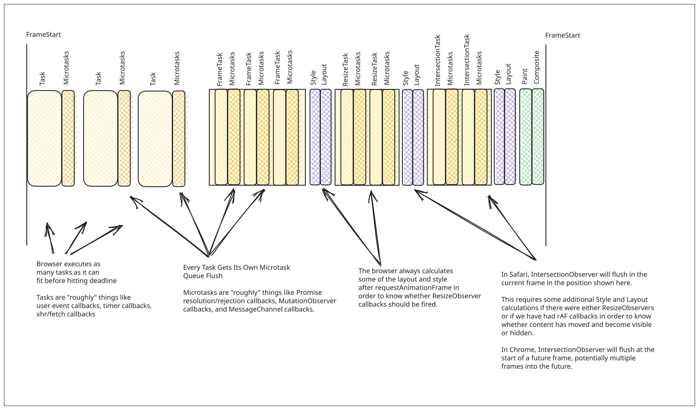

# Render Aware Scheduler Interface

## Summary

This RFC proposes replacing `@ember/runloop` ([Backburner.js](https://github.com/BackburnerJS/backburner.js))
with an interface for common scheduling needs.

The interface describes *intent* for when work should be performed in relation to the native
event queues and render cycle of the browser. The details of *how* that work is scheduled and
flushed are up to the specific implementation, allowing for experiments in this space.

Only the new interface, its phase functions, and a default implementation are proposed for
acceptance here; deprecating `@ember/runloop` and RSVP are proposed separately as
[RFC #1219](https://github.com/emberjs/rfcs/pull/1219) and
[RFC #1220](https://github.com/emberjs/rfcs/pull/1220).

## Motivation

### The Short Answer: *Better Things Now Exist*

Backburner (`@ember/runloop`) was written in an era that predates most async primitives including [microtasks](https://developer.mozilla.org/en-US/docs/Web/API/HTML_DOM_API/Microtask_guide) and [requestAnimationFrame](https://developer.mozilla.org/en-US/docs/Web/API/window/requestAnimationFrame).

It was written to help coordinate work that needed to complete before the browser might render again: in effect this made backburner a microtask polyfill, albeit one with requestAnimationFrame ideals.

[RSVP](https://github.com/tildeio/rsvp.js) similarly was written in an era in which native Promise support was being proposed but did not yet exist. As
such, while it provided an attempt at polyfilling microtasks, Ember chose to replace RSVP's microtask polyfill with
Backburner in order to reduce the overhead of promise flushing and reduce the risk of multiple renders occurring
within the same frame. In effect, this allowed Backburner to *also* function to [multiplex](https://en.wikipedia.org/wiki/Multiplexing)
Promises *and* to function as an *after microtasks complete* callback from which Ember's render work would be
flushed.

Notably, the idea of being able to control the last microtask in the queue for this sort of framework level
work has become [a common need](https://twitter.com/jarredsumner/status/1694351991626166658?s=20), but remains
a missing primitive.

In short, to summarize the motivations of the *current* system, Ember had need of

- a high priority task queue
- a guarantee of the ability to do its render work before browser render
- the ability to let async work complete before flushing render
- a signal that work was occurring after which it should render
- the ability to let other work be scheduled to be done relative
  to its render.

### The Other Short Answer: *Embrace The Platform*

Polyfilled microtasks typically do not have a meaningful stack trace due to their queued flush,
resulting in debugging and error tracing being especially difficult to use.

Native microtasks automatically piece together the stack trace across async boundaries, allowing
in most situations an error stack or a pause in a debugger to allow the developer to work back to
an originating change more quickly. This includes in performance
tooling such as the chrome profiler, where promises and other async callbacks will draw a line back to the point they were scheduled to help explore how the work evolved.

Thus encouraging use of native microtasks wherever possible automatically improves the debugging
experience for all developers, especially for remote traces captured by bugtracking software.

It also significantly simplifies the mental model and clarity for developers. While the concept of scheduling
will still exist, this RFC would enable developers to remove
"what is RSVP", "what is Backburner" and "what is the Runloop" from their mental model. Instead of thinking about scheduling, developers in most cases can "just use a promise" or "just use async/await" or "just use concurrency".

### The Complex Answer: *Making Mutation Safer & Performance*

As native promises, async/await usage, and raw fetch usage have become ever more prevalent,
the benefits of a "unified" flush provided by Backburner and the Backburner/RSVP configuration
have both diminished and even become largely detrimental.

Because Ember will re-render every time a flush occurs, interleaving native and RSVP promises
results in repeated re-renders while resolving a promise chain that ought to have produced a
single render. Similarly, every XHR/Fetch result produces its own render stack where before
requests that resolved within a very short time of each other would have usually had their
work scheduled into the same deferred backburner queue flush.

This results in not only a substantial amount of unnecessary and typically duplicate work
being done before the next meaningful render, but also results in thrashing the DOM and forced
layouts. In addition to poor performance, this becomes a disaster for accessibility tooling as
focus and DOM shifts rapidly around waiting for a final settled state.

Additionally, this interleaving means that there are three significant risks to application code
where async data fetching is involved:

1) Being notified due to an extraneous render to calculate too early before the data is in the
right settled state. This can result in errors due to missing or incomplete state that should
have been able to have been depended on to be there by the time of render.

2) Mutating state multiple times due to extraneous renders, leading to higher potential for
hitting the dreaded "backtracking render" error when it should have been safe to have read and
written multiple times.

3) Awaiting a data fetch and assuming that the work done after await occurs before render, when
due to Ember's current zealous flushing it is taking place post-render.

## Detailed design

### Scope of This RFC

Only the brand-new, purely additive API is proposed for acceptance here:
the `Strategy` interface, the phase functions and `registerStrategy` in
`@ember/scheduler`, and the default strategy in `@ember/scheduler/strategy`
(implemented in [emberjs/ember.js#21493](https://github.com/emberjs/ember.js/pull/21493)).
This surface is opt-in and changes no existing behavior.

Everything else is proposed in its own RFC: deprecating `@ember/runloop`
([RFC #1219](https://github.com/emberjs/rfcs/pull/1219)), deprecating RSVP
([RFC #1220](https://github.com/emberjs/rfcs/pull/1220)), and eventually
driving Ember's own rendering through this interface, once it has been
proven in apps, addons, and framework spikes
([emberjs/ember.js#21520](https://github.com/emberjs/ember.js/pull/21520)).
See the [Migration Roadmap](#migration-roadmap).

### Overview

The scheduler interface defines several "phases" of when work should be done
that align to concepts in the browser's render cycle. The primary goal is
to reduce the number of times Ember needs to alter the DOM per frame to 0 or 1
as often as possible.

We also want to help applications coordinate work in a way that avoids the pitfalls
of DOM read/write interleaving. This means we need to provide both a mechanism for
applications to schedule work that occurs *after* the render but before the browser
has painted, and a mechanism by which to schedule work *after* that work but also
before the browser has painted.

To understand the phases of work to be done, it helps to understand a bit about
the mechanics of the browser's render cycle.

### Frames

The scheduler interface conceptualizes work as belonging to a "Frame", where a Frame
constitutes the time between when states of the DOM are observable to a user.

Below is a rough approximation of how browsers schedule various work.



Tasks are things such as `setTimeout`, callbacks for `DOMEvent`s, or the completion
of an `xhr` or `fetch` request. The browser will execute as many tasks as it can
until it has met or passed the point at which it would like to try to update the screen.

`Microtasks` are callbacks executed via `queueMicrotask(callback)`, promise completion
such as `Promise.resolve().then(callback)`, `MutationObserver` callbacks, or `MessageChannel`
callbacks. Microtasks can recursively schedule new microtasks, and the browser will not
move on to another task or continue towards updating the screen until the queue is exhausted.

`FrameTasks` are callbacks executed for `requestAnimationFrame(callback)`. The browser
will execute all `FrameTasks` that existed when it began flushing the queue, but callbacks
may not schedule new `FrameTasks` recursively. E.g. any new calls to `requestAnimationFrame`
will go into the "next" Frame.

Similar to `FrameTasks`, `ResizeTasks` are for `ResizeObserver` callbacks and `IntersectionTasks`
are for `IntersectionObserver` callbacks. These queues can recursively schedule, though if
too much recursion is encountered by a `ResizeObserver` it errors and tries again on the next frame.

### Phases

With this understanding of the lifecycle of a Frame, roughly speaking we start to see a few
patterns for how we might want to schedule work in a way that seamlessly coordinates with the
framework and other parts of our application.

We divide this work into 6 conceptual phases:

- `tasks` - work that updates reactive state. This phase is not part of the scheduler interface: it is where code runs by default, and so needs no scheduling function.
- `render` - work that may need to adjust reactive state that needs to occur after Ember has updated the DOM and run any associated modifiers but before the browser shows the new state
- `layout` - work that needs to read DOM but does not require adjusting reactive state and should occur after `render` but before the browser shows the new state.
- `composite` - work that needs to write DOM but does not require reading state or adjusting reactive state and should occur after `render` and `layout` but before the browser shows the new state. E.g. adjusting transform values during an animation.
- `next` - work that should be deferred as a `task` to be done only once the browser has completed the current frame.
- `idle` - work that should be deferred until the browser is under less load.

We will discuss these phases in more depth below.

### Strategies

We refer to an implementation of the scheduler interface as a `Strategy`. The
strategy gets to choose when each promise will resolve, and what happens if
say `render` is invoked while `layout` is flushing.

```ts
interface Strategy {
  render(): Promise<void>;
  layout(): Promise<void>;
  composite(): Promise<void>;
  next(): Promise<void>;
  idle(): Promise<void>;
}
```

Notably the strategy has no knowledge of the work to be done. This keeps the scheduling
overhead light, and enables async stack traces for scheduled work to maintain the context
of where the work was scheduled.

For instance, take the strategy sketched below, a slightly simplified
version of the proposed default strategy discussed later. (The full
implementation, including `next()`, `idle()`, and non-browser fallbacks, is
in [emberjs/ember.js#21493](https://github.com/emberjs/ember.js/pull/21493).)
It handles `render`, `layout` and `composite` by registering ordered
`requestAnimationFrame` callbacks whose resolution flushes each phase's
awaiting work, allowing recursive calls to `render` and just-in-time calls
to `layout` and `composite` within the current frame. The `console.log`
calls exist purely to make the flush order visible in the examples that
follow.

**Example 1**
```ts
type FramePhase = 'render' | 'layout' | 'composite';

const PHASE_ORDER: Record<FramePhase, number> = { render: 0, layout: 1, composite: 2 };

class Frame {
  render = Promise.withResolvers<void>();
  layout = Promise.withResolvers<void>();
  composite = Promise.withResolvers<void>();
  complete = Promise.withResolvers<void>();
}

class FrameStrategy {
  _frame: Frame | null = null;      // the frame registered but not yet completed
  _nextFrame: Frame | null = null;  // while flushing, the frame to run after it
  _flushing: FramePhase | null = null;

  render(): Promise<void> {
    if (this._flushing === 'render') {
      // recursive scheduling into `render` resolves within the current window
      return Promise.resolve();
    }
    return this._phase('render');
  }

  layout(): Promise<void> {
    return this._phase('layout');
  }

  composite(): Promise<void> {
    return this._phase('composite');
  }

  _phase(name: FramePhase): Promise<void> {
    if (this._flushing === null) {
      this._frame ??= this._scheduleFrame();
      return this._frame[name].promise;
    }

    if (PHASE_ORDER[name] > PHASE_ORDER[this._flushing]) {
      // this phase of the flushing frame is still upcoming: resolve
      // just-in-time within the current frame
      return this._frame![name].promise;
    }

    // the window for this phase has already flushed this frame
    this._nextFrame ??= this._scheduleFrame();
    return this._nextFrame[name].promise;
  }

  _scheduleFrame(): Frame {
    let frame = new Frame();

    // callbacks registered with the browser in the same frame run in
    // registration order, giving us ordered phase windows within a single
    // frame, all before the next paint. Microtasks (and thus work awaiting
    // a phase) flush between callbacks. When a frame is scheduled while
    // another frame is flushing, the browser runs these callbacks in the
    // next frame.
    requestAnimationFrame(() => {
      console.log('flushing render');
      this._flushing = 'render';
      frame.render.resolve();
    });
    requestAnimationFrame(() => {
      console.log('flushing layout');
      this._flushing = 'layout';
      frame.layout.resolve();
    });
    requestAnimationFrame(() => {
      console.log('flushing composite');
      this._flushing = 'composite';
      frame.composite.resolve();
    });
    requestAnimationFrame(() => {
      console.log('flushing complete');
      this._flushing = null;
      this._frame = this._nextFrame;
      this._nextFrame = null;
      frame.complete.resolve();
    });

    return frame;
  }
}

const scheduler = new FrameStrategy();
```

Using this strategy, let's observe what happens when we use normal `async/await`
patterns to schedule some work.

**Example 2**
```ts
// simulates expensive blocking work, logging when it runs so the ordering
// is visible in the console and the performance profiler
function doExpensiveWork(name, step) {
  const start = performance.now();
  while (performance.now() - start < 10) {}
  console.log(`${step}. ${name}`);
}

async function doWork() {
  requestAnimationFrame(() => doExpensiveWork('before', 1));
  let render = scheduler.render();
  requestAnimationFrame(() => doExpensiveWork('after', 7));
  await render;
  doExpensiveWork('render', 2);
  await Promise.resolve();
  doExpensiveWork('promise', 3);
  await scheduler.render();
  doExpensiveWork('renderAgain', 4);
  await scheduler.layout();
  doExpensiveWork('layout', 5);
  await scheduler.composite();
  doExpensiveWork('composite', 6);
}

doWork();

// Output:
// 1. before
// flushing render
// 2. render
// 3. promise
// 4. renderAgain
// flushing layout
// 5. layout
// flushing composite
// 6. composite
// flushing complete
// 7. after
```

And a more complicated example with interleaving:

**Example 3**
```ts
requestAnimationFrame(() => doExpensiveWork('before', 0));
scheduler.render()
  .then(() => {
    doExpensiveWork('render', 1);

    scheduler.composite()
      .then(() => {
        doExpensiveWork('composite', 5);
      })
  });
requestAnimationFrame(() => doExpensiveWork('after', 8));

scheduler.render()
  .then(() => {
    doExpensiveWork('render', 2);

    scheduler.composite()
      .then(() => {
        doExpensiveWork('composite', 6);
      });

    return scheduler.composite();
  })
  .then(() => {
    doExpensiveWork('composite', 7);
  });

scheduler.composite()
  .then(() => {
    doExpensiveWork('composite', 4);
  });

scheduler.layout()
  .then(() => {
    doExpensiveWork('layout', 3);
    // `layout` is currently flushing, so this resolves in the next frame
    scheduler.layout()
      .then(() => doExpensiveWork('layout', 9));
  });

// Output:
// 0. before
// flushing render
// 1. render
// 2. render
// flushing layout
// 3. layout
// flushing composite
// 4. composite
// 5. composite
// 6. composite
// 7. composite
// flushing complete
// 8. after
// flushing render   (the next frame begins)
// flushing layout
// 9. layout
// flushing composite
// flushing complete
```

### The Default Strategy

Ember provides a default implementation of the scheduler interface as the
default export of `@ember/scheduler/strategy`:

```ts
import strategy from '@ember/scheduler/strategy';
```

The default strategy is the `FrameStrategy` sketched in Example 1 above,
completed with `next()`, `idle()`, environment fallbacks, and no logging.
It models work as belonging to a Frame and flushes
the `render` → `layout` → `composite` windows in order within a single frame,
before the next paint, by registering ordered `requestAnimationFrame`
callbacks. Its semantics follow the examples above:

- work scheduled while no Frame is flushing resolves in the corresponding
  phase of the upcoming Frame
- scheduling into a phase that the flushing Frame has not yet reached
  resolves "just-in-time" within the current Frame
- scheduling into `render` while `render` is flushing resolves recursively
  within the current Frame's render phase
- scheduling into a phase the flushing Frame has already passed (or into
  `layout`/`composite` while that same phase is flushing) resolves in the
  next Frame
- `next()` resolves in a new task once the current (or upcoming) Frame has
  completed; `idle()` resolves via `requestIdleCallback` where available,
  with a timeout cap so the promise remains resolvable on pages that never
  go idle
- in environments without `requestAnimationFrame` (such as SSR / FastBoot),
  phases degrade to equal-delay timers, preserving FIFO phase ordering

### Providing a Strategy

```ts
import { registerStrategy } from '@ember/scheduler';
```

The scheduling strategy should be provided by registering it when defining the Application.

```ts
import Application from '@ember/application';
import { registerStrategy } from '@ember/scheduler';
import Resolver from 'ember-resolver';
import loadInitializers from 'ember-load-initializers';
import config from 'my-app/config/environment';

// the default scheduler implementation
import strategy from '@ember/scheduler/strategy';

export default class App extends Application {
  modulePrefix = config.modulePrefix;
  podModulePrefix = config.podModulePrefix;
  Resolver = Resolver;
}

registerStrategy(strategy);
loadInitializers(App, config.modulePrefix);
```

The strategy is registered exactly once: calling `registerStrategy` a second
time with a different strategy is an assertion error, as swapping strategies
mid-flight would strand work already scheduled into the previous strategy's
phases. Scheduling into a phase before any strategy has been registered is
also an assertion error, with a message that shows how to register the
default strategy.

### Scheduling Work Into a Phase

Each phase has a corresponding import from `@ember/scheduler` for
use in scheduling in the app.

```ts
import { render, layout, composite, next, idle } from '@ember/scheduler';
```

Each import is a function returning a promise that resolves according
to the registered strategy.

```ts
await render();
```

This allows scheduling from any function, class or context regardless
of ability to access an ember service.

### Cancelling Work

Since the scheduler does not itself store any callbacks, there is no need
to tell the scheduler to cancel work. Instead, if your work requires cancellation
or cleanup, handle this at the point the work was scheduled.

```ts
import Component from '@glimmer/component';
import { tracked } from '@glimmer/tracking';
import { isDestroyed } from '@ember/destroyable';
import { render } from '@ember/scheduler';

class Example extends Component {
  @tracked width = 10;

  async doWork() {
    this.width = 100;
    await render();
    if (isDestroyed(this)) {
      return;
    }
    // safe to continue working with the updated DOM
  }
}
```

Libraries or the framework may desire to provide sugar for automated cleanup,
and can do so over this much simpler primitive.

### The Phases In Detail

Each phase carries rules about the kind of work that is appropriate within
it, collected here in one place. Violations of the ❌ rules error in
development mode:

| Phase | Write reactive state | Read DOM | Write DOM |
| --- | --- | --- | --- |
| `tasks` | ✅ | ✅ | ✅ |
| `render` | ✅ (a rerender before paint is not guaranteed) | ✅ | ❌ |
| `layout` | ❌ | ✅ | ❌ |
| `composite` | ❌ | ⚠️ allowed but discouraged (forces layout) | ✅ |
| `next` | ✅ | ✅ | ✅ |
| `idle` | ✅ | ✅ | ✅ |

#### Phase 1: Tasks

In this first phase, state is read and modified as a reaction to either
a user interaction, network request completion, or timer callback.

These "tasks" and their associated microtasks "simply just work". Users
need to do no special scheduling (such as the runloop's former `schedule('actions', callback)`
and `schedule('routerTransitions', callback)` queues), and need to use zero framework-
or library-provided primitives (such as RSVP, or the runloop's `bind` `run` or `join` methods).

In order for this to work, Ember's reactivity system will be evolved to ensure that it
becomes responsible for scheduling an update to render whenever reactive state has changed.

This more or less means that the reactivity primitives we use become responsible for
triggering the render schedule or a revalidation, instead of using backburner's
`on('begin', callback)` to schedule a render any time a runloop is initiated as is the
case today, and `on('end', callback)` to schedule a revalidate (as it does today).

During the tasks phase, user code cannot expect the DOM to have updated to reflect changes to
state. This is similar to how the timing expectations work in the runloop today with `render`
and `afterRender`, but extends this expectation across potentially multiple tasks and
microtasks.

#### Phase 2: Render

The render phase occurs whenever Ember has decided to render new DOM containing
the changes you've just made. Scheduling into `render` guarantees that your work has
access to that DOM prior to the next paint.

```ts
import { render } from '@ember/scheduler';

// ...

await render();
```

A strategy may choose to flush render at any time, potentially multiple
times, so long as the work completes prior to the next paint.

The phase functions in `@ember/scheduler` delegate directly to the registered
strategy and add no wrapping of their own. The guarantee that new DOM exists
by the time your work runs comes from ordering: once Ember's rendering is
driven by this interface (see the Migration Roadmap), the renderer awaits
`render` before any application code can, so generation of DOM and execution
of modifiers flush ahead of application `await render()` continuations.

During the render phase, updates to reactive state are allowed, but Ember does not
guarantee that any updates will rerender before the next paint; this is up to the
strategy to decide.

During the transition away from the runloop, both `schedule('render')` and
`schedule('afterRender')` will be mapped mechanically onto this phase,
preserving their relative order. Code that used `afterRender` to *measure*
DOM should migrate to `layout()`, the phase designed for reads.

#### Phase 3: Layout

The layout phase occurs after the render phase and prior to the next paint.

```ts
import { layout } from '@ember/scheduler';

// ...

await layout();
```

This phase is for work that needs to read DOM but does not require adjusting reactive state.

#### Phase 4: Composite

The composite phase occurs after the layout phase and prior to the next paint.

```ts
import { composite } from '@ember/scheduler';

// ...

await composite();
```

This phase is for work that needs to write DOM but does not require reading DOM state
or adjusting reactive state.

Users should take every opportunity to avoid reading DOM in this phase to avoid forced
layouts and interleaved read/write of DOM state.

This phase is ideal for updating animations or moving tooltips to a final position based
on measurements made in the previous phase.

#### Phase 5: Next

This phase is for work that needs to escape the current frame but is still a relatively
high priority.

```ts
import { next } from '@ember/scheduler';

// ...

await next();
```

#### Phase 6: Idle

This phase is for work that is low priority. Most commonly tasks like background fetch, server pings, or analytics processing.

```ts
import { idle } from '@ember/scheduler';

// ...

await idle();
```

### Migration Roadmap

None of the following is proposed for acceptance by this RFC; the linked
RFCs are the authoritative source for their own details.

1. **Deprecate RSVP** — [RFC #1220](https://github.com/emberjs/rfcs/pull/1220).
   Native `Promise` replaces the `rsvp` module bundled with `ember-source`,
   and Ember stops configuring RSVP's flush through backburner.
2. **Deprecate `@ember/runloop`** — [RFC #1219](https://github.com/emberjs/rfcs/pull/1219).
   All exports are deprecated in favor of platform primitives, modifiers,
   destroyables, and test waiters, `later`/`debounce`/`throttle` included.
   See [Alternatives](#alternatives) for how #1219 relates to this
   proposal.
3. **An async-rendering RFC** for a `use-async-scheduler` optional feature —
   the point at which the registered strategy actually controls Ember's own
   render timing. Ember's glimmer integration shifts from assuming its
   render flush is synchronous to scheduling its render and revalidation
   through this interface. This carries the bulk of the compatibility risk,
   since apps may be accidentally reliant on "sync complete" timing, so it
   ships behind an app-wide optional feature, following the
   `default-async-observers` precedent (RFC #0494). During the transition,
   any not-yet-removed runloop APIs delegate into the interface:
   `run`/`join`/`bind` simply execute their callback, `next` and the named
   queues map onto the corresponding phases, and `schedule('actions', doWork)`
   becomes `Promise.resolve().then(doWork)`. The test story ships with the
   feature: test waiters observe the scheduler so `settled()` continues to
   mean "all scheduled work has finished."

In parallel (not RFC-gated), ember-concurrency should remove its usage of
the runloop and RSVP, and add a test waiter to its tasks.

## How we teach this

### The platform comes first

The first lesson is when *not* to use this API. Most code needs no
scheduler at all: update `@tracked` state and rendering happens; use a
modifier to set up and tear down behavior on an element; use
`async`/`await`, `setTimeout`, `requestAnimationFrame`,
`requestIdleCallback`, `ResizeObserver`, and `IntersectionObserver`
directly for everything they already cover. The terms "runloop",
"Backburner", and "RSVP" leave the mental model, and "scheduler" does not
take their place for everyday code.

`@ember/scheduler` is for the unusual remainder: performance-sensitive code
that must coordinate DOM reads and writes with Ember's DOM update and the
upcoming paint, a window the platform has no hook for. Its audience is
addon authors of DOM-coordinating libraries (animation, measurement,
virtualized lists, positioning) and the framework itself, the same way
`requestAnimationFrame` is documented for library authors rather than for
everyday application code.

| You want to… | Use |
| --- | --- |
| Update tracked state | nothing — just update it |
| Set up / tear down behavior on an element | a modifier |
| Delays, polling, one-off frame callbacks | `setTimeout` / `requestAnimationFrame` |
| React to size or visibility changes | `ResizeObserver` / `IntersectionObserver` |
| Coordinate work with Ember's DOM update, before paint | `await render()` |
| …then measure DOM without thrashing layout | `await layout()` |
| …then write styles from those measurements | `await composite()` |
| Continue after the frame has been shown | `await next()` |
| Low-priority background work | `await idle()` |

### Names and terminology

The phase names come from the browser's rendering pipeline rather than from
Ember's history: `render`, `layout`, and `composite` correspond to stages
developers already see in browser performance tooling. Two terms are
introduced: a **phase** (a named window of time within or after a frame,
entered by awaiting a promise) and a **strategy** (an implementation of the
interface, which decides when each phase's promise resolves). Present this
as a new pattern, not as "the new runloop".

### Guides and API documentation

The runloop currently occupies an entire advanced section of the guides.
That section is eventually replaced by a much shorter advanced guide,
"Scheduling work around rendering", built around the frame diagram and
phase table from this RFC. Nothing about the scheduler needs to appear in
the introductory guides. All new API ships with full API documentation
([emberjs/ember.js#21493](https://github.com/emberjs/ember.js/pull/21493)),
and the development-mode assertions cover misuse at the point it happens:
scheduling with no registered strategy, and the phase-rule violations in
the table above.

### Existing users

Existing users know this problem space through `@ember/runloop`; the
deprecation guides for RFCs #1219 and #1220 teach by translation:

| Today | After this RFC's roadmap |
| --- | --- |
| `schedule('render', cb)` / `schedule('afterRender', cb)` | `await render()` |
| DOM measurement in `afterRender` | `await layout()` |
| `next(cb)` | `await next()` |
| `later` / `debounce` / `throttle` | `setTimeout` and userland utilities (per RFC #1219) |
| `run`, `join`, `bind` | none needed — just call the function |
| `RSVP.Promise`, `RSVP.resolve`, … | native `Promise` (per RFC #1220) |
| `scheduleOnce('render', obj, method)` | `await render()`, deduplicating at the call site |

Test-writers keep their existing mental model: `await settled()` continues to
mean "all scheduled work has finished."

## Drawbacks

- `@ember/runloop` and RSVP appear in nearly every mature app and many
  addons. The deprecate-and-remove arc spans multiple majors, though much
  of it is already chartered by the RFCs listed in the Motivation and by
  RFC #1219 and RFC #1220.
- Timing changes show up as behavioral bugs, not build warnings. Apps that
  depend on synchronous flush semantics only find out at runtime, which is
  why rendering through the scheduler will ship behind an app-wide optional
  feature, at the cost of two timing modes coexisting during the
  transition.
- Test integration is the critical path. Until test waiters can observe the
  scheduler, `settled()` cannot, and the async-rendering feature is not
  practically adoptable.
- Because the scheduler stores no callbacks, there is no `cancel()`, no
  `scheduleOnce`-style deduplication, and no queue for tooling like Ember
  Inspector to display. Cleanup and deduplication move to the call site.
- Promises cannot express "flush right now". Interop that relies on `run()`
  forcing a synchronous flush has no equivalent in this interface.
- "Before the next paint" only holds where a paint exists. In background
  tabs and SSR the default strategy degrades to ordered timers.
- The development-mode phase errors require instrumentation in the
  framework and carry some risk of false positives.

## Alternatives

### Do nothing

The costs in the Motivation grow as native async usage grows. The
performance exploration accompanying this RFC
([emberjs/ember.js#21520](https://github.com/emberjs/ember.js/pull/21520))
measured scheduler-driven rendering at roughly 4.5x frame throughput on the
DB Monitor benchmark and 6-21x on update-heavy benchmarks, and found
scheduling to be a larger performance lever than any rendering-engine
optimization tested alongside it.

### Deprecate the runloop with no replacement

[RFC #1219](https://github.com/emberjs/rfcs/pull/1219) proposes that
platform primitives, modifiers, destroyables, and test waiters cover
real-world needs, with no public scheduling interface at all. The two
proposals share the same diagnosis and nearly the same migration path, and
are not in conflict. This RFC holds that `layout`/`composite`, coordinated
read/write batching between Ember's DOM update and paint, is the one need
on that list the platform does not cover.

### Modernize Backburner in place

Keeps the callback-queue model: stack traces still originate inside a
flush, and every native `await` still exits the unified flush.

### A callback-based scheduler interface

`schedule('layout', cb)` with a cancellation token would keep central
cancellation and introspection, but loses native async stack traces and
`async`/`await` composability, and requires the scheduler to store and
flush work.

### Build on `scheduler.postTask`

Provides task priorities but no phases relative to the framework's DOM
update. A future strategy could implement `next` and `idle` on top of it
without changing the interface.

### Adopt an existing scheduling library

React's `scheduler` time-slices the framework's own work; `fastdom` batches
DOM reads and writes but has no knowledge of a framework render. Neither
covers this interface.

### Prior art

React (`useLayoutEffect` / `useEffect`), Vue (`nextTick` and watcher
`flush: 'pre' | 'post' | 'sync'`), Svelte (`tick()`), and Angular's move to
zoneless change detection all give user code a way to schedule relative to
framework-owned render timing. What is distinctive here is that the phases
are awaitable promises and the strategy is swappable.

## Unresolved questions

None at this time.
