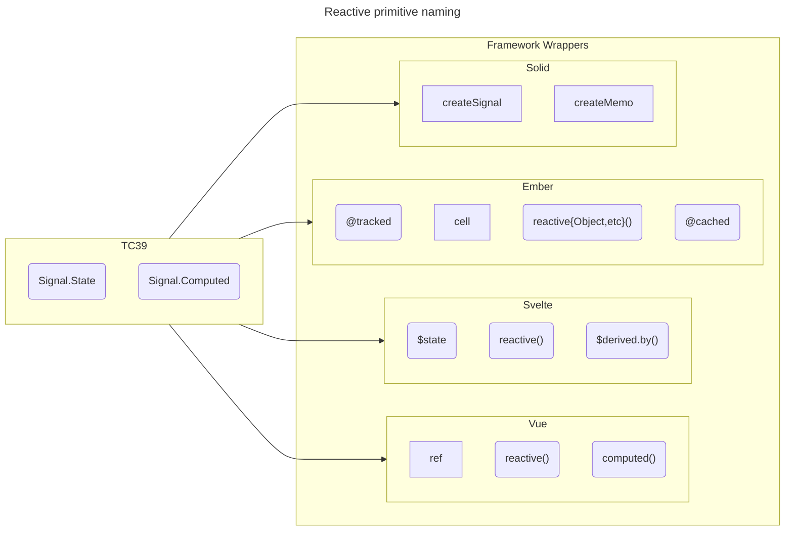
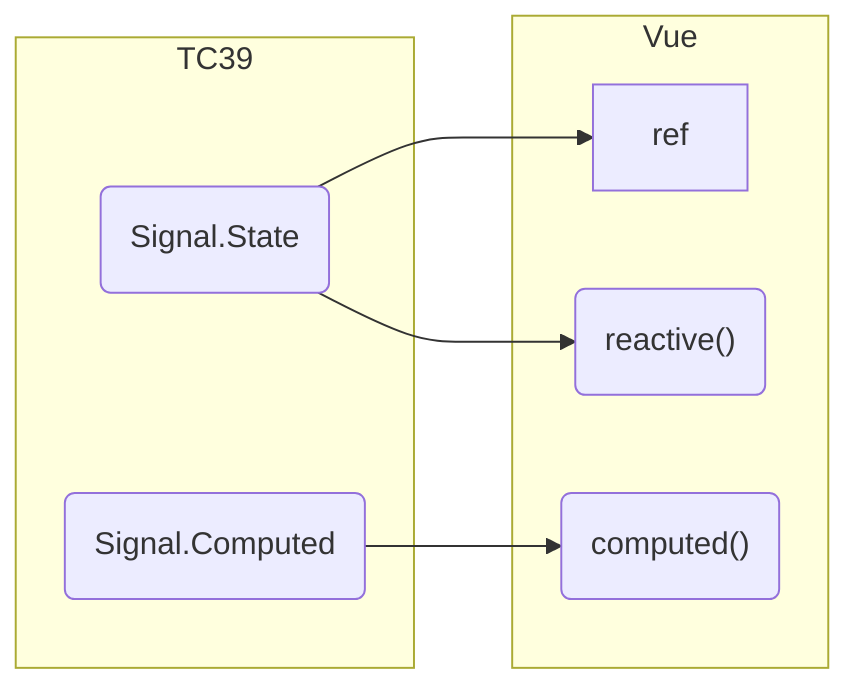
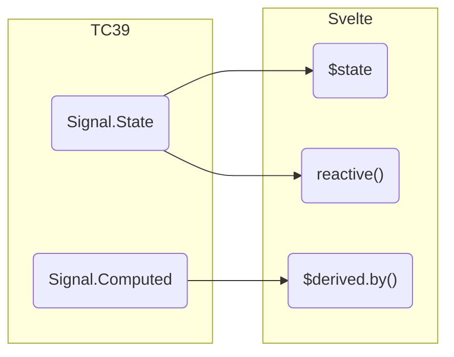
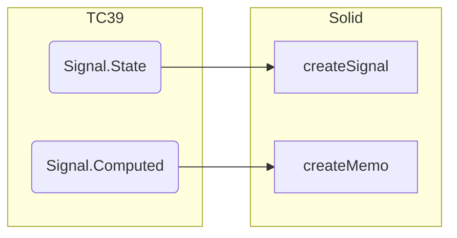
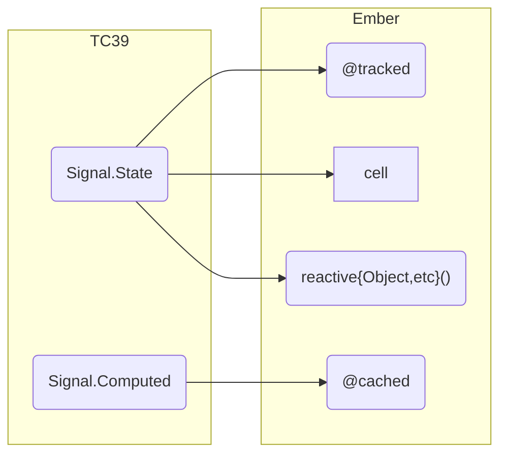

<!--- 
Directions for above: 

stage: Leave as is
start-date: Fill in with today's date, 2032-12-01T00:00:00.000Z
release-date: Leave as is
release-versions: Leave as is
teams: Include only the [team(s)](README.md#relevant-teams) for which this RFC applies
prs:
  accepted: Fill this in with the URL for the Proposal RFC PR
project-link: Leave as is
suite: Leave as is
-->

# Introduce `cell` 

## Summary

This RFC introduces a new tracking primitive, which represents a single value, the `Cell`.

## Motivation

The `Cell` is part of the "spreadsheet analogy" when talking about reactivity -- it represents a single tracked value, and can be created without the use of a class, making it a primate candidate for demos[^demos] and for creating reactive values in function-based APIs, such as _helpers_, _modifiers_, or _resources_. They also provide a benefit in testing as well, since tests tend to want to work with some state, the `Cell` is wholly encapsulated, and can be quickly created with 0 ceremony. 

This is not too dissimilar to the [Tracked Storage Primitive in RFC#669](https://github.com/emberjs/rfcs/blob/master/text/0669-tracked-storage-primitive.md). The `Cell` provides more ergonomic benefits as it doesn't require 3 imports to use. This RFC intends to replace the unimplemented storage-primitives. 

The `Cell` was prototyped in [Starbeam](https://starbeamjs.com/guides/fundamentals/cells.html) and has been available for folks to try out in ember via [ember-resources](https://github.com/NullVoxPopuli/ember-resources/tree/main/docs/docs). 

[^demos]: demos _must_ over simplify to bring attention to a specific concept. Too much syntax getting in the way easily distracts from what is trying to be demoed. This has benefits for actual app development as well though, as we're, by focusing on concise demo-ability, gradually removing the amount of typing needed to create features. 

## Detailed design

> [!NOTE]  
> Only `cell` will be importable as a value. The types will also be importable, but the `Cell` class is private. 

### Types 

Some interfaces to share with future low-level reactive primitives:

~~~ts
interface Reactive<Value> {
   /**
    * The underlying value
    *
    * Allows easy usage of reactive values in templates.
    *
    * @example
    *
    * ```gjs
    * const myCell = cell(0);
    * <template>
    *   {{myCell.current}}
    * </template>
    * ```
    */
    current: Value;
}

interface ReadOnlyReactive<Value> extends Reactive<Value> {
    /**
    * The underlying value.
    * Cannot be set.
    */
    readonly current: Value;
}

/**
* Utility to create a Cell without the caller using the `new` keyword.
* exists as a separate function so that in memory, there is only one copy of the Cell class,
* with a single constructor.
*/
function cell<Value>(
    initialValue: Value,
    options?: { 
        equals: (a: Value, b: Value) => boolean, 
        description?: string 
    } = {}
) {
  return new Cell(
    initialValue,
    {
      equals: options?.equals ?? Object.is,
      description: options?.description
    }
  );
}

interface Cell<Value> extends Reactive<Value> {
    /**
    * Function short-hand of updating the current value
    * of the Cell
    *
    * This is a convience method for different usage-styles, and is functionally the same as
    * assigning the `.current` value.
    */
    set: (value: Value) => boolean;
    /**
    * Function short-hand for using the current value to 
    * update the state of the Cell
    */
    update: (fn: (value: Value) => Value) => void;

    /**
     * Prevents further updates, making the Cell
     * behave as a ReadOnlyReactive
     *
     * This is an optimization that avoids update-checking later.
     */
    freeze: () => void;
}
~~~

Behaviorally, the `Cell` behaves almost the same as this function:
```js
function cell(initial, { equals, description ) = {}) {
  return new CellPolyfill(initial, { equals, description });
}

class CellPolyfill {
    #isFrozen = false;
    #value;

    constructor(initialValue, options) {
        this.#value = initialValue;
        this.#equals = options.equals;
        this.#description = options.description;
        // ...
    }

    get current() {
        // + consume
        return this.#value;
    }
    set current(value) {
        assert(`Cannot set a frozen Cell`, !this.#isFrozen);
        // + dirty
        this.#value = value;
    } 

    set(value) {
        this.current = value;
    }

    update(updater) {
        // #value is not tracked, 
        // so update reads without consuming
        this.current = updater(this.#value);
    }

    freeze() {
        this.#isFrozen = true;
    }
}
```

The key difference is that with a primitive, we expose a new way for developers to decide when their value becomes dirty.
The above example, and the default value, would use the "always dirty" behavior of `() => false`.

This default value allows the `Cell` to be the backing implementation if `@tracked`, as `@tracked` values do not have equalty checking to decide when to become dirty.

For example, with this Cell and equality function:

```gjs
const value = cell(0, { equals (a, b) => a === b });

const selfAssign = () => value.current = value.current;

<template>
    <output>{{value}}</output>

    <button {{on 'click' selfAssign}}>Click me</button> 
</template>
```

The contents of the `output` element would never re-render due to the value never changing. 

This differs from `@tracked`, as the contents of `output` would always re-render.


### Usage

Incrementing a count with local state.

```gjs
import { cell } from '@glimmer/tracking';

const increment = (c) => c.current++;

<template>
    {{#let (cell @initialCount) as |count|}}
       Count is: {{count.current}} 

        <button {{on "click" (fn increment count)}}>add one</button>
    {{/let}}
</template>
```

Incrementing a count with module state.
This is already common in demos.

```gjs
import { cell } from '@glimmer/tracking';

const count = cell(0);
const increment => count.current++;

<template>
   Count is: {{count.current}} 

    <button {{on "click" increment}}>add one</button>
</template>
```

Using private mutable properties providing public read-only access:

```gjs
export class MyAPI {
    #state = cell(0);

    get myValue() {
        return this.#state;
    }

    doTheThing() {
        this.#state = secretFunctionFromSomewhere(); 
    }
}
```


### Re-implementing `@tracked` 

For most current ember projects, using the TC39 Stage 1 implementation of decorators:

```js
function tracked(target, key, { initializer }) {
  let cells = new WeakMap();

  function getCell(obj) {
    let cell = cells.get(obj);

    if (cell === undefined) {
      cell = new Cell(initializer.call(this), { equals: null, description: `tracked:${key}` });
      cells.set(this, cell);
    }

    return cell;
  };

  return {
    get() {
      return getCell(this).current;
    },

    set(value) {
      getCell(this).set(value);
    },
  };
}
```

<details><summary>Using spec / standards-decorators</summary>

```js
import { Cell } from '@glimmer/tracking';
    
export function tracked(target, context) {
  const { get } = target;

  return {
    get() {
      return get.call(this).current;
    },

    set(value) {
      get.call(this).set(value);
    },

    init(value) {
      return new Cell(value, { equals: null, description: `tracked:${key}` });
    },
  };
}
```

</details>

### Usage as "side-signals"

Side-signals are the reactive approach used in tracked-bulit-ins, and other reactive-collections, where the Signal/Cell/tracked value isn't relevant / not used, and the reactive collection only uses the reactive structure for telling the renderer when to update/render/etc.

This can often be done with proxies:
```ts
import { cell } from '@glimmer/tracking';

const nonReactiveObject = {};

let cache = new WeakMap<object, Map<key, Cell>>();

function getReactivity(obj) {
    if (cache.has(obj)) {
        return reactiveCache.get(obj);
    }

    let cacheForObj = new Map();
    reactiveCache.set(obj, cacheForObj);
    return cacheForObj;
}

function consume(cacheForObj, key) {
    let cache = keyCache(cacheForObj, key);

    cache.read();
}

function dirty(cacheForObj, key) {
    let cache = keyCache(cacheForObj, key);

    cache.set(null);
}

function keyCache(obj, key) {
    let existing = cacheForObj.get(key);

    if (existing) {
        return existing;
    }

    existing = cell(null, { equals: () => false });
    cacheForObj.set(existing, key);
    return existing;
}

const myReactiveObject = new Proxy(nonReactiveObject, {
    get(target, key) {
        let reactiveValues = getReactivity(target);

        consume(reactiveValues, key);

        return Refluct.get(...arguments);
    },
    set(target, key, value) {
        let reactiveValues = getReactivity(target);

        dirty(reactiveValues, key);

        return Refluct.set(...arguments);
    }
});

// now using `myReactiveObject` is reactive
myReactiveObject.foo = 2; 
```


## How we teach this

The `Cell` is a primitive, and for most real applications, folks should continue to use classes, with `@tracked`, as the combination of classes with decorators provide unparalleled ergonomics in state management. 

However, developers may think of `@tracked` (or decorators in general) as magic -- we can utilize `Cell` as a storytelling tool to demystify how `@tracked` works -- since `Cell` will be public API, we can easily explain how `Cell` is used to _create the `@tracked` decorator_.

We can even use the example over-simplified implementation of `@tracked` from the _Detailed Design_ section above.

### When to use `current`

Allows for easy use in templates as well as assignment

```gjs
import { cell } from '@glimmer/tracking';

const increment = (c) => c.current++;

<template>
    {{#let (cell @initialCount) as |count|}}
       Count is: {{count.current}} 

        <button {{on "click" (fn increment count)}}>add one</button>
    {{/let}}
</template>
```

### When to use `set()`

Allows partial application, e.g.:

```gjs
import { cell } from '@glimmer/tracking';

<template>
    {{#let (cell @initialCount) as |count|}}
       Count is: {{count.current}} 

        <button {{on "click" (fn count.set 1)}}>set one</button>
        <button {{on "click" (fn count.set 2)}}>set two</button>
    {{/let}}
</template>
```

### When to use `update()`

Allows updating a value without consuming/entangling with the current value.
Can be useful for changing the initial value once.


```gjs
import { cell } from '@glimmer/tracking';

let num = cell(0);

export class Demo extends Component {
    constructor() {
        super(...arguments);

        num.update((previous) => previous + 1);
    }

    <template>
        {{num.current}} => renders 1
    </template>
}

```


### When to use `freeze()`

Prevents further updates to the Cell. 


## Drawbacks

- another API

## Alternatives

- Have the cell's equality function check value-equality of primitives, rather than _always_ dirty. This may mean that folks apps could subtly break if we changed the `@tracked` implementation. But we could maybe provide a different tracked implementation from a different import, if we want to pursue this equality checking without breaking folks existing apps.

## Unresolved questions

- none yet

## Appendix

### Naming

Naming in the broader context of the JavaScript ecosystem, and why we're using "Cell"[^other-rfcs-pending][^relationships-for-demonstration-only]:


[^other-rfcs-pending]: Other RFCs are pending for this all to be fully coherent and make sense. For example, we need [RFC #1122: Resources](https://github.com/emberjs/rfcs/pull/1122) as well as a (at the time of writing) not yet submitted RFC for how we adapt with TC39 Signals, and the other reactive ecosystems[^implementation-details].


[^relationships-for-demonstration-only]: The relationships shown between TC39 and the respective frameworks here are speculative, and while we can prepare for reactive programming making in to _THE PLATFORM_ and have what's going on in the broader ecosystem, it is too early to _formally support_ something like TC39 Signals. But this is not to say we can't have interop with something generic in the future (so if folks wanted to use something they're actively told not use in production, they could)

[^implementation-details]: the details of how Cell gets implemented _could_ be the glue that holds all ecosystems together. More on that in another RFC (see also: [Starbeam](https://starbeamjs.com/)).



#### TC39

Current proposed namespace is `Signal`, but an individual state value _is_ called a `Signal`.

#### Vue

Vue uses `ref` for state and `computed()` for cached values.




#### Svelte

Svelte uses _runes_, and changes semantics of syntax of runtime javascript, to help its developers type less (at the cost of learning magic behavior).

But they use `$state` and `$derived` for their state + cache concepts.



#### Solid

Solid has a slight SEO situation as their primitive value is _also_ called a Signal conflates TC39's Signal with its own Signals. This can be an SEO problem, as folks searching for "JavaScript Signals" can find results for both TC39 Signals and Solid Signals.

This brings up something we need to consider when naming -- the intent of what we're using in our reactive programs/apps vs what the name of the actual APIs. 



#### Ember

We have a strong case for using `cell` in Ember, because of the aforementioned "spreadsheet analogy".

`cell` is a single value, and it isn't currently used by any of the other reactive frameworks, thus helping with our SEO (avoiding conflation, as we'd have with `Signal`, or if we chose any other name, we'd conflict and be conflated with the other frameworks).

TC39 has chosen _computed_ for its cache, which we _cannot_ use due to our historical use of `computed()` and `@computed` in pre-Octane-era Ember (pre 2019), so sticking to `@cached` makes sense for us long-term.



> [!IMPORTANT]
> We have no intention of renaming our our core utilities in ember as that would cause a ton of unneeded churn for no value. This deos not mean that at some point in the future, all the other framework's utilities wouldn't be usable in ember. We want our specific names (Cell, etc), to be unique to ember for both SEO reasons, and for future conflict avoidance reasons (which are currently outside the scope of this RFC)

