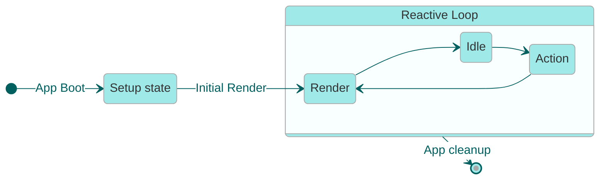

<!--- 
Directions for above: 

stage: Leave as is
start-date: Fill in with today's date, 2032-12-01T00:00:00.000Z
release-date: Leave as is
release-versions: Leave as is
teams: Include only the [team(s)](README.md#relevant-teams) for which this RFC applies
prs:
  accepted: Fill this in with the URL for the Proposal RFC PR
project-link: Leave as is
suite: Leave as is
-->

<!-- Replace "RFC title" with the title of your RFC -->

# The Glimmer Reactivity System 

## Summary 

An explanation of the depths of the reactivity system we've been using and refining since Ember Octane (ember-source 3.13+).


## Motivation

Unlike other RFCs, this RFC is more about documenting the details and concepts of reactivity at a low level so that we may build other primitive utilities that build on the concepts laid out in this document. This unblocks implementation of [`Cell`](https://github.com/emberjs/rfcs/pull/1071), Resources (and other primitives), and gives us more details to work with when describing reactive behavior.

This is just an overview, and much of it is copied from the source-of-truth, the markdown docs code-located with the sourcecode that implements these behaviors.

Details and further updates are not and will not be added to this document.

## Detailed design

### Terms to Know 

As you read this document, some of the terms may be unfamiliar, here they are:

- **Algebraic Primitive**: An element or concept that generates a larger structure or building block that can't be defined in terms of other lower-level concepts. All user-land primitives are actually higher-level concepts built on these primitives. But may favor performance over ergonomics (which result in the need for user-land "primitives")

- **Monotonic**: for the purposes of our reactivity system -- this is a number that only ever increases. 


### Background

1. [Tag Composition](#tag-composition): The formal composition semantics of Glimmer's tag-based
   validation system.
2. [The Fundamental Laws of Reactivity](#laws): A definition of Glimmer's reliable and
   consistent reactive programming model, and the rules that reactive abstractions must
   satisfy in order to safely support this model.
3. [System Phases](#system-phases): A description of the phases of the Glimmer execution model:
   _action_, _render_, and _idle_, and how the exeuction model supported batched _UI_ updates while
   maintaining a _coherent_ data model.
4. [Reactive Abstractions](#reactive-abstractions): A description of the implementation of
   a number of reactive abstractions, and how they satisfy the laws of reactivity.

   
#### Tag Composition

Glimmer's reactivity system is founded on a minimal algebraic primitive called _Tag_. Tags operate on a _monotonic revision timeline_ and compose within _tracking frames_.

Tags intentionally exist as a separate layer from the [reactive values](./reactive-values.md) they represent, creating a clean separation between validation algebra and value semantics.

> [!NOTE]
>
> This separation distinguishes Glimmer from most reactive systems: Glimmer can validate reactive computations without recomputing values or performing equality comparisons. While this approach doesn't provide reference-equality-based cutoffs for invalidation propagation, it enables reliable fine-grained validation and controlled root-state invalidation through equivalence rules. At scale, this architecture yields significant benefits in predictability and performance.

##### Core Algebraic Primitives

- **Revision Timeline**: A monotonically increasing sequence where each increment represents an atomic change. The timeline advances in a discrete and monotonic manner, with each new revision strictly greater than all previous revisions.

- **Tag**: A stateful object that represents a timestamp (revision) on the timeline when its
  associated value or computation last changed. _Tags can be retained and later used to determine if
  a previously snapshotted value is still valid, without recomputing that value._
  
  All tags support the `[Consume]` operation, which records the tag in the current tracking frame when accessed.

- **Value Tag**: <a id="value-tag"></a> The base tag type that tracks when a single value changes.

- **Mutable Tag**: A tag that can be explicitly updated with:
  - `[Update]`: Advances the timeline and records the new revision as the tag's current revision.
  - `[Freeze]`: Marks a tag as immutable, preventing its accesses from being recorded in tracking frames.

- **Combined Tag**: <a id="combined-tag"></a> A tag that represents the join (maximum) of multiple tag revisions. This join operation maintains the algebraic property that if any constituent tag invalidates, the combined tag also invalidates.

- **Tracking Frame**: A collector that accumulates tags consumed during a computation. The frame has
  two operations:
  - `[Begin]`: Creates a bounded context for tag collection.
  - `[Commit]`: Closes the collection scope and produces a combined tag from the collected tags.

- **Tracking Stack**: A nested structure of tracking frames representing the current computation hierarchy. Enables compositional reactive tracking across function boundaries.

##### Revision Timeline

The revision timeline forms the foundation of Glimmer's validation algebra. It consists of:

- **Initial Revision**: Timeline begins at revision `1`.
- **Constant Revision**: Special revision `0` indicates values that never change. Tags with this revision are not tracked.
- **Timeline Advancement**: Each atomic update advances the global timeline exactly once.
- **Revision Comparison**: Two tags can be compared by examining their respective revisions.

> [!NOTE]
>
> Revision `0` (constant revision) receives special treatment in the algebra. Tags with revision `0` do not participate in tracking and a frame containing only constant tags is itself considered constant.


#### The Fundamental Laws of Reactivity

##### ♾ The Fundamental Axiom of Reactivity

> ### "A reactive abstraction must provide both the current value and a means to detect invalidation without recomputation."

From the perspective of a Glimmer user, this axiom enables writing reactive code using standard
JavaScript functions and getters that automatically reflect the current state of UI inputs.

**Glimmer users write UI code as straightforward rendering functions**, yet the system behaves _as
if_ these functions re-execute completely whenever any reactive value changes.

> [!IMPORTANT]
>
> When root state is mutated, all reactive abstractions reflect those changes immediately, even when
> implemented with caching. Glimmer's reactive values are _always coherent_ — changes are never
> batched in ways that would allow inconsistencies between computed values and their underlying root
> state.

##### Definitions

- **Root Reactive State**: An atomic reactive value that can be updated directly. It is represented
  by a single [value tag](./concepts.md#value-tag). You can create a single piece of root state
  explicitly using the `cell` API, but containers from `tracked-builtins` and the storage created by
  the `@tracked` decorator are also root reactive state.
- **Formula**: A reactive computation that depends on a number of reactive values. A formula's
  revision is the most recent revision of any of the members used during the last computation (as a
  [combined tag](./concepts.md#combined-tag)). A
  formula will _always_ recompute its output if the revision of any of its members is advanced.
- **Snapshot**: A _snapshot_ of a reactive abstraction is its _current value_ at a specific
  revision. The snapshot <a id="invalidate"></a> _invalidates_ when the abstraction's tag has a more
  recent revision. _A reactive abstraction is said to _invalidate_ when any previous snapshots would
  become invalid._

##### The Fundamental Laws of Reactivity

In order to satisfy the _Fundamental Axiom of Reactivity_, all reactive abstractions must adhere to these five laws:

1. **Dependency Tracking**: A reactive abstraction **must** [invalidate](#invalidate) when any
   reactive values used in its _last computation_ have changed. _The revision of the tag associated
   with the reactive abstraction <u>must</u> advance to match the revision of its most recently
   updated member._

2. **Value Coherence**: A reactive abstraction **must never** return a cached _value_ from a
   revision older than its current revision. _After a root state update, any dependent reactive
   abstractions must recompute their value when next snapshotted._

3. **Transactional Consistency**: During a single rendering transaction, a reactive abstraction
   **must** return the same value and revision for all snapshots taken within that transaction.

4. **Snapshot Immutability**: The act of snapshotting a reactive abstraction **must not**
   advance the reactive timeline. _Recursive snapshotting (akin to functional composition) naturally
   involves tag consumption, yet remains consistent with this requirement as immutability applies
   recursively to each snapshot operation._

5. **Defined Granularity**: A reactive abstraction **must** define a contract specifying its
   _invalidation granularity_, and **must not** invalidate more frequently than this contract
   permits. When a reactive abstraction allows value mutations, it **must** specify its equivalence
   comparison method. When a new value is equivalent to the previous value, the abstraction **must
   not** invalidate.

All reactive abstractions—including built-in mechanisms like `@tracked` and `createCache`, existing
libraries such as `tracked-toolbox` and `tracked-builtins`, and new primitives like `cell`—must
satisfy these Five laws to maintain the Fundamental Axiom of Reactivity when these abstractions are
composed together.

> [!TIP]
> 
> In practice, the effectiveness of reactive composition is bounded by the **Defined Granularity** and **Specified Equivalence** of the underlying abstractions.
> 
> For instance, if a [`cell`](#cell) implementation defines granularity at the level of JSON serialization equality, then all higher-level abstractions built upon it will inherit this same granularity constraint.
> 
> The laws do not mandate comparing every value in every _computation_, nor do they require a
> uniform approach to equivalence based solely on reference equality. Each abstraction defines its
> own appropriate granularity and equivalence parameters.
>
> For developers building reactive abstractions, carefully selecting granularity and equivalence
> specifications that align with user mental models is crucial—users will experience the system
> through these decisions, expecting UI updates that accurately reflect meaningful changes in their
> application state.
> 


#### Reactive Values

To allow developers to reason about reactive composition, developers typically interact with 
[_tags_](./concepts.md#tags) through higher-level abstractions that represent _reactive values_.

While reactive tags describe the formal _composition_ semantics of the Glimmer system, "Reactive 
Values" describe the rules that higher-level abstractions must follow in order to allow developers 
to safely reason about reactive composition.

##### System Phases and the Fundamental Laws

Glimmer's reactivity system combines three key elements that work together to provide a coherent reactive programming model:

1. **A Tag-Based Validation System**: As described in [tag-composition.md](./tag-composition.md), Glimmer uses tags to track and validate dependencies without requiring value recomputation.

2. **The Fundamental Laws of Reactivity**: The [laws](./laws.md) define the contracts that all reactive abstractions must adhere to, ensuring predictable behavior when abstractions are composed.

3. **System Phases**: The system operates in distinct phases that separate mutation from validation, enabling efficient tracking while preventing inconsistencies.

These elements combine to create a system where developers can write straightforward JavaScript code while the framework maintains reactivity behind the scenes. The phases of the system, in particular, provide the framework for implementing the laws in practice.

##### System Phases: A Visual Overview





- [Action Phase](#action-phase)
- [Render Phase](#render-phase)
- [Idle Phase](#idle-phase)

###### Action Phase

The action phase allows app code to update reactive state in response to a system event (such as a 
promise resolution) or a user event (such as an input event or button click).

During this phase, app code is permitted to freely read and write reactive values as if they were 
normal JavaScript values. This prepares the reactive state for the next phase, the render phase.

- Root state can be updated freely, and each update advances the timeline.
- Reactive values can be accessed freely in order to decide how to update the root state.
- Reactive state is always fully coherent: reading from a reactive computation after updating one if 
  its dependencies will always return a value that is consistent with the current values of its 
  dependencies.

###### Render Phase

The render phase updates the UI to reflect any changes to the reactive state.

This phase is **transactional**, which means that reactive state is _observably frozen_ for the 
duration of the render phase. Once a reactive value is accessed during a render transaction, any 
subsequent accesses will produce the same value at the same revision. 

To satisfy the requirement that reactive state is _observably frozen_ during a single render phase:

- Ember's _backtracking rerender assertion_ throws a development-mode exception if a tag that was 
  consumed during the render transaction is updated again during the transaction. _While this is not 
  enforced in production, this is a performance optimization, and the system assumes that this 
  prohibition is upheld._
- Safe reactive abstractions **must** obey the **Snapshot Immutability** law, which forbids them 
  from updating any tags during the snapshotting operation.

###### Idle Phase

The idle phase represents a quiescent state where the UI is fully rendered and consistent with the current reactive state. During this phase:

- The system is waiting for the next event that will trigger state changes
- No tracking frames are active
- No updates to the reactive timeline occur

The idle phase ends when an event occurs (user interaction, network response, timer, etc.) and the
event handler updates one or more reactive values (via the `[Update]` operation on a tag). This
transition the system into the **action phase**.

The system also **schedules the render phase** to run asynchronously after the current JavaScript job
completes (consistent with JavaScript's run-to-completion semantics).

###### Batched Updates with a Coherent Data Model

As a consequence of this design, all reactive updates that occur within the same JavaScript execution context are naturally batched together and processed in a single upcoming render phase. 

It's important to understand that while updates to the _rendered output_ (UI) are batched, the reactive values _inside_ the system maintain full coherence at all times:

- There is no delay between updating root state and seeing that update reflected in a computation that depends on it
- When a computation is accessed after its dependencies have changed, it will immediately recompute based on the current values
- This internal coherence ensures that JavaScript code always sees a consistent reactive state, even though UI updates are batched

This automatic batching ensures optimal performance by preventing cascading rerenders while allowing developers to work with reactive values as if they were normal JavaScript values. From the developer's perspective, reactive computations behave just like normal functions, giving them a familiar programming model with the added benefit of automatic UI updates.

#### Reactive Abstractions 

###### `@tracked`

The `@tracked` accessor creates a single reactive value that that is accessed and mutated through a 
JavaScript property. It satisfies the reactivity laws:

1. **Dependency Tracking**: This requirement is satisfied for root state as long as reads
  of the root state consume the same tag that is updated when the root state is changed. It is
  trivial to verify that the implementation of `@tracked` satisfies these requirements.

2. **Value Coherence**: This requirement is also satisfied for root state as long as writes to the
   root storage always write to the same JavaScript storage location that is accessed when the root
   state is accessed. It is trivial to verify that the implementation of `@tracked` satisfies this
   requirement.

3. **Transactional Consistency**: This requirement is trivially satisfied for root state by Ember's
   "backtracking rerender assertion." This assertion ensures that once a reactive value has been
   _read_ during a rendering transaction, it cannot be updated again during the same transaction.

4. **Snapshot Immutability**: In this case, the property is snapshotted when the property is read
   and when the tag is consumed by the current tracking frame. It is trivial to verify that the
   `get` operation does not advance the timeline.

5. **Defined Granularity**: The `@tracked` accessor is specified to invalidate whenever the property
   is set, regardless of previous or subsequent value. The new value is _never_ considered
   equivalent to the previous value.

<details>
<summary>Pseudo-Implementation of <code>@tracked</code></summary>

```ts
export function tracked(_value, context) {
  context.addInitializer(function () {
    ValueTag.init(this, context.name);
  });

  return {
    get() {
      const tag = ValueTag.get(this, context.name);
      tag.consume();
      return context.access.get(this);
    },

    set(value) {
      const tag = ValueTag.get(this, context.name);
      context.access.set(this, value);
      tag.update();
    },
  };
}
```

</details>

###### `Cell`

The new `cell` API satisfies the reactivity laws:

1. **Dependency Tracking**: This requirement is satisfied for root state as long as reads
  of the root state consume the same tag that is updated when the root state is changed. It is
  trivial to verify that the implementation of `cell` satisfies these requirements.

2. **Value Coherence**: This requirement is also satisfied for root state as long as writes to the
   root storage always write to the same JavaScript storage location that is accessed when the root
   state is accessed. It is trivial to verify that the implementation of `cell` satisfies this
   requirement.

3. **Transactional Consistency**: This requirement is trivially satisfied for root state by Ember's
   "backtracking rerender assertion." This assertion ensures that once a reactive value has been
   _read_ during a rendering transaction, it cannot be updated again during the same transaction.

4. **Snapshot Immutability**: In this case, the property is snapshotted when the property is read
   and when the tag is consumed by the current tracking frame. It is trivial to verify that the
   `get` operation does not advance the timeline.

5. **Defined Granularity**: When the cell is set, the new value is compared to the previous value for 
   equivalence using the specified `equals` function. When the new value is equivalent to the 
   previous value, the cell's tag will _not_ invalidate.

<details>
<summary>Pseudo-Implementation of the <code>cell</code> constructor</summary>

```ts
export function cell(value, { equals = Object.is } = {}) {
  const tag = ValueTag.init(this, 'value');

  return {
    get() {
      tag.consume();
      return value;
    },

    set(newValue) {
      if (!equals(value, newValue)) {
        value = newValue;
        tag.update();
      }
    },
  };
}
```

</details>

###### The `createCache` Primitive API

The `createCache` primitive API satisfies the reactivity laws:

1. **Dependency Tracking**: The cache's computation uses `begin()` and `commit()` to automatically
   track the reactive values used in the computation. Since the tag returned by `commit` produces
   the maximum revision of its members, the cache will invalidate whenever any of the reactive values
   used in the computation have changed.

2. **Value Coherence**: This requirement is satisfied by the cache's implementation, which only
   returns a previously cached value if its tag is still valid. When the tag is invalidated, the
   cache recomputes its value before returning it, ensuring it never returns a stale value.

3. **Transactional Consistency**: This requirement is satisfied by consuming the combined tag
   during every read, regardless of whether the cache was valid or invalid. Since Ember's backtracking
   rerender assertion fires whenever a tag that was previously consumed is updated during the same
   rendering transaction, this requirement is enforced.

4. **Snapshot Immutability**: In this case, snapshotting occurs when `getCache` is called. The
   implementation only consumes tags during this operation and doesn't update any tags, ensuring
   that reading a cache doesn't advance the timeline. This property holds recursively for the
   entire computation, as each reactive value accessed during execution must also
   satisfy the same immutability requirement.

5. **Defined Granularity**: The granularity of the `createCache` API is defined transitively - 
   the cache invalidates whenever any of its dependencies invalidate, according to their own 
   granularity rules. The cache itself does not add any additional equivalence checks.

<details>
<summary>Pseudo-Implementation of <code>createCache</code></summary>

```ts
const COMPUTE = new WeakMap();

export function createCache(fn) {
  const cache = {};
  let last = undefined;

  COMPUTE.set(cache, () => {
    if (last && last.revision >= last.tag.revision) {
      runtime.consume(last.tag);
      return last.value;
    }

    runtime.begin();
    try {
      const result = fn();
      const tag = runtime.commit();
      runtime.consume(tag);
      last = { value: result, tag, revision: runtime.current() };
      return result;
    } catch {
      last = undefined;
    }
  });

  return cache;
}

export function getCache(cache) {
  const fn = COMPUTE.get(cache);

  if (!fn) {
    throw new Error('You must only call `getCache` with the return value of `createCache`');
  }

  return fn();
}
```

</details>

###### The `LocalCopy` Primitive

> [!NOTE]
>
> This section omitted for brevity. The crux of the matter is that `LocalCopy` satisfies the
> reactivity laws because:
>
> 1. Snapshotting a `LocalCopy` deterministically returns the value that corresponds to the latest
>    the upstream computation or the local cell, whichever is more recent.
> 2. Since the backtracking rerender assertion prevents any tag from being updated once it's
>    consumed, it is impossible for the choice of upstream computation or local cell to change in
>    the same rendering transaction.
> 3. What's weird about `LocalCopy` is that its value is determined in part by the _revision_ of the
>    members of the composition, whereas most compositions are determined entirely by the _values_
>    of the members.
> 4. By being explicit about reactivity semantics and the reactivity laws, we can see that
>    `LocalCopy` is a safe abstraction despite having a dependency on the revision of the members.

An implementation of `LocalCopy` exists in composition.ts (in [PR#1690](https://github.com/glimmerjs/glimmer-vm/pull/1690)) with
comments that explain how the implementation satisfies the reactivity laws.


### Current State

> ![NOTE]
> The renderer is subject to change as we have a lot of room to improve in the [js-framework-benchmark](https://github.com/krausest/js-framework-benchmark) (A benchmark for just raw rendering -- not really reactivity or anything else useful to measure by for real apps). Defining the code here does not and cannot tie us to a particular API contract. This is all Private API, as we must be able to improve rendering..


1. [Rendering with the VM](#rendering-with-the-vm): An overview of the current renderer - GlimmerVM. 

2. [What happens when you set a tracked prop?](what-happens-when-you-set-a-tracked-prop): A walkthrough of the lifecycle of rendering upon a change, given the configured global context, and renderer.

#### Rendering with the VM

> [!TIP]
> You can interact with this demo in [JSBin, here](https://jsbin.com/mobupuh/edit?html,output) 


> [!CAUTION]
> This is heavy in boilerplate, and mostly private API. This 300 line *minimal* example, should be considered our todo list, as having all this required to render a tiny component is _too much_.

The purpose of showing all this is to demonstrate what we expect to happen when a tag changes, and how you can trace that update.
No implementation details of the VM itself are defined here, because, over time, we want to change it all up (e.g.: improving rendering performance, parse/load performance, pay-as-you-go opcodes, other features, etc)


<details><summary>Annotated Code from JSBin</summary>

```html
<!doctype html>
<html>
  <head>
    <meta charset="utf-8" />
    <meta name="viewport" content="width=device-width" />
    <title>Minimal Glimmer Rendering</title>
    <script type="module">
      import {
        runtimeOptions,
        NewTreeBuilder,
        renderComponent,
        renderSync,
        on,
      } from "@glimmer/runtime";
      import { EvaluationContextImpl, templateFactory } from "@glimmer/opcode-compiler";
      import { artifacts, RuntimeOpImpl } from "@glimmer/program";
      import {
        setComponentTemplate,
        setInternalComponentManager,
        getComponentTemplate,
      } from "@glimmer/manager";
      import { precompile, precompileJSON } from "@glimmer/compiler";
      import { dirtyTagFor, tagFor, consumeTag } from "@glimmer/validator";
      import { preprocess, getTemplateLocals } from "@glimmer/syntax";
      import setGlobalContext from "@glimmer/global-context";
      import { createConstRef, valueForRef } from "@glimmer/reference";

      /**
        This repo has no component managers
      */
      class BasicComponentManager {
        create(_owner, Component, args) {
          const instance = new Component(args.capture());
          const self = createConstRef(instance, "this");
          return { instance, self };
        }

        getDebugName() {
          return "example";
        }

        didCreate() {}

        didRenderLayout() {}

        didUpdate() {}

        didUpdateLayout() {}

        getCapabilities() {
          return {
            dynamicLayout: false,
            dynamicTag: false,
            prepareArgs: false,
            createArgs: true,
            attributeHook: false,
            elementHook: false,
            dynamicScope: false,
            createCaller: false,
            updateHook: false,
            createInstance: true,
            wrapped: false,
            willDestroy: false,
            hasSubOwner: false,
          };
        }

        getSelf(state) {
          return state.self;
        }

        getDestroyable(state) {
          return state.instance;
        }

        getStaticLayout(definition) {
          return getComponentTemplate(definition)();
        }
      }

      const boilerplateComponentManager = new BasicComponentManager();

      const scheduledDestructors = [];
      const scheduledFinalizers = [];

      function flush(queue) {
        for (const fn of queue) fn();
        queue.length = 0;
      }

      let result;

      function registerResult(_result) {
        result = _result;
      }

      let revalidateScheduled = false;

      /**
       * The Global Context provides some core swappable utilities, feature flag configuration, and some hooks for some of the Render Phases.
       * This is required to be configured, but could be entirely unneeded in modern code.
       *
       *
       * This feels like it could have been designed to try to allow for different reactivity systems over time.
       * But we don't need those use cases anymore.
       * Additionally, we can configure the render phases in scheduleRevalidate
       * it is *required* to do this, else updates to the DOM do not occur
       */
      setGlobalContext({
        scheduleRevalidate() {
          if (!revalidateScheduled) {
            Promise.resolve()
              .then(() => {
                const { env } = result;
                console.log("env.begin");
                env.begin();
                console.log("env.rerender");
                result.rerender();
                revalidateScheduled = false;
                env.commit();
                console.log("env.commit");
              })
              .catch((e) => console.error(e));
          }
        },

        getProp(obj, prop) {
          return obj[prop];
        },

        setProp(obj, prop, value) {
          obj[prop] = value;
        },

        getPath(obj, path) {
          let parts = path.split(".");

          let current = obj;

          for (let part of parts) {
            if (
              typeof current === "function" ||
              (typeof current === "object" && current !== null)
            ) {
              current = current[part];
            }
          }

          return current;
        },

        setPath(obj, path, value) {
          let parts = path.split(".");

          let current = obj;
          let pathToSet = parts.pop();

          for (let part of parts) {
            current = current[part];
          }

          current[pathToSet] = value;
        },

        toBool(value) {
          return Boolean(value);
        },

        toIterator() {
          return null;
        },

        warnIfStyleNotTrusted() {
          // noop
        },

        scheduleDestroy(destroyable, destructor) {
          scheduledDestructors.push(() => destructor(destroyable));
        },

        scheduleDestroyed(fn) {
          scheduledFinalizers.push(fn);
        },

        assert(test, msg) {
          if (!test) {
            throw new Error(msg);
          }
        },

        deprecate(msg, test) {
          if (!test) {
            console.warn(msg);
          }
        },
      });

      function createEnvDelegate(isInteractive) {
        return {
          isInteractive: true,
          enableDebugTooling: false,
          onTransactionCommit() {
            flush(scheduledDestructors);
            flush(scheduledFinalizers);
          },
        };
      }

      /**
       * With the component manager we've configured, we don't need a super class
       * but also, we don't interact with any args (this.args doesn't exist).
       */
      class Counter {
        _count = 0;

        /**
         * This is a simplified version of @tracked
         */
        get count() {
          console.log("read: count");
          consumeTag(tagFor(this, "_count"));
          return this._count;
        }
        set count(value) {
          console.log("set: count");
          this._count = value;
          dirtyTagFor(this, "_count");
        }

        increment = () => this.count++;

        static {
          setInternalComponentManager(boilerplateComponentManager, this);
          setComponentTemplate(
            /* Custom Compile Template because Glimmer Standalone is very unergonomic */
            createTemplate(
              `<p>You have clicked the button {{this.count}} times.</p>

              <button {{on "click" this.increment}}>Click</button>`,
              { on },
            ),
            this,
          );
        }
      }

      /**
       *
       * Copied from @glimmer-workspace/integration-tests/lib/compile
       *
       * We don't have a good way to do runtime compilation in glimmer.
       */
      function createTemplate(templateSource, scopeValues = {}) {
        let options = {};
        options.locals = Object.keys(scopeValues ?? {});
        let [block, usedLocals] = precompileJSON(templateSource, { strictMode: true, ...options });
        let reifiedScopeValues = usedLocals.map((key) => scopeValues[key]);

        let templateBlock = {
          id: `id-${Date.now()}`,
          block: JSON.stringify(block),
          moduleName: options.meta?.moduleName ?? "(unknown template module)",
          scope: reifiedScopeValues.length > 0 ? () => reifiedScopeValues : null,
          isStrictMode: true,
        };

        return templateFactory(templateBlock);
      }

      /**
       * Main entrypoint for the demo.
       * This configures a whole bunch of legacy features that shouldn't be needed, especially in
       strict mode.
       */
      function render() {
        const element = document.body;
        const sharedArtifacts = artifacts();
        const envDelegate = createEnvDelegate();
        const components = new Map();
        const helpers = new Map();
        const modifiers = new Map();

        const resolver = {
          lookupHelper: (name) => helpers.get(name) ?? null,
          lookupModifier: (name) => modifiers.get(name) ?? null,
          lookupComponent: (name) => components.get(name) ?? null,

          lookupBuiltInHelper: () => null,
          lookupBuiltInModifier: () => null,
        };

        const runtime = runtimeOptions({ document }, envDelegate, sharedArtifacts, resolver);

        const context = new EvaluationContextImpl(
          sharedArtifacts,
          (heap) => new RuntimeOpImpl(heap),
          runtime,
        );

        const env = context.env;
        const cursor = { element, nextSibling: null };
        const treeBuilder = NewTreeBuilder.forInitialRender(env, cursor);

        console.log("renderSync");
        const result = renderSync(env, renderComponent(context, treeBuilder, {}, Counter, {}));

        registerResult(result);
      }

      render();
    </script>
  </head>
  <body></body>
</html>
```

</details>

#### What happens when you set a tracked prop?

When the above renders: all that's printed is:
```
renderSync
read: count
```

When clicking the button, we have
```
# increment()
read: count
set: count
# scheduleRevalidate()
env.begin
env.rerender
read: count
env.commit
```


## How we teach this

This document is meant as an introduction, and further updates will not be in this document, but in the markdown co-located with the code. 

For now, none of this information is anything that normal users of ember need to be concerned with as a primary motivator for creating this document is to unblock [The cell, RFC#1071](https://github.com/emberjs/rfcs/pull/1071#issuecomment-2707389724).


## Drawbacks

n/a -- this is "current state"

## Alternatives

n/a

## Unresolved questions

n/a 
