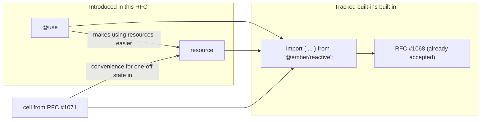
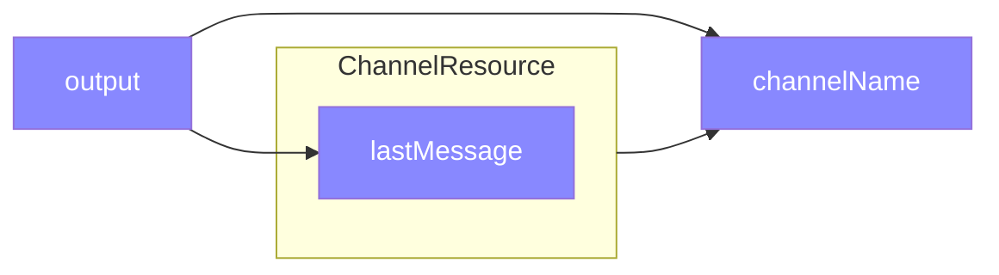
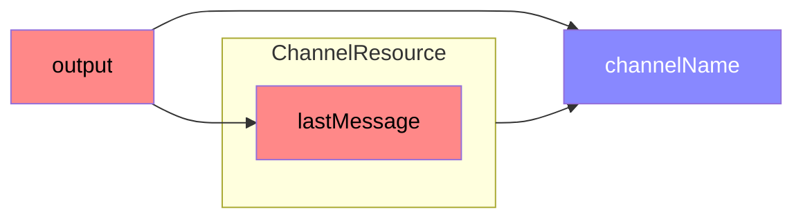
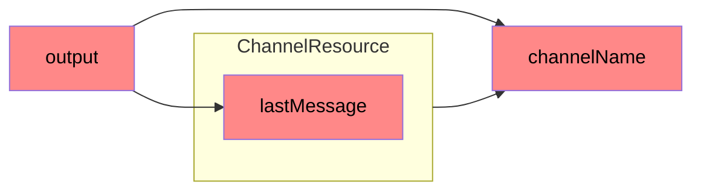

# Add Resources as a low-level Reactive Primitive

## Summary

Resources are a reactive primitive that enables managing stateful processes with cleanup logic as reactive values. They unify concepts like custom helpers, modifiers, components, and services by providing a consistent pattern for expressing values that have lifecycles and may require cleanup when their owner is destroyed.


> [!NOTE]
> This RFC has some dependencies / relation with other RFCs



## Motivation

Ember's current Octane programming model provides excellent primitives for reactive state (`@tracked`), declarative rendering (templates), and component lifecycle, but it lacks a unified primitive for managing stateful processes that need cleanup. This fragmentation has created a complex ecosystem where different concepts each require their own approach to lifecycle management, leading to scattered patterns and cognitive overhead.

### Lifecycle Management

Today, Ember developers must be aware of multiple systems for managing setup and teardown:

<details><summary>Components</summary>

have lifecycle hook: `willDestroy()`:
```js
export default class TimerComponent extends Component {
  @tracked time = new Date();
  timer = null;

  constructor() {
    super(...arguments);
    this.timer = setInterval(() => this.time = new Date(), 1000);
  }

  willDestroy() {
    if (this.timer) clearInterval(this.timer); // Easy to forget!
  }
}
```

</details>

<details><summary>Modifiers</summary>

two different approaches from `ember-modifier` for class-based and function based modifiers.

class-based:
```js
import Modifier from 'ember-modifier';

class foo extends Modifier {
  constructor() {
    super(...arguments);
    registerDestructor(this, cleanup); 
  }
}
```

function-based:
```js
import { modifier } from 'ember-modifier';

const foo = modifier((element) => {

  return () => {
    /* this is the destructor */
  }
})
```

the function-based modifier here is _almost_ like a resource.

There is a another modifier implementation availabel from a community library, [reactiveweb](https://github.com/universal-ember/reactiveweb), 
which looks like this:

```js
import { resource } from 'ember-resources';
import { modifier } from 'reactiveweb/resource/modifier';

const wiggle = modifier((element, arg1, arg2, namedArgs) => {
    return resource(({ on }) => {
        let animation = element.animate(/* ... */);

        on.cleanup(() => animation.cancel());
    });
});
```

The downside to this approach is, of course, 2 imports, and it doesn't solve the problem of function based modifiers not supporting generics.

If resources were formally supported by the framework, the wrapper function would not be needed, and we could gain generics support (more on that later)

</details>

<details><summary>Helpers</summary>

```js
export default class DataHelper extends Helper {
  willDestroy() {
    this.abortController?.abort(); // Another lifecycle hook
  }
}

// Function helpers have no cleanup mechanism at all
export default helper(() => {
  // No way to clean up side effects!
});
```

</details>


<details><summary>Services</summary>

Services have `willDestroy`, but because they are only able to be classes, `registerDestructor` may also be used. This gives us two ways to do things, which can add to decision fatigue like all the other multi-option scenarios above.

```js
export default class WebSocketService extends Service {
  constructor(...args) {
    super(...args);

    registerDestructor(this, () => this.otherSocket?.close());
  }

  willDestroy() {
    this.socket?.close(); 
  }
}
```

</details>

### The Destructor API

The `registerDestructor()` API ([RFC #580](https://github.com/emberjs/rfcs/pull/580)) improved destruction in general by providing a unified way to register cleanup functions:

```js
import { registerDestructor } from '@ember/destroyable'; // Additional import required

class MyComponent extends Component {
  constructor() {
    // Setup happens here
    let timeoutId = setTimeout(() => console.log('hello'), 1000);
    
    // Cleanup requires manual registration
    registerDestructor(this, () => clearTimeout(timeoutId));
  }
}
```

While this remains useful as a low-level tool, and essential for adding destruction in custom classes today, it's not the most ergonomic for the common use case:

- `registerDestructor()` requires an additional import, adding friction to every file that needs cleanup logic.
- Understanding when and how to use `associateDestroyableChild()` (see the [link RFC #1067](https://github.com/emberjs/rfcs/pull/1067))
- Different patterns for different types of objects / classes / lifecycles

### Outside of cleanup

There isn't a cohesive / consistent way to encapsulate state with cleanup. This leads to:
- Logic scattered across multiple lifecycle hooks
- Difficulty extracting and reusing patterns
- Not knowing how to properly associate children with `associateDestroyableChild()`
- Memory leaks from forgotten cleanup

### A unified approach to lifecycle management in one package (function)

Resources solve these problems by providing a **single, consistent container for setup and teardown logic** that works across all contexts. Instead of learning multiple[^14-competing-standards] lifecycle patterns, developers work with one unified primitive:

```js
const Clock = resource(({ on }) => {
  const time = cell(new Date());
  
  // Setup and cleanup co-located
  const timer = setInterval(() => time.set(new Date()), 1000);
  on.cleanup(() => clearInterval(timer));
  
  return time;
});
```

[^14-competing-standards]: This is "yet another competing standard", but over time we can unify on this concept -- but the plan for doing so is out of scope for this RFC. This RFC is focused on unifying low-level concepts, and end-users of the framework may choose to continue not using resources directly. See also [XKCD 927](https://xkcd.com/927/).

**Resources unify all existing concepts** by providing:

1. **A Standard Container**: One primitive that works for components, helpers, modifiers, services, and custom logic (more on this later)
2. **Co-located Setup/Teardown**: No more spreading logic across constructors, lifecycle hooks, and destructor registrations  
3. **Hierarchical Cleanup**: Automatic owership linkage and disposal and child management without manual `associateDestroyableChild()` + `registerDestructor` (also with a way to manually link, similar to [RFC #1067](https://github.com/emberjs/rfcs/pull/1067))

Resources don't replace existing patterns. Resources unify those patterns under a single abstraction that eliminates the need to choose between different lifecycle approaches or remember multiple APIs.

### Examples

To illustrate how resources unify existing concepts, here are small examples showing how traditional Ember constructs could be reimagined using resources. Note that **classes are user-defined** while **resources are framework-internal** - this separation allows resources to wrap and manage existing class-based patterns.

<details><summary>Services</summary>

Using existing services, keeping the same behavior:

```js
// User-defined Service class (unchanged)
class SessionService extends Service {
  @tracked currentUser = null;
  
  willDestroy() {
    this.logout(); // Manual cleanup
  }
  
  login(credentials) {
    return authenticate(credentials).then(user => this.currentUser = user);
  }
  
  logout() {
    this.currentUser = null;
  }
}

// Framework-internal resource wrapper
const SessionServiceResource = resource(({ on, owner }) => {
  const service = new SessionService(owner);
  
  // Framework manages lifecycle via resource pattern
  on.cleanup(() => service.willDestroy());
  
  return service;
});
```

A hypothetical new way to use services without the string registry (exact details and implementation is outside the scope of this RFC)

```js
class Storage {
  foo = 2;
}

// Usage
class MyComponent extends Component {
  storage = service(this, Storage);

  get data() {
    // no proxy
    return this.storage.current.foo;
    // with proxy
    return this.storage.foo;
  }
}

// where service is
function service(context, klass) {
  const manager = resource(({ on, link, owner }) => {
    let instance = new klass(owner);
    // sets up destroyable linking to the owner
    // without passing owner, the instance would be linked to the lifetime of the context (the component in this example)
    link(instance, owner);
    // not needed due to `link`. Any registerDestructor setup in the passed klass will just work
    on.cleanup(() => /* call wilLDestroy? */)

    return instance;
  });

  return use(context, manager);
}
```
however, without using a proxy to kick off all the instantiation of the service (since we still want service instantiation to be lazy), it may be better to support something like this:


```js
class MyComponent extends Component {
  // the use decorator turns the property in to a cached getter that is lazily evaluated upon access -- the only requirement
  // is that the right-hand side has a registered helper manager
  // 
  // in addition, @use also has access to the instance / this. So passing to `service` is not needed. 
  //
  // NOTE: TypeScript still does not allow decorators (even the decorators that are landing in browsers) to alter the type on the right-hand side of the equals
  @use accessor storage = service(Storage);

  get data() {
    return this.storage.foo;
  }
}
```

See also: [RFC: #502 | Explicit Service Injection](https://github.com/emberjs/rfcs/pull/502)

</details>

<details><summary>Components, Routes, Services, (anything with willDestroy)</summary>

```gjs
class Demo extends Component {
  <template>hello</template>
}

// Framework-internal resource wrapper
function InternalInvoker(Component, argsProxy) {
  return resource(({ on, owner, link }) => {
    const instance = new Component(owner, argsProxy);

    link(instance);
    
    if ('willDestroy' in instance) {
      on.cleanup(() => instance.willDestroy());
    }
    
    return instance;
  });
}
```

</details>


<details><summary>Helpers</summary>

Resources _are_ helpers, so while this is not needed exactly (as we have the helper manager), we could look at helpers like this:

```js
// User-defined Helper class (unchanged)
class FormatDateHelper extends Helper {
  @service intl;
  
  compute([date]) {
    return this.intl.formatDate(date);
  }
}
```

an equiv resource-based helper would look like this:
```js
function formatDate(date) {
  return resource(({ on, owner }) => {
    let intl = owner.lookup('service:intl');

    return () => 
      intl.formatdate(date);
  });
}
```

</details>

<details><summary>DOM Rendering</summary>


Instead of the VM, we could use resources to manage the insertion and removal of known dynamic nodes in the DOM:

```gjs
// Let's pretend we are rendering a simple counter:
const count = cell(0);
const increment = () => count.current++;

<template>
    {{count.current}}
    <button onclick={{increment}}>++</button>
    {{#if (isEven count.current)}}EVEN!{{/if}}
</template>

// render could be responsible for directly managing the create/destroy 
// / invocation/cleanup
// each node in this array will be wrapped in a resource if cleanup is possibly needed, such as the case of if blocks    
export default component([
    () => count.current,
    [createElement, 'button' { 
        // the arrow function is for the chance that the value might by reactive
        onclick: () => increment,
    }, ["++"]],
    [condition, () => isEven(count.current), ['EVEN!']],
]);

// a hypothetical component()
function component(instructions) {
    return resource(({ on, use }) => {
        let fragment = document.createDocumentFragment();

        on.cleanup() => fragment.remove();

        // iterate over instructions,
        // if any instructions are resoures, they'll be `use`d.
        // each `use`d thing has its own cache / begin/end tracking frame pair.

        // caller of component() will append fragment
        return fragment;
    })
}

// a hypothetical if evaluator
function condition(evaluate, whenTrue, whenFalse) {
    return resource(({ on, use }) => {
        let fragment = document.createDocumentFragment();

        on.cleanup() => fragment.remove();

        return () => {
            let contents = evalute() ? whenTrue() : whenFalse();
            fragment.append(contents);
            return fragment;
        }
    });
}
```

> [!NOTE] these examples are are hypothetical and non-functional today. They are strictly for illustration.

</details>


This unification hopefully will lead to simplification of the implmentation of all our concepts. 

## Detailed design

### Overview

A **resource** is a reactive function that represents a value with lifecycle and optional cleanup logic. Resources are created using the `resource()` function and automatically manage their lifecycle through Ember's existing destroyable system[^future-destruction], though the exact implementation could change at any time (to be simpler) as we work at simplifying a bunch of internals.

[^future-destruction]:  while today in userland, we can implement what we need through destroyables, the real implementation can eventually become low-level enough where we use it to build the renderer in place of our current VM.

```gjs
import { cell, resource } from '@ember/reactive';

const Clock = resource(({ on }) => {
  const time = cell(new Date());
  
  const timer = setInterval(() => {
    time.set(new Date());
  }, 1000);

  on.cleanup(() => clearInterval(timer));

  return time;
});

<tmelptae>
  {{Clock}}
</template>
```

<details><summary>Ignoring the Value, using for the lifecycle management -- synchronizing external state</summary>

```gjs
import { cell, resource } from '@ember/reactive';

function addScript(url) {
  return resource(({ on }) => {
    let el = document.createElement('script');

    on.cleanup(() => el.remove());

    Object.assign(el, { src: url });
  });
}

<template>
  {{#if @useBootStrap}}
    {{addScript "https://some.cdn.com/bootstrap/v5/bootstrap.js"}}
  {{/if}}
</template>
```

</details>

### Core API

The `resource()` function takes a single argument: a function that receives a ResourceAPI object and returns a reactive value.

The implementation types:
```ts
interface ResourceAPI {
  on: {
    cleanup: (destructor: () => void) => void;
  };
  use: <T>(resource: T) => ReadOnlyCell<T>;
  link: (obj: unknown) => void;
  owner: Owner;
}

type ResourceFunction<T> = (api: ResourceAPI) => T;

function resource<T>(fn: ResourceFunction<T>): ResourceBuilder<T>

// These APIs are handled by the framework and would not be interacted with by users in app code.
// But would become useful for unit testing purposes.
// However, using rendering/reactivity testing would be better and would not require the use of these interfaces.
interface ResourceBuilder<T> {
  create(): Resource<T>;
}

interface Resource<T> extends ReadOnlyCell<T> {
  link(context: object): void
}
```

#### `on.cleanup`

Allows user-defined cleanup to occur when the resource would be torn down. Same behavior as the existing  `registerDestructor`.

Example
```gjs
resource(({ on }) => {
  on.cleanup(() => console.log('cleaning up'));
})
```

> [!NOTE]
> If you've seen [Starbeam](https://starbeamjs.com/), you may be aware of an `on.sync`. `on.sync` is not currently possible with today's reactivity system (at the time of writing this RFC). Some updates to how the reactivity system and renderer will be needed before we can add `on.sync`, but it would be in addition to everything described in this RFC and the existing state of this RFC does not conflict with the desire for an `on.sync` later.

<details><summary>AbortController example</summary>

```js
const DataLoader = resource(({ on }) => {
  const controller = new AbortController();
  const state = cell({ loading: true });

  on.cleanup(() => controller.abort());

  fetch('/api/data', { signal: controller.signal })
    .then(response => response.json())
    .then(data => state.set({ loading: false, data }))
    .catch(error => state.set({ loading: false, error }));

  return state;
});
```

</details>

#### `use`

A short-hand for interacting with `invokeHelper` -- allows using nested resources as stable references. Upon update, cleanup is guaranteed to run before the creation / update of the internal state of the `use`d thing.

Use returns a read-only cell, with only a `.current` property.

Example
```gjs
resource(({ use }) => {
  let state = use(OtherResource(() => { /* ... */ }))

  return () => {
    let active = state.current;

    return active.result;
  };

})
```

> [!TIP]
> Because `use` returns a read-only cell with only a `.current` property, the "value" of the used resource, for clarity, should try to avoid having its own `.current` property, as that would have folks with `state.current.current`, which looks weird. 

<details><summary></summary>

```js
const Now = resource(({ on }) => {
  const time = cell(new Date());
  const timer = setInterval(() => time.set(new Date()), 1000);
  on.cleanup(() => clearInterval(timer));
  return time;
});

const FormattedTime = resource(({ use }) => {
  const time = use(Now);
  return () => time.current.toLocaleTimeString();
});
```

</detailS>

#### `link`

A shorthand for wiring up the owner and and destruction hierarchies. 

Example
```gjs
resource(({ link }) => {
  let state = new State();

  // enables State to have service injection and use registerDestructor
  link(state);
})

```

#### `owner`

Enables accessing services and other things on the owner.

Example
```gjs
resource(({ owner }) => {
  let router = owner.lookup('service:router');
});
```


### Resource Creation and Usage


First, the manual way, as if using resources outside of ember, with no framework whatsoever.

> [!NOTE]
> This is using the previously mentioned APIs that *could* be useful for unit testing -- but folks should prefer rendering/reactivity testing.

```js
import { resource } from '@ember/reactive';
import { setOwner } from '@ember/owner';

let thing = resource(() => 2);
let owner = {
  lookup: (registrationName) => { /* ... */ }
};

let instance = thing.create();

instance.link(owner);
// if in a test: 
// assert.strictEqual(instance.current, 2);
```

<details><summary>preview: how one would do the above with a rendering / reactivity test</summary>

```gjs
import { resource } from '@ember/reactive';
import { setOwner } from '@ember/owner';

module('suite', function (hooks) {
  setupRenderingTest(hooks);

  /**
  * Normally a test would look like this:
  */
  test('example', async function () {
    let thing = resource(() => 2);
    
    await render(
      <template>
        {{thing}}
      </template>
    );
    
    assert.dom().hasText('2');
  });

  /**
  * When using a manually created and managed resource
  */
  test('manual mode', async function () {
    let thing = resource(() => 2);
    let owner = {
      lookup: (registrationName) => { /* ... */ }
    };

    let instance = thing.create();

    instance.link(owner);
    
    await render(
      <template>
        {{instance.current}}
      </template>
    );
    
    assert.dom().hasText('2');
  });
})
```

</details>


Resources can be used in several ways:

**1. In Templates (as helpers)**
```js
import { cell, resource } from '@ember/reactive';

const Clock = resource(({ on }) => {
  const time = cell(new Date());
  const timer = setInterval(() => time.set(new Date()), 1000);
  on.cleanup(() => clearInterval(timer));
  return time;
});

// In template
<template>Current time: {{Clock}}</template>
```

**2. With the `@use` decorator**

```js
import { use } from '@ember/reactive';

export default class MyComponent extends Component {
  @use clock = Clock;
  
  <template>Time: {{this.clock}}</template>
}
```

The `@use` decorator is an ergonomic shorthand that automatically invokes any value with a registered helper manager. This means that `Clock` (which has a resource helper manager) gets automatically invoked when accessed, eliminating the need to call it explicitly or access `.current`. This works for resources, but also for any other construct that has registered a helper manager via `setHelperManager` from RFC 625 and RFC 756.

**Convention: Function Wrapping for Clarity**

While `@use clock = Clock` works, assigning a value via `@use` can look unusual since no invocation is apparent. By convention, it's more appropriate to wrap resources in a function so that the invocation site clearly indicates that behavior:

```js
// Preferred: Clear that invocation/behavior is occurring
@use clock = Clock()

// Works but less clear: Looks like simple assignment
@use clock = Clock
```

This convention makes the code more readable and aligns with the expectation that decorators like `@use` are performing some active behavior rather than passive assignment.

#### Helper Manager Integration and the `@use` Decorator

The `@use` decorator builds upon Ember's existing helper manager infrastructure ([RFC #625](https://github.com/emberjs/rfcs/pull/625) and [RFC #756](https://github.com/emberjs/rfcs/pull/756)) to provide automatic invocation of values with registered helper managers. When a resource is created with `resource()`, it receives a helper manager that makes it invokable in templates and enables the `@use` decorator's automatic behavior.

Here's how it works:

```js
// A resource has a helper manager registered
const Clock = resource(({ on }) => {
  // ... resource implementation
});

// The @use decorator detects the helper manager and automatically invokes it
@use clock = Clock; 

// Without @use, you need explicit invocation or .current access as `clock` cannot be "replaced" as decorators allow.
clock = use(this, Clock);
```

The `@use` decorator pattern extends beyond resources to work with any construct that has registered a helper manager. This means that future primitives that integrate with the helper manager system (like certain kinds of computed values, cached functions, or other reactive constructs) will automatically work with `@use` without any changes to the decorator itself.

**Helper Manager vs Direct Invocation:**

When using resources in templates directly (e.g., `{{Clock}}`), the helper manager handles the invocation automatically. The `@use` decorator brings this same ergonomic benefit to class properties, bridging the gap between template usage and class-based usage patterns.

**3. With the `use()` function**
```js
export default class MyComponent extends Component {
  clock = use(this, Clock);
  
  <template>Time: {{this.clock.current}}</template>
}
```

The `use()` function provides manual resource instantiation when you need more control over the lifecycle or want to potentially avoid "magic" that yet-to-be-understood decorators provide, like that of `@use` - where `.current` would not be needed in the template. 

### Key Differences Between Usage Patterns

**Understanding `@use` as an Ergonomic Shorthand**

The `@use` decorator is fundamentally an ergonomic convenience that builds upon Ember's helper manager infrastructure. When you apply `@use` to a property, it doesn't assign the value directly—instead, like `@tracked`, it replaces the property with a getter that provides lazy evaluation and automatic invocation. This allows you to not need to interact with the `.current` property on resources (and cells as well);

```js
export default class MyComponent extends Component {
  // This
  @use clock = Clock;
  
  // is (roughly) equivalent to defining a getter that automatically invokes
  // any value with a registered helper manager:
  @cached
  get clock() {
    return getValue(invokeHelper(this, Clock));
  }
}
```

> [!NOTE]
> If one were to do `@use count = Cell(2)`, that would be behaviorally the same as `@tracked count = 2;`, with the exception that `@use` is only ever read-only.

**`@use` decorator vs resource `use()` vs top-level `use()`:**

All forms of use can operate on the same structures (resources, helpers, etc)

1. **`@use` decorator** - An ergonomic shorthand that leverages Ember's helper manager system:
   - Replaces the property with a getter (like `@tracked`) for lazy access
   - Works with resources, but also any construct that has a helper manager
   - Returns the "unwrapped" value directly (no `.current` needed)
   - Best for when you want the simplest possible API with automatic lifecycle management[^lifecycle-downside]

[^lifecycle-downside] being tied to the component's lifecycle can be a downside depending on the size of your component. For this reason it is important to consider the factoring of your application -- keeping components small, and/or ensuring that when fine-grained destruction is needed, resources are created in the template instead of the JavaScirpt class (but with fine-grained components, js vs template is likely equivelant)

2. **Resource `use()` method** - For resource composition within resource functions:
   - Available only within the resource function's API object
   - Manages lifecycle and cleanup of nested resources automatically
   - Returns a reactive value that can be consumed with `.current`
   - Essential for building complex resources from simpler ones
   - Enables hierarchical resource composition with proper cleanup chains

3. **Top-level `use()` function** - For manual control:
   - Requires explicit owner/context management
   - Returns a reactive value requiring `.current` access
   - Useful when you need fine-grained control over instantiation timing
   - Primarily for library authors or advanced use cases where automatic behavior isn't desired

### Relationship to the Cell Primitive

While the `cell` primitive ([RFC #1071](https://github.com/emberjs/rfcs/pull/1071)) is not strictly required for resources to function, resources are significantly more ergonomic and powerful when used together with `cell` (this is doubly so since Resources need the interfaces and types from the Cell implementation). Resources can work with Ember's existing `@tracked` properties, but `cell` provides several advantages:

**Without `cell` (using `@tracked`):**
```js
import { resource } from '@ember/reactive';
import { tracked } from '@glimmer/tracking';

// Must create a separate class to hold tracked state
class ClockState {
  @tracked time = new Date();
}

const Clock = resource(({ on }) => {
  const state = new ClockState();
  
  const timer = setInterval(() => {
    state.time = new Date();
  }, 1000);

  on.cleanup(() => clearInterval(timer));

  return () => state.time;
});

// Usage requires property access
<template>Current time: {{Clock}}</template>
```

**With `cell`:**
```js
import { cell, resource } from '@ember/reactive';

const Clock = resource(({ on }) => {
  const time = cell(new Date());
  
  const timer = setInterval(() => {
    time.set(new Date());
  }, 1000);

  on.cleanup(() => clearInterval(timer));

  return time; // Consumer gets the cell directly
});

// Usage is more direct
<template>Current time: {{Clock}}</template>
```

While this RFC does not strictly depend on the `cell` primitive from [RFC #1071](https://github.com/emberjs/rfcs/pull/1071), resources become significantly more ergonomic when used together with `cell`.

#### Reactive Ownership and Automatic Disposal

Resources implement **reactive ownership**, a pattern pioneered by fine-grained reactive systems, which enables automatic memory management without manual disposal:

```js
const ParentResource = resource(({ use, on }) => {
  // Child resources are automatically owned by parent
  const child1 = use(SomeChildResource);
  const child2 = use(AnotherChildResource);
  
  // When ParentResource is destroyed, all children are automatically cleaned up
  // This creates a disposal tree similar to component hierarchies
  
  return () => ({
    data1: child1.current,
    data2: child2.current
  });
});
```

<details><summary>Similaries to "Explicit Resource Management"</summary>

```js
function parent() {
  using child1 = someChild();
  using child2 = anotherChild();

  return () => ({
    child1,
    child2,
  });
}
```

This looks fairly similar to our resources, and at a high-level, might behave similarily.
But a key difference is that each `use` gets its own cache, so `child1` and `child2` can invalidate independently -- whereas all of `parent` would invalidating in the Explicit Resource Management example.

</details>

The ownership model ensures that:
- Disposal propagates down through the resource tree
- No manual `willDestroy` or cleanup management needed

### Examples

**Data Fetching with Modern Async Patterns**

[Demo here with ember-resources](https://limber.glimdown.com/edit?c=JYWwDg9gTgLgBAbzlApgZwgVygYxQGjjwBti4BfOAMyghDgHIUQAjFKAWlQ2zzQYDcAKCFVMAOxwxgEcXABKzCDBQARAIYx1ACmzEAlIiFxkKGNjncsuFNu1JZFQwF4AfEZMmcstPF%2BaUOGciFFJ7OGIIdQATYHEAcwAuOBgoTAI4aM11ZPFMUkJ2Wihc-LJyfWFPIh94b3FUiFJ2ILhxFAB3OABBFmgYAGFZRuaobUrjOEmTWQA6HGIUdTywOxd3epHFqFn1PthxiZNpuAB6U7gAZRwACxRo-Pu4FAA3dWJMTRk5DmozW7g-lgaDgoBA92AAWIAE8UhA4OoXhBgNE4B0AlAqO9iGgTlR-jddFBiIQkGhgPFxO9kptaKNZuTKe8nCcTLMYHdxNpuJBxGhAm4PNVPMAqHBtABCHk%2BFCzCAAa0MCFZwo5tC67S6AFEoMVtAADAASABVjQAFOAAEgQ0r5sv85jQ5GS1tt-IZWkdxpQAA8YOR9UdhSZyCqTKhzFBLOhee6AFYYLlB6oVFXsznaLJaILuB32szhSIxOJJajvfmELPqQq66ClUhOfRpnCaW7aIrQHNC4PnOAAeXEMLgmDAWcCedBYo5gVQAEd0r40eo0OIGPA9v17mHJ%2BKJbSmtsGRSqcRdvsVNElduTHmGQWkEXYglklicRkq-WSc9a1AnFVgxQKoVP%2BJwRhYgKeig-7AUIoZCL2QzgBAaB7IsmTZHAYC0Hw5IJHAvyIsi0QgnOC7wOiKiYtiuL1IuZrYeg-LRBo2bBFYvC2OEmD8k4XbKl4tTIOoHQseorTcbYiggMoajZNoDA3DAMBgGgiTnB0GkMuiYDAOyKC3Kc6g6acYDEMsZj8PoQaTGBUbius3Y1Hy8APlET7xJW2Q1sUFCtFAwmifM2CoA0-7HNUorio%2BJaGLZchkp63HJAw0UJAwFBhTu7Y-rFZjgQlmhJYwHZQAwhDgmgKHxCgyQlbMFVVYE5DCKBeV2fxwoOkVDBoJgOA4WVKpYRAOH3KJyRVrM3D5DAaD1UZ2jACo9CCvY26zBtS3MPg269hg4IItEsTSLIzJVnAdyoHAnb7WYNwlkBVknM1kwvTB8EXMadw8eoV3iMobQoPcTyyHgF1KSpamnPES03JgLDzHQpzMGwUAJqcmI4GgJllKcACMeMAEyEx9oIgqApnMCgDRbhT-SIKYPA2AAYuoUjQLClA0HQxWsOwXDoNYfCCEI7Es2zMAc9oUkyaJExCAAPMtpkBK4kwIAgABSlx9gAch6UAlqKsLaPRI2MWN2SGHkDYAMzkKGCunMrZkqK4QA&format=gjs)

```js
import { resource, cell } from '@ember/reactive';

function RemoteData(url) {
  return resource(({ on }) => {
    const state = cell({ loading: true, data: null, error: null });
    const controller = new AbortController();
  
    on.cleanup(() => controller.abort());
  
    // Scheduled evaluation - fetch starts immediately to avoid waterfalls
    fetch(url, { signal: controller.signal })
      .then(response => {
        if (!response.ok) {
          throw new Error(`HTTP ${response.status}: ${response.statusText}`);
        }
        return response.json();
      })
      .then(data => state.set({ loading: false, data, error: null }))
      .catch(error => {
        // Only update state if the request wasn't aborted
        if (!controller.signal.aborted) {
          state.set({ loading: false, data: null, error });
        }
      });
  
    return state;
  });
}

// Composable data processing - avoids request waterfalls
const ProcessedData = resource(({ use }) => {
  const rawData = use(RemoteData('https://www.swapi.tech/api/planets'));
  
  return () => {
    const { loading, data, error } = rawData.current;
    
    if (loading) return { status: 'loading' };
    if (error) return { status: 'error', message: error.message };

    return {
      status: 'success',
      processedData: data.results.map(item => ({
        ...item,
        // some additional data here or something
      }))
    };
  };
});

<template>
  {{JSON.stringify (ProcessedData) null 3}}
</template>
```

**WebSocket Connection with Reactive State Management**

```js
const WebSocketConnection = resource(({ on, owner }) => {
  const notifications = owner.lookup('service:notifications');
  const connectionState = cell({ 
    status: 'connecting',
    lastMessage: null,
    errorCount: 0 
  });
  
  const socket = new WebSocket('ws://localhost:8080');
  
  socket.addEventListener('open', () => {
    connectionState.set({ 
      status: 'connected', 
      lastMessage: null, 
      errorCount: 0 
    });
  });
  
  socket.addEventListener('message', (event) => {
    const message = JSON.parse(event.data);
    connectionState.set({
      ...connectionState.current,
      lastMessage: message,
      status: 'connected'
    });
    notifications.add(message);
  });
  
  socket.addEventListener('error', () => {
    const current = connectionState.current;
    connectionState.set({
      ...current,
      status: 'error',
      errorCount: current.errorCount + 1
    });
  });
  
  socket.addEventListener('close', () => {
    connectionState.set({
      ...connectionState.current,
      status: 'disconnected'
    });
  });

  on.cleanup(() => {
    if (socket.readyState === WebSocket.OPEN) {
      socket.close();
    }
  });

  return connectionState;
});
```

**Reactive DOM Event Handling with Debouncing**

[Demo here with ember-resources](https://limber.glimdown.com/edit?c=JYWwDg9gTgLgBAbzlApgZwgVygYxQGjjwBti4BfOAMyghDgHIUQAjFKAWlQ2zzQYDcAKCE4IAOzTwA6sHEATCAHcAysABeKOAF5k6LLhQAKI0gkUAlDoB8iIXCISpcNBq26SxU-YdwlweRgACwAuPzlFJQA6OXF2WUCg-B8HIJRgAHMgmDD-BWUY8TioAAl0rJhk3zgAQzQwFBwYACUamGAIXIiC2PiA4LgAenD86N7S8uyfcgthH0HhgBEUFixxPHk4TDB5Nq0YCFqANwgAuBQADz5XI61ULhQFdjQfYhR4dpAULBgASXlhA4xJJ4NtdjAUGpNDo4EYrNpbAgUkQ3jUoAAVUDfTAwIyfbF-eSzZH4n7-GFod6Yr4-EzwxHIoFOeD%2BRIwvKRQrFBLBQHVRwguBpTLZdndMZFdhlEUwPnVVyaKKU3FI-m%2BVnBKpqoWTSqM3x1BpNVrtTrhNnDYUVfUzOUUQgAVgADMSHOQ5g4OQUavJ5ABRW7iGAAGWAUke7CMDG4bgYhDBeyhBEQcDAdRuKDCMCgmC0tp8PgkURwqPE2zpNjs1S90VQIAgtwDjxDYYhxSjMc0ca2O0TbldvhLKDR1IJeKxZKJfPzPlQMGw4hcbmEM4WcGWUGAt02LFQNQA1pA5PBuAY8KJmXAAEJ7w%2BnIO-cRUQ66U%2B8YymLaUyyV1UC5w1kmMKYJSRiyKMSYDrO7wLrC9JVoOl5IBqQQUGKEFuMW2CoEGHq%2BMAVCwihcAADxwAA7AAbAAHFYc6wUgu7Dnex5hAwtxQAAni4IA1KQDAUHaBFEf0qFkQAjE6ABMAAsdEwVAi6MbeR5BmxaC8fxgnIsJRjERJlFOi6ejzopKZMQeqk5IwXzyMAmAgAJ7rIsi9FmcpzFWWx8joPuBxgE504rsSQgkRC4DEHs1g%2BAgCAAFIqAA8gAckq2ZyBkBHcUYN6efefxPhAVhlqQcAAMzkOQoWDOFYCRRC1hAA&format=gjs)

```js
const WindowSize = resource(({ on }) => {
  const size = cell({
    width: window.innerWidth,
    height: window.innerHeight,
    aspectRatio: window.innerWidth / window.innerHeight
  });

  // Debounced update to avoid excessive re-renders
  let timeoutId;
  const updateSize = () => {
    clearTimeout(timeoutId);
    timeoutId = setTimeout(() => {
      const width = window.innerWidth;
      const height = window.innerHeight;
      size.set({
        width,
        height,
        aspectRatio: width / height
      });
    }, 50);
  };

  window.addEventListener('resize', updateSize, { passive: true });
  
  on.cleanup(() => {
    window.removeEventListener('resize', updateSize);
    clearTimeout(timeoutId);
  });

  return size;
});

// Derived breakpoint resource
const BreakpointInfo = resource(({ use }) => {
  const windowSize = use(WindowSize);
  
  return () => {
    const { width } = windowSize.current;
    
    if (width < 768) return { breakpoint: 'mobile', isMobile: true };
    if (width < 1024) return { breakpoint: 'tablet', isMobile: false };
    return { breakpoint: 'desktop', isMobile: false };
  };
});
```


**Parallel Data Loading**: Avoid waterfalls by composing resources that run async independently:

> [!NOTE] 
> WarpDrive has utilities for this problem as well

```js
const DashboardData = resource(({ use }) => {
  // All three resources start fetching in parallel.
  // A key thing is that they are required to be accessed in order to start their request.
  const userData = use(UserData);
  const analytics = use(AnalyticsData);
  const notifications = use(NotificationData);
  
  // @cached shorthand
  return () => {
    // Can access data here
    let user = userData.current;
    
    // When any of the 3 requests invalidates, this object will be dirtied as percieved by consumers
    return {
      user,
      analytics: analytics.current,
      notifications: notifications.current,
      get hasUnreadNotifications() {
        return notifications.current.unreadCount > 0;
      }
    };
  });
});
```

**Graceful Degradation**: Design resources to handle errors gracefully:

```js
const ResilientDataLoader = resource(({ on }) => {
  const state = cell({ 
    status: 'loading',
    data: null,
    error: null,
    retryCount: 0 
  });
  
  const maxRetries = 3;
  const backoffDelay = (attempt) => Math.min(1000 * Math.pow(2, attempt), 10000);
  const controller = new AbortController();

  on.cleanup(() => controller.abort());
  
  const fetchWithRetry = async (attempt = 0) => {
    // When running code that changes state in the resource body,
    // it's crucial to detach from auto-tracking via an `await` or some other means.
    // (in the future, on.sync may help out here)
    try {
      const response = await fetch('/api/critical-data', { signal: controller.signal });
      if (!response.ok) throw new Error(`HTTP ${response.status}`);
      
      const data = await response.json();
      state.set({ status: 'success', data, error: null, retryCount: attempt });
    } catch (error) {
      if (attempt < maxRetries) {
        const delay = backoffDelay(attempt);
        setTimeout(() => fetchWithRetry(attempt + 1), delay);
        state.set({ 
          status: 'retrying', 
          data: null, 
          error, 
          retryCount: attempt + 1 
        });
      } else {
        state.set({ status: 'failed', data: null, error, retryCount: attempt });
      }
    }
  };
  
  fetchWithRetry();
  
  return state;
});
```

**Lazy Evaluation for Expensive Operations**:

```js
const ExpensiveComputation = resource(({ use }) => {
  const sourceData = use(SourceData);
  
  // Use function return to defer computation until needed
  return () => {
    const data = sourceData.current;
    
    // Only compute when actually accessed
    if (data.status !== 'success') {
      return { status: data.status };
    }
    
    return {
      status: 'computed',
      get result() {
        return performExpensiveAnalysis(data.result);
      }
    };
  };
});
```

**Memoization for Stable Results**:

```js
const MemoizedProcessor = resource(({ use }) => {
  const input = use(InputData);
  let lastInput = null;
  let cachedResult = null;
  
  // This function here is intepreted as a `createCache`
  return () => {
    const currentInput = input.current;
    
    // Memoize based on input value equality
    if (currentInput !== lastInput) {
      lastInput = currentInput;
      cachedResult = expensiveProcessing(currentInput);
    }
    
    return cachedResult;
  };
});
```

**Unit testing with Resources**:

```js
import { module, test } from 'qunit';
import { setupTest } from 'ember-qunit';
import { cell } from '@ember/reactive';

module('Unit | Resource | timer', function(hooks) {
  setupTest(hooks);

  test('timer updates every second', async function(assert) {
    const TestTimer = resource(({ on }) => {
      const time = cell(new Date('2023-01-01T00:00:00'));
      let interval = 0;
      
      const timer = setInterval(() => {
        interval += 1000;
        time.set(new Date('2023-01-01T00:00:00').getTime() + interval);
      }, 100); // Faster for testing
      
      on.cleanup(() => clearInterval(timer));
      return time;
    });

    const instance = TestTimer.create();
    instance.link(this.owner);
    
    const initialTime = instance.current;
    
    await new Promise(resolve => setTimeout(resolve, 250));
    
    const laterTime = instance.current;
    assert.ok(laterTime > initialTime, 'Timer advances');
    
    instance.destroy();
  });
});
```

**Service Integration**:

```js
const ServiceAwareResource = resource(({ owner }) => {
  const session = owner.lookup('service:session');
  const router = owner.lookup('service:router');
  
  // Resource can depend on and coordinate multiple services
  return () => ({
    currentUser: session.currentUser,
    currentRoute: router.currentRouteName,
  });
});
```

These patterns demonstrate how resources can be composed to build sophisticated reactive architectures while maintaining clarity, testability, and performance.

## How we teach this

#### How autotracking works

This information can, and maybe _should_ be added to the guides before this RFC, as much of it is is not specific to resources, but there are core reactivity concepts that our current guides content is presently missing. It is fundamental to understanding reactivity outside the `@tracked` usage that folks may be used to in components.

-------

##### tl;dr: autotracking

Every `{{}}`, `()`, and non-element `<component>` region in a component is auto-tracked. 

What this is means is before the renderer evaluates what content should be rendered, a "tracking frame" is opened -- and when the renderer gets an answer about what should be rendered the "tracking frame" is closed. This happens synchronously, and can be understood with this psuedo code:
```js
function getValueFor(x) {
  openTrackingFrame();
  x(); // the value, helper, modifier, component, etc
  closeTrackingFrame();
}
```

Internally when we evaluate `x()`, any tracked values encountered are added to the current tracking frame.
Like this psuedo code / psuedo implementation:
```
let currentFrame = null;
// beginTrackingFrame
currentFrame = [];
function readTracked(trackedRef) {
  currentFrame.push(trackedRef);
}
✨ associate currentFrame with the region ✨

// read x
// -> encounter and read @tracked foo
readTracked(ref); // for each encountered tracked value (this is inherent to the plumbing of the getter used by @tracked)

// closeTrackingFrame
currentFrame = null;
```

Later, when `@tracked foo` is set, we schedule the renderer to check what regions' associated frame informations may have changed, and then re-render just those regions, repeated the above process.


##### _what_ is autotracking

Autotracking only works when access of a tracked value is deferred untli the tracked region that needs it. Thinking about this in terms of templates and javascript is inherently different, because the templates are designed to be much less cumbersome than would otherwise be required in JavaScript.

For example, in a component-template, we understand that in
```gjs
class Demo extends Component {
  @tracekd foo = 0;

  <template>
    <Display @count={{this.foo}} />
  </template>
}
```
even though `{{this.foo}}` looks like an _eager access_, the actual value of `foo` isn't read until rendered -- until `{{@count}}` is rendered within `<Display>`.

In JavaScript, without templating, this would be the equivelent of:
```js
class Demo {
  @tracked foo;

  render() {
    return Display({
      '@count': () => this.foo, 
    })
  }
}
```

In this hypothetical implementation, `foo` would not be auto-tracked until `@count()` was invoked. 

This is exactly how getters work as well.

> [!NOTE]
> FUN FACT: in most JS ASTs, a getter is a ClassMethod with `kind: 'get'`

```js
class Demo {
  @tracked foo

  get bar() {
    return this.foo;
  }

  render() {
    return Display({
      '@count': () => this.bar;
    });
  }
}
```

> [!Important]
> the `@tracked` decorator replaces the property with a getter, so that the behavior on access is _lazy evaluation_.

Consequentially, this is why this common mistake _doesn't work as initially expected_
```js
class Display extends Component {
  @tracked count = this.args.count;

  <template>
    {{this.count}}
  </template>
}
```
the right side of an equals sign only happens one. _There is no possible way in JavaScript to make the right side of an equals sign reactive_.

Access and evaluation is still lazy, however. In decorator terminology this is (roughly) called the `init` phase, and only happens once.


Likelwise, when we want to build a plain old javascript object, and give it reactivity, we have to follow the JavaScript rules of lazy evaulation:
```js
class Demo extends Component {
  @tracked foo = 0;

  // 1. ❌ Not reactive, this.foo is evaluated onece when `State` is created
  state = new State(this.foo)

  // 2. ✅ reactive -- this.foo isn't evaluated until `State` needs it.
  state = new State(() => this.foo);

  <template>
    {{this.state.doubledFoo}}
  </template>
}
```

In example 1 where `State` is created via `new State(this.foo)`, `State` may look like this:
```js
class State {
  constructor(foo) {
    this.#foo = foo;
  }

  get doubledFoo() {
    return this.#foo * 2;
  }
}
```
This is _non_ reactive, because `#foo` is assigned once _and_ is passed a primitive value, `0` in this case -- and primitive values are not capable of being reactive. 

> [!IMPORTANT]
> Reactivity requires an abstraction around the value we wish to be reactive. This is where [Cell](https://github.com/emberjs/rfcs/pull/1071) comes in for representing reactive references to "some value" (without a class). Note that `@tracked` can be implemented with `Cell` internally. See [RFC #1071](https://github.com/emberjs/rfcs/pull/1071) for details.

In example 2, where `State` is created via `new State(() => this.foo)`, `State` make look like this: 
```js
class State {
  constructor(fooFunction) {
    this.#fooFn = fooFunction;
  }

  get doubledFoo() {
    return this.#fooFn() * 2;
  }
}
```
This is reactive because the construction of `State` does not require the value (`foo`) to be evaluated. It defers evaluation until later -- in this case when `doubledFoo` would be evaluated. This deferring of evaluation allows the renderer to find the tracked state while rendering each individual `{{}}`, `()`, or `<component>` region in the template. In the example earlier with tracking frames, where we hand-waived over `x()` "adding to the `currentFrame`,  it doesn't matter what is access, or how many things are accessed, because tracked values, when read, push their state into the global `currentFrame` variable.


##### The styles of deferring evaluation until _needed_ in JavaScript.

- [Single-value function](https://limber.glimdown.com/edit?c=JYWwDg9gTgLgBAYQuCA7Apq%2BAzKy4DkAAgOYA2oI6UA9AMbKQZYEDcAUKJLHAN5wwoAQzoBrdABM4AXzi58xcpWo1BI0cFQk2nFD35oZcvCEJF0IAEYqQECcGzBqO9nTJCAzh7gBlGEJh0PnY4OABibAgIADFUDlCGVA9BAFc6GGgACkiY1ABKPgEAC2APADoIqNi4AF45KriZdhC4EnR4ADchMhT0TILeFtCodpSoVGLSipzY-vim6Wb0AA9ueAl0bCEUsng3T28AEQsIOBXA1AlvJBRmeEHQojUxSXrTuoAGDhbkgKC6jAAd18-kCmX6tQAfJNyjk8t9Qpo6CMqFhanAITVoTASrCogBqfEIuAAHkC4HcgUhQz4vBxU1%2BgTKXR66Gki1CoRJlhSMAyE14vEMBDcwDEBBhZSRKMwMHZkOlFllJJoPL5aGpXNUFjAlPQ1MWQA&format=gjs)
  ```js
  class Demo extends Component {
    @tracked foo = 0;

    state = new State(() => this.foo);

    <template>{{this.state.value}}</template>
  }

  class State {
    constructor(fooFn) { this.#fooFn = fooFn }

    get value() {
      return this.#fooFn();
    }
  }
  ```
- [Multi-value function](https://limber.glimdown.com/edit?c=JYWwDg9gTgLgBAYQuCA7Apq%2BAzKy4DkAAgOYA2oI6UA9AMbKQZYEDcAUKJLHAN5wwoAQzoBrdABM4AXzi58xcpWo1BI0cFQk2nFD35oZcvCEJF0IAEYqQECcGzBqO9nTJCAzh7gBlGEJh0PnY4OABiCDAYYDQPDlCGVA9BAFc6GGgACkjo2IAxVABKPgEAC2APADoIqJikuABeOBy6jwLWGXYQuBJ0eDR0TOLebtCoPpSoVDKK6pbYocqB%2BM7u3vgYAHcIIeDQsYmpmaqa3KTFrYgV6XYb9nQAD254CXRsIRSyeDdPbwARCwQOCPQKoCTeJAoZjwEahIhqMSSZoYRpwAAMK3hwkRUkuqIxXVCyQCQSaGE2vn8gUyuwaAD44JkDBgAFzHJYYAA0Am2bJg5SqeOkhUKHG6mjo4yoWAAjKjaQz%2BbMBgBqFUrCVSzAwABM8uK9PZlzVYtCAB5AuB3IE6aM%2BLwlVViYEOehpLIAD72x2VZ3oSqXd12s2WFIwDLTXi8QwENzAMQEdmaizamXuunJ6X9DBmmih8NoW37OAhsMR%2B0xuMJpOoSUprA69OZ7U8iC5-MRosl1QWMDW9C2m5AA&format=gjs)
  ```js
  class Demo extends Component {
    @tracked one = 0;
    @tracked two = 0;

    state = new State(() => ({ one: this.one, two: this.two }));

    <template>{{this.state.value}}</template>
  }

  class State {
    constructor(fooFn) { this.#fooFn = fooFn }

    get one() {
      return this.#options().one;
    }

    get two() {
      return this.#options().two;
    }
  }
  ```  
  Note that when `one` changes, the whole function passed in to `State` will be considered invalidated -- whet `state.one` is changed, so also will `state.two` be changed. This is simpler, but can be expensive for complex derivations.
- [Fine-grained object](https://limber.glimdown.com/edit?c=JYWwDg9gTgLgBAYQuCA7Apq%2BAzKy4DkAAgOYA2oI6UA9AMbKQZYEDcAUKJLHAN5wwoAQzoBrdABM4AXzi58xcpWo1BI0cFQk2nFD35oZcvCEJF0IAEYqQECcGzBqO9nTJCAzh7gBlGEJh0PnY4OABiCDAYYDQPADFUVjgQuAZUD0EAVzoYaAAKSOjYhIBKPgEAC2APADoIqJj0hLgAXjhCxvjUGXYUknR4eqL0vLLeFNCoAcyobpgq2qHOhNGOUOle0JoaOAAVCvQPIKEpuE17ADdgCUyhMjIATzgpkWiL9D6B9oxR4NDJ6azSrVOodWI1TQYKAAeQwax6n3gMAA7hBfuN-s9AXMFqCGuDIdRdqj4RtEalkJZNJJ0RMsTAZjiQUtwQwrNSJKT2GT0AAPbjwCTobBCTJkeBuTzeAAiFggcD5gVQEm8SBQzHgGLgRDUYkk3yCbQADPCdcI9VIUfLjRwUhkAoa4Bhkb5-IE8r8WgA%2BP7-MhfMAnTDwNrzaq2zFTBlA-h0rY7AhhjwEM7dIRwfowQJQVNwITdCCWABW6ByWOw1G8uUqQULJZyABonRAkQc4IGplgKVhFTU4xmvoSYT8xv2AdHuh3gzU0Oh4ZjpA3%2B5nU1DiWjR5jI9j20GsDUrfP-ovl182VSMBJaVv-lHGcDakPYUEAFQPiGoNck-sbBekkoRqmdBTFQWAAIytHAno%2BkmM4YAA1PB8KaMBFjBgATJB0HvlaiGAQAPIE4DuIEXp0rwvCwfagRweg0iyAAPnwlG4tR6AHqi9FwExFFUW67Hnhy9F0vhliZFmhgUYYBBuMAYgprBKEgcGYH0V6SloV2s74TQYkSagZGYqJ4m5N0UndDJFDye%2BGmgTA6FqbZwYCKiOl6aZhlwDpRFgCR6BkRsQA&format=gjs)
  ```js
  class Demo extends Component {
    @tracked one = 0;
    @tracked two = 0;

    state = new State(() => {
      let parent = this;

      return { 
        // 'this' in a getter in an object refers to the object, not the parent context.
        get innerOne() {
          return parent.one;
        },
        get innerTwo() {
          return parent.two;
        },
        get combined() {
          return this.innerOne * this.innerTwo;
        }
      };
    });

    <template>{{this.state.one}}</template>
  }

  class State {
    constructor(optionsFn) { this.#optionsFn = optionsFn }

    get #options() {
      return this.#options();
    }

    // These are individually reactive
    get one() {
      return this.#options.innerOne;
    }

    get two() {
      return this.#options.innerTwo;
    }

    get combined() {
      return this.#options.combined;
    }
  }
  ```
  In this example, `state.one` and `state.two` are _individually_ reactive. and `state.combined` entantgles with both.


### Core Primitives

conceptual primitives, even below the "reactive" primitives.

- values  
  A value is the most basic kind of reactive primitive. It's a place to store data that can be updated atomically. Updates to values take effect immediately.

- functions  
  JavaScript has a built in mechanism for computing values based on other values: functions. Supporting functions as a reactive primitive, as well as their arguments, is essential for reducing the number of abstractions folks need to learn. 

- functions with cleanup  
  Many things in a JavaScript app require cleanup, but it is often forgotten about, leading to memory leaks, increased network activity, and increased CPU usage. This includes handling timers, intervals, fetch, sockets, etc.
	
### Values

This is a reactive value.
```js 
const greeting = cell('Hello there!');
```
It can be read and updated, just like a `@tracked` function.

Here is an [interactive demo](https://tutorial.glimdown.com/2-reactivity/1-values) demonstrating how `cell` can be used anywhere (in this case, in module-space[^module-space])

<details><summary>Code for the demo</summary>

```gjs
import { cell } from '@ember/reactive';

const greeting = cell("Hello there!");

// Change the value after 3 seconds
setTimeout(() => {
	greeting.current = "General Kenobi!";
}, 3000);

<template>
	Greeting: {{greeting.current}}
</template>
```

</details>


[^module-space]: Even though we can define state in module-space, you typically do not want to do so in your apps. Adding state at the module level is a "module side-effect", and tree-shaking tools may not tree-shake if they detect a "module side-effect". Additionally, when state is, in some way, only created within the context of an app, that state is easily reset between tests (assuming that app state is not shared between tests).

> **Note** <br>
> Cells do not _replace_ `@tracked` or `TrackedObject` / `TrackedArray` or any other reactive state utility you may be used to, but they are another tool to use in your applications and libraries and are otherwise an implementation detail of the more complex reactive data-structures.

<details><summary>Deep Dive: Re-implementing @tracked</summary>

When framing reactivity in terms of "cells", the implementation of `@tracked` could be thought of as an abstraction around a `getter` and `setter`, backed by a private `cell`:

```js 
class Demo {
	#greeting = cell('Hello there!');

	get greeting() {
		return this.#greeting.current;
	}
	set greeting(value) {
		this.#greeting.set(value);
	}
}
```


And then actual implementation of the decorator, which abstracts the above, is only a handful of lines:

```js 
function tracked(target, key, descriptor) {
	let cache = new WeakMap();

	let getCell = (ctx) => {
		let reactiveValue = cache.get(ctx);

		if (!reactiveValue) {
			cache.set(ctx, reactiveValue = cell(descriptor.initializer?.()));
		}

		return reactiveValue;
	};

	return {
		get() {
			return getCell(this).current;
		},
		set(value) {
			getCell(this).set(value);
		}
	}
}
```

Note that this decorator style is using the [Stage 1 / Legacy Decorators](https://github.com/wycats/javascript-decorators/blob/e1bf8d41bfa2591d949dd3bbf013514c8904b913/README.md)

See also [`@babel/plugin-proposal-decorators`](https://babeljs.io/docs/babel-plugin-proposal-decorators#version)


</details>

One huge advantage of this way of defining the lowest level reactive primitive is that we can escape the typical framework boundaries of components, routes, services, etc, and rely every tool JavaScript has to offer. Especially as Starbeam is being developed, abstractions made with these primitives can be used in other frameworks as well.  


Here is an [interactive demo showcasing `@tracked`](https://tutorial.glimdown.com/2-reactivity/2-decorated-values), but framed in way that builds off of this new "value" primitive.

<details><summary>Code for the demo</summary>

```gjs
import { tracked } from '@glimmer/tracking';

class Demo {
	@tracked greeting = 'Hello there!';
}

const demo = new Demo();

// Change the value after 3 seconds
setTimeout(() => {
	demo.greeting = "General Kenobi!";
}, 3000);

<template>
	Greeting: {{demo.greeting}}
</template>
```

</details>

### Functions

This is a reactive function.

```js
function shout(text) {
	return text.toUpperCase();
}
```
It's _just a function_. And we don't like to use the word "just" in technical writing, but there are honestly 0 caveats or gotchyas here.

Used in Ember, it may look like this:
```js
function shout(text) {
	return text.toUpperCase();
}

<template>
	{{shout @greeting}}
</template>
```

The function, `shout`, is reactive: in that when the `@greeting` argument changes, `shout` will be re-called with the new value.


Here is an interactive demo showcasing how [functions are reactive](https://tutorial.glimdown.com/2-reactivity/4-functions)

<details><summary>Code for the demo</summary>

```gjs
import { cell } from '@ember/reactive';

const greeting = cell("Hello there!");
const shout = (text) => text.toUpperCase();

// Change the value after 3 seconds
setTimeout(() => {
	greeting.current = "General Kenobi!";
}, 3000);

<template>
	Greeting: {{ (shout greeting.current) }}
</template>
```

</details>


### Functions with cleanup

_Why does cleanup matter?_

Many things in a JavaScript app require cleanup. We need to cleanup in order to:
- prevent memory leaks
- reduce unneeded network activity 
- reduce CPU usage 

This includes handling timers, intervals, fetch, sockets, etc.

_Resources_ are functions with cleanup, but cleanup isn't all they're conceptually concerned with.

>
> Resources Convert Processes Into Values 
>
> Typically, a resource converts an imperative, stateful process.
> That allows you to work with a process just like you'd work with any other reactive value.
> 

For details on resources, see the [Resources chapter](./resources.md).

Here is an interactive demo showcasing how [resources are reactive functions with cleanup](https://tutorial.glimdown.com/2-reactivity/5-resources)

<details><summary>Code for the demo</summary>

```gjs 
import { resource, cell } from '@ember/reactive';

const Clock = resource(({ on }) => {
	let time = cell(new Date());
	let interval = setInterval(() => time.current = new Date(), 1000);

	on.cleanup(() => clearInterval(interval));

	return () => time.current;
});

<template>
	It is: <time>{{Clock}}</time>
</template>
```

</details>


# Resources


> [!NOTE]
> A resource is a reactive function with cleanup logic.

Resources are created with an owner, and whenever the owner is cleaned up, the resource is also cleaned up. This is called ownership linking.

Typically, a component in your framework will own your resources. The framework renderer will make sure that when your component is unmounted, its associated resources are cleaned up.

<details>
<summary>Resources Convert Processes Into Values</summary>

Typically, a resource converts an imperative, stateful process, such as an asynchronous request or a ticking timer, into a reactive value.

That allows you to work with a process just like you'd work with any other reactive value.

This is a very powerful capability, because it means that adding cleanup logic to an existing reactive value doesn't change the code that works with the value.

The only thing that changes when you convert a reactive value into a resource is that it must be instantiated with an owner. The owner defines the resource's lifetime. Once you've instantiated a resource, the value behaves like any other reactive value.

</details>

## A Very Simple Resource

To illustrate the concept, let's create a simple resource that represents the current time.

```js
import { cell, resource } from "@ember/reactive";

export const Now = resource(({ on }) => {
  const now = cell(Date.now());

  const timer = setInterval(() => {
    now.set(Date.now());
  });

  on.cleanup(() => {
    clearInterval(timer);
  });

  return now;
});
```

To see this code in action, [checkout the live demo](https://limber.glimdown.com/edit?c=MQAggiDKAuD2AOB3AhtAxgCwFBYCIFMBbWAOwGdoAnVAS1JFgDMRkQAlfM2AV0rXxDQMqEAGt8%2BeGUHU0ohs1yp8AOhKxELaQEduNOVpA1oINMhI4ABtYDmAK2kAbGgDd8WGoXixKJgN4glJw8fPgANKb4jo4gAL4gjJSwhCAA5EQARviUALRBXLz8ZKkA3Dj4AB7evqakFCAAchogALyBwYX4ABRdAfSxAJStAHwgflggteQm6ppt-NFdStCqs10DA2UgE1P10J7ZrSBk%2BNAAkiQrlC7Ijj1DLaPjk5OzKifQS8pqGuubO4MtjtSCo0I58OZuPB7iMxjtJmCIZQLlcbnd9oRsv9JoCdjsgtBeCQQLMyricAAeFZeRzKYY7M4mGhkABcICpB2Gfj8TUQsViFIA9Bj8PShdT4LSVvTrJYgA&format=glimdown).

> **:bulb:** <br>
> A resource's return value is a reactive value. If your resource represents a single cell, it's fine to return it directly. It's also common to return a function which returns reactive data -- that depends on reactive state that you created inside the resource constructor.

When you use the `Now` resource in a component, it will automatically get its lifetime linked to that component. In this case, that means that the interval will be cleaned up when the component is destroyed.

The `resource` function creates a resource Constructor. A resource constructor:

1. Sets up internal reactive state that changes over time.
2. Sets up the external process that needs to be cleaned up.
3. Registers the cleanup code that will run when the resource is cleaned up.
4. Returns a reactive value that represents the current state of the resource as a value.

In this case:

| internal state | external process | cleanup code | return value |
| ---- | ---- | ---- | ---- |
| `Cell<number>` | `setInterval` | `clearInterval` | `Cell<number>` |


<details><summary>Resource's values are immutable</summary>

When you return a reactive value from a resource, it will always behave like a generic, immutable reactive value. This means that if you return a `cell` from a resource, the resource's value will have `.current` and `.read()`, but not `.set()`, `.update()` or other cell-specific methods.

If you want your resource to return a value that can support mutation, you can return a JavaScript object with accessors and methods that can be used to mutate the value.

This is an advanced use-case because you will need to think about how external mutations should affect the running process.

</details>

## A Ticking Stopwatch

Here's a demo of a `Stopwatch` resource, similar to the above demo.
The main difference here is that the return value is a function.

```js
import { resource, cell } from '@ember/reactive';

const formatter = new Intl.DateTimeFormat("en-US", {
  hour: "numeric",
  minute: "numeric",
  second: "numeric",
  hour12: false,
});

export const Stopwatch = resource((r) => {
  const time = cell(new Date());

  const interval = setInterval(() => {
    time.set(new Date());
  }, 1000);

  r.on.cleanup(() => {
    clearInterval(interval);
  });

  return () => {
    const now = time.current;

    return formatter.format(now);
  };
});
```

To see this code in action, [checkout the live demo](https://limber.glimdown.com/edit?c=MQAggiDKAuD2AOB3AhtAxgCwFBYCIFMBbWAOwGdoAnVAS1JFgDMRkQAlfM2AV0rXxDQMqEAGt8%2BeGUHU0ohsyEC0vSvhLRBNQvgA0LEgBMQjWJUKppNTYgzqQao-ko0SAcwB0OAAa%2B3AK2kAGxoAN3wsbXgzTQBvB04ePj0QfiCgkABfE0pYQhAAciIAI2cAWjUuXn4yAoBuHDRSChMzC2hoZxAAXhASfEQQAEkNII9cVHwAFW18ADE21AAKACJ1MoBVSBX9WKwQEAwkgC4QFZJuHRc0Hf2QQlduTtPzy%2BcaG907snwmoxeLlcPrcDkdeABGABMp0YyCCPy%2BmQAlA0sH8WjAECh0Bgegkqsklkt4vRkT0AHwgPYHdGaaCzPFpIJLfqDCadJZIlF3WkgVydSihOF4n7QEYCoXMzkUrQ6DwqSiOTS9Vkgdn4Tn6cEABl13LupHlQXwyAu8CJSJlaGNyEo4uckqW-IdcK5qIOamgvBIIGl3Up1IOqWamhIsEGvXpcoVSvdQc93ta5lQAo8pmT0BZ4e5B0yWGRqIAPJ1CPAgpNyXchpoaGRTsXZuTYrFMUhUJhMplCwB6KP4Ss9ktlitYXzeIA&format=glimdown).

A description of the `Stopwatch` resource:

| internal state | external process | cleanup code | return value |
| ---- | ---- | ---- | ---- |
| `Cell<Date>` | `setInterval` | `clearInterval` | `string` |

The internals of the `Stopwatch` resource behave very similarly to the `Now` resource. The main difference is that the `Stopwatch` resource returns the time as a formatted string.

From the perspective of the code that uses the stopwatch, the return value is a normal reactive string.

## Reusing the `Now` Resource in `Stopwatch`

You might be thinking that `Stopwatch` reimplements a whole bunch of `Now`, and you ought to be able to just use `Now` directly inside of `Stopwatch`.

You'd be right!

```js
const formatter = new Intl.DateTimeFormat("en-US", {
  hour: "numeric",
  minute: "numeric",
  second: "numeric",
  hour12: false,
});

const Stopwatch = resource(({ use }) => {
  const time = use(Now);

  return () => formatter.format(time.current);
});
```

The `Stopwatch` resource instantiated a `Now` resource using its use method. That automatically links the `Now` instance to the owner of the `Stopwatch`, which means that when the component that instantiated the stopwatch is unmounted, the interval will be cleaned up.

## Using a Resource to Represent an Open Channel

Resources can do more than represent data like a ticking clock. You can use a resource with any long-running process, as long as you can represent it meaningfully as a "current value".

<details><summany>Compared to other systems: Destiny of Unused Values</summary>

You might be thinking that resources sound a lot like other systems that convert long-running processes into a stream of values (such as observables).

While there are similarities between Resources and stream-based systems, there is an important distinction: because Resources only produce values on demand, they naturally ignore computing values that would never be used.

This includes values that would be superseded before they're used and values that would never be used because the resource was cleaned up before they were demanded.

**This means that resources are not appropriate if you need to fully compute values that aren't used by consumers.**

In stream-based systems, there are elaborate ways to use scheduling or lazy reducer patterns to get similar behavior. These approaches tend to be hard to understand and difficult to compose, because the rules are in a global scheduler, not the definition of the stream itself. These patterns also give rise to distinctions like "hot" and "cold" observables.

On the other hand, Resources naturally avoid computing values that are never used by construction.

TL;DR Resources do not represent a stream of values that you operate on using stream operators.

> **:key: Key Point** <br>
>resources represent a single reactive value that is always up to date when demanded.

This also allows you to use resources and other values interchangably in functions, and even pass them to functions that expect reactive values.

</details>

Let's take a look at an example of a resource that receives messages on a channel, and returns a string representing the last message it received.

In this example, the channel name that we're subscribing to is dynamic, and we want to unsubscribe from the channel whenever the channel name changes, but not when we get a new message.

```js
import { resource, cell } from '@ember/reactive';

function ChannelResource(channelName) {
  return resource(({ on }) => {
    const lastMessage = cell(null);

    const channel = Channel.subscribe(channelName);

    channel.onMessage((message) => {
      lastMessage.set(message);
    });

    on.cleanup(() => {
      channel.unsubscribe();
    });

    return () => {
      const prefix = `[${channelName}] `;
      if (lastMessage.current === null) {
        return `${prefix} No messages received yet`;
      } /*E1*/ else {
        return `${prefix} ${lastMessage.current}`;
      }
    };
  });
}
```

To see this code in action, [checkout the live demo](https://limber.glimdown.com/edit?c=MQAgMglgtgRgpgJxAUQCYQC4HsEChcAicUWAdgM4YICGGEZIWAZiNSAEpzlYCuCAxnBAYAFrRAI4AB0nk4pDOWEihAIhKUJcQQpBQu5agHM4qrYIgA3OKkalWIAOpwYAZSz8A1nAwgAwmKkpHAANgB0%2BAAG0UYAVkohVnC40FI4vgDeWtx8ggBi1PzYCACeADTZvAJwFYIhISAAviBMCFhQIADkxPAIALSyVYLknQDc%2BAD0AFRTIAAKkhjytgHUQaEgqSHE8hi09PZMOCAwkpaYJSBTE7j8ZJqr6w0AvCAZuCAg5Dww5PwIEHgAC4QAAKfiBYIhABy1H0AEoQM8AHxvD6fEDbXz8aj1GCFTxKV4AbQAuuN0Z8JhMvtAeCFaEJJBZzqQjF8PN5fPpyIYTEopIh6OgcfUSpTMT5NgpEJZcUivj4AJIyhBykKg0GIlFojEYrGbWyvACytBEYTaPFIqFBptEFrWqHaWquIAAHAAGREAahAAEZxnrPgaQHwXiBIiIMBgpOQgdTyAB3ahSCBhVBwSwTFMQCYAEgyELWUNh%2Bka%2BYyEFQjUi%2BCDLR8ENBYfhEr1YVE8lBsjSFCEOp79zgYXiZC1rfrnw7KlIoNQtDYOvek4xopC%2BK85DCUBT4Nx64JSNRa43njnC7CpDhcHhE8njXhgYxjQqfo978fdYxiz49mXQbIY0DGMOAQVBJhSG1Y991PLcpB4cgRHAyCyjbUMKB%2BP4AWBMEoN1ScTwJIkQDJJ9634bZqAQFUljVXFQQgVV1U-etGglNjPjYtj8DuChfEeKFOByaoFUGXI4AKIocBKTUiyeUsbyPfCfwQewxOqTUsgYB8lP-T5eM0BlKCA3kQIVOoNVIekQhYiUDOxSENleATQjCb5fn%2BQE4HBRyYWvWy9TkqEwkA4CTE1Hk%2BUUpc0KMjATKityfFBSKQJY58AoxMgwgouA1h4KRNTwvTV18sIrXcrCvK1Mimkyz4VPsF0YvI%2B5fBkOAmAgAAPBVImJAsgtCBTGlJCNas%2BCAWFBOKEpAnK%2BEkXRnhWkArPqRESr1RqIwLDquu65poSwPQwq4cw4CSWwSh8SIJqaEBpmQP1rhAUI5Hw%2BsdsiPbJAO5oC1ms6FoQJaMBre6OOfJ8H3GWH8AAHiWKApAZJZkXRBH0EsL4MBKbZnlUGAcAzBAQT9KReu4RJUFGEApGoVB0DZcnJCgUZVAxvUMgyFyQiEoY1EFLBUdMRooYRiZsYxyXkdRxkMeiWsgA&format=glimdown)

`ChannelResource` is a JavaScript function that takes the channel name as a reactive input and returns a resource constructor.

That resource constructor starts by subscribing to the current value of the `channelName`, and then telling Ember to unsubscribe from the channel when the resource is cleaned up.

It then creates a cell that holds the last message it received on the channel, and returns a function that returns that message as a formatted string (or a helpful message if the channel hasn't received any messages yet).

At this point, let's take a look at the dependencies:



Our output depends on the channel name and the last message received on that channel. The lastMessage depends on the channel name as well, and whenever the channel name changes, the resource is cleaned up and the channel is unsubscribed.

If we receive a new message, the lastMessage cell is set to the new message. This invalidates lastMessage and therefore the output as well.



However, this does not invalidate the resource itself, so the channel subscription remains active.

On the other hand, if we change the channelName, that invalidates the ChannelResource itself.



As a result, the resource will be cleaned up and the channel unsubscribed. After that, the resource will be re-created from the new channelName, and the process will continue.


> **:key: Key Point** <br> From the perspective of the creator of a resource, the resource represents a stable reactive value.

<details><summary>Under the hood</summary>

Under the hood, the internal `ChannelResource` instance is cleaned up and recreated whenever its inputs change. However, the resource you got back when you created it remains the same.
</details>


----------------------------------------


[^starbeam]: These docs have been adapted from the [Starbeam](https://www.starbeamjs.com/guides/fundamentals/resources.html) docs on Resources.

[^copying]: while ~90% of the content is copied, adjustments have been made for casing of APIs, as well as omissions / additions as relevant to the ember ecosystem right now. Starbeam is focused on _Universal Reactivity_, which in documentation for Ember, we don't need to focus on in this document. Also, mega huge thanks to [@wycats](https://github.com/wycats) who wrote most of this documentation. I, `@nullvoxpopuli`, am often super stressed by documentation writing (at least when stakes are high) -- I am much happier/relaxed writing code, and getting on the same page between our two projects.

### In Strict Mode / `<template>`

Resources work best in strict mode / gjs/gts / `<template>`.

For more information about this format, please see [this interactive tutorial](https://tutorial.glimdown.com)

```gjs
const Clock = resource(/* ... */);

<template>
  {{Clock}}
</template>
```

And then if your resource takes arguments:

```gjs
function Clock(locale) {
  return resource(/* ... */);
}

resourceFactory(Clock)

<template>
  {{Clock 'en-US'}}
</template>
```


### In Templates

Resources are powered by Ember's "Helper Manager" APIs, such as [`invokeHelper`](https://api.emberjs.com/ember/release/functions/@ember%2Fhelper/invokeHelper).

So in order to use resources in loose-mode or template-only components, they'll need to be re-exported in your `app/helpers/*` folder.

For example, by defining `app/helpers/clock.js`,
```js
export { Clock as default } from './location/of/clock';
```

you'd then be able to directly reference `Clock` in your template, albeit in the lower-kebab-case format (i.e.: if your helper is MultiWord, it's invoked as `multi-word`),

```hbs
{{ (clock) }}
```


### When the template has a backing class.

Because resources are backed by the Helper Manager API, and ever since "everything that has a value can be used in a template" [docs here](https://guides.emberjs.com/release/in-depth-topics/rendering-values/), we can _almost_ use resources in templates _as if_ you were using `<template>`.
This is not a feature of resources, but it is a useful technique that we've been able to use since `ember-source@3.25`

```js
import { Clock } from './location/of/clock';
import Component from '@glimmer/component';

export default class Demo extends Component {
  /**
   * This looks goofy!
   * This assigns the value "Clock" to the property on Demo, "Clock"
   * [property] = value;
   *
   * It could also be
   * AClock = Clock, and then access in the template as this.AClock
   */
  Clock = Clock;
}
```
```hbs
{{this.Clock}}

{{! and if Clock takes arguments }}

{{this.Clock 'en-US'}}
```

## Usage in JavaScript

In JavaScript, we need a helper utility to bridge from native javascript in to ember's reactivity system.

When using `@use`, the host class will need to have [_the Owner_](https://api.emberjs.com/ember/5.0/modules/@ember%2Fowner) set on it.

Resources may only be composed within
- a class with an owner
- another resource (covered [here](./resources.md)


```js
import { use } from '@ember/reactive';
import { Clock } from './location/of/clock';

class Demo {
  clock = use(this, Clock);
}
```

Or, if the resource takes arguments:

```js
import { use } from '@ember/reactive';
import { Clock } from './location/of/clock';

class Demo {
  clock = use(this, Clock('en-US'));
}
```

If you need the argument(s) to the resource to be reactive, you can pass a function:

```js
import { use } from '@ember/reactive';
import { tracked } from '@glimmer/tracking';
import { Clock } from './location/of/clock';

class Demo {
  @tracked locale = 'en-US';

  clock = use(this, Clock(() => this.locale));
}
```

<details><summary>why can't a decorator be used here?</summary>

When defining a function in the decorator

```js
class Demo {
  @use(Clock(() => this.locale)) clock;
  /* ... */
}
```

The arrow function does _not_ take on the context of the class instance,
because decorators are evaluated before an instance is created.
The `this` is actually the type of the context that the class is defined in.

This form of decorator *is* implemented, but it turned out to not be useful
enough for the variety of use cases we need for resource invocation.

Here is how it looks for no args, and static args, and both of these situations
work as you'd expect:

```js

import { use } from '@ember/reactive';
import { Clock, ClockWithArgs } from './location/of/clock';

class Demo {
  @use(Clock) clock;
  @use(ClockWithArgs('en-US')) clockWithArg;
}
```

</details>

This technique with using a function is nothing special to resources, and can be used with any other data / class / etc as well.

Further, if multiple reactive arguments are needed with individual reactive behavior, you may instead decide to have your wrapping function receive an object.

<details><summary>about resourceFactory</summary>

`resourceFactory` is a pass-through function purely for telling ember to
invoke the underlying resource immediately after invoking the `resourceFactory` function.

This is why we don't use its return value: it's the same as what you pass to it.

Without `resourceFactory`, ember would need extra internal changes to support primitives that
don't yet exist within the framework to, by convention, decide to _double-invoke_ the functions.

The signature is basically `() => () => Value`, where we want to flatten that chain of functions to get the underlying `Value`.

</details>


```js
import { use } from '@ember/reactive';
import { tracked } from '@glimmer/tracking';
import { Clock } from './location/of/clock';

class Demo {
  @tracked locale = 'en-US';
  @tracked timezone = 'America/New_York';

  clock = use(this, Clock({
    locale: () => this.locale,
    timeZone: () => this.timezone,
  }));
}
```

So when authoring a `Clock` that receives these types of function arguments, but _also_ needs to support being invoked from a template, how do you implement that?

```js
import { resource } from '@ember/reactive';

export function Clock(args) {
  return resource(() => {
    let { locale, timeZone } = args;

    // each of locale and timeZone could be either be a
    // string or a function that returns a string
    let localeValue = typeof locale === 'function' ? locale() : locale;
    let timeZoneValue = typeof timeZone === 'function' ? timeZone() : timeZone;

    // ...
  });
}

resourceFactory(Clock);
```

<details><summary>using functions for fine-grained reactivity</summary>

Earlier, it was mentioned that this way of managing reactivity isn't specific to resources.
That's because it's one technique you can use to build native classes in you app that have fine-grained reactivity.

For example, say you have a component:
```js
import Component from '@glimmer/component';

export default class Demo extends Component {
  /** ... */
}
```

And you have want to manage state in another class that doesn't necessarily need to a be a component.
For example, this could be a data abstraction, or a statemachine, or some other integration with the browser.

```js
class MyState {}
```

You can assign an instance of `MyState` to an instance of your component by calling `new`.

```js
import Component from '@glimmer/component';

export default class Demo extends Component {
  state = new MyState();

  /** ... */
}
```

but then to pass args, you may expect that you'd pass them like this:

```js
import Component from '@glimmer/component';

export default class Demo extends Component {
  state = new MyState(this.locale, this.timezone);

  /** ... */
}
```

But this is not reactive, because the values of `locale` and `timezone` are evaluated at the time of creating `MyState`.

We can delay auto-tracking by converting these properties to functions:
```js
import Component from '@glimmer/component';

export default class Demo extends Component {
  state = new MyState(() => this.locale, () => this.timezone);

  /** ... */
}
```

and then using them in getters:
```js
class MyState {
  constructor(localeFn, timeZoneFn) {
    this.#localeFn = localeFn;
    this.#timeZoneFn = timeZoneFn;
  }

  get locale() {
    return this.#localeFn();
  }

  get timeZone() {
    return this.#timeZoneFn();
  }
}
```

And then all the way back in our component template (`demo.hbs`), we can say:
```hbs
{{this.state.locale}}

and

{{this.state.timeZone}}
```

and each of the individual `{{ }}` usages will individually auto-track with the corresponding properties on `MyState`.


</details>


## Usage in TypeScript / Glint

### Typing the above examples

If you've used TypeScript in Ember before, this may look familiar as we declare the types on services in the same way. This follows the same pattern described [here](https://jamescdavis.com/declare-your-injections-or-risk-losing-them/)

```ts
import { use } from '@ember/reactive';
import { Clock, ClockWithArgs } from './location/of/clock';

class Demo {
  clock = use(this, Clock);
// ^? string

  clock2 = use(this, ClockWithArgs('en-US'));
// ^? string
}
```

```ts
import { use } from '@ember/reactive';
import { tracked } from '@glimmer/tracking';
import { Clock, ClockWithReactiveArgs } from './location/of/clock';

class Demo {
  @tracked locale = 'en-US';

  clock = use(this, ClockWithReactiveArgs(() => this.locale));
// ^? string
}
```


### For Library Authors

For TypeScript, you may have noticed that, if you're a library author, you may want to be concerned with supporting all usages of resources in all contexts, in which case, you may need to support overloaded function calls.

Here is how the overloads for `Compiled`, the resource that represents a dynamically compiled component, provided by `ember-repl`, and used by https://limber.glimdown.com and https://tutorial.glimdown.com.

[compile/index.ts](https://github.com/NullVoxPopuli/limber/blob/main/packages/ember-repl/addon/src/browser/compile/index.ts)

```ts
// Additional types and APIs omitted for brevity
export function Compiled(markdownText: Input | (() => Input)): State;
export function Compiled(markdownText: Input | (() => Input), options?: Format): State;
export function Compiled(markdownText: Input | (() => Input), options?: () => Format): State;
export function Compiled(markdownText: Input | (() => Input), options?: ExtraOptions): State;
export function Compiled(markdownText: Input | (() => Input), options?: () => ExtraOptions): State;

export function Compiled(
  markdownText: Input | (() => Input),
  maybeOptions?: Format | (() => Format) | ExtraOptions | (() => ExtraOptions)
): State {
  return resource(() => {
    let maybeObject =
      typeof maybeOptions === 'function' ? maybeOptions() : maybeOptions;
    let format =
      (typeof maybeObject === 'string' ? maybeObject : maybeObject?.format) || 'glimdown';
    let options =
      (typeof maybeObject === 'string' ? {} : maybeObject) || {};

    let input = typeof markdownText === 'function' ? markdownText() : markdownText;

    /* ... */

    return () => ({
      isReady: ready.current,
      error: error.current,
      component: result.current,
    });
  });
}
```

When defining `Compiled` this way, we can be type-safe in a variety of situations.
Note that when we invoke from a template, we don't need to worry about functions because,
in templates, all tracked values are inherently reactive, and will re-invoke functions appropriately.

> [!NOTE]
> The function concept here is this demo is _an_ example of how to pass on reactivity to future auto-tracking context. You could pass a `Cell`, or some other instance of an object that has its own tracked properties. Functions, however, are a platform primitive that allows for easy demoing -- but it's important to use the abstraction that best fits your, and your team's, use case.

<details>
<summary>  Using `Compiled` as

`(doc: string) => State`

</summary>

- Usage in gjs directly in the template:

  ```gjs
  import { Compiled } from 'ember-repl';

  let doc = '...';

  <template>
    {{#let (Compiled doc) as |state|}}
       ...
    {{/let}}
  </template>
  ```
  This is reactive

- Usage in a class

  ```gjs
  import Component from '@glimmer/component';
  import { tracked } from '@glimmer/tracking';

  import { use } from '@ember/reactive';
  import { Compiled } from 'ember-repl';

  export default class Demo extends Component {
    @tracked doc = '...';

    @use(Compiled(this.doc)) state;

    /* ... */
  }
  ```
  This is _not_ reactive because the value of `this.doc` is read when evaluating the decorator.

</details>


<details>
<summary>  Using `Compiled` as

`(doc: string, options: ExtraOptions) => State`

</summary>

- Usage in gjs directly in the template:
  ```gjs
  import { Compiled } from 'ember-repl';
  import { hash } from '@ember/helper';

  let doc = '...';

  <template>
    {{#let (Compiled doc (hash format='gjs')) as |state|}}
       ...
    {{/let}}
  </template>
  ```

- Usage in a class

  ```gjs
  import Component from '@glimmer/component';
  import { tracked } from '@glimmer/tracking';

  import { use } from '@ember/reactive';
  import { Compiled } from 'ember-repl';

  export default class Demo extends Component {
    @tracked doc = '...';
    @tracked format = '...';

    state = use(this, Compiled(this.doc, { format: this.format }));

    /* ... */
  }
  ```
  This is _not_ reactive because the value both `this.doc` and the second arg are read when evaluating the decorator.

</details>


<details>
<summary>  Using `Compiled` as

`(doc: string, format: Format) => State`

</summary>

- Usage in gjs directly in the template:
  ```gjs
  import { Compiled } from 'ember-repl';
  import { hash } from '@ember/helper';

  let doc = '...';

  <template>
    {{#let (Compiled doc 'gjs') as |state|}}
       ...
    {{/let}}
  </template>
  ```


- Usage in a class
  ```gjs
  import Component from '@glimmer/component';
  import { tracked } from '@glimmer/tracking';

  import { use } from '@ember/reactive';
  import { Compiled } from 'ember-repl';

  export default class Demo extends Component {
    @tracked doc = '...';
    @tracked format = '...';

    state = use(this, Compiled(this.doc, this.format));

    /* ... */
  }
  ```
  This is _not_ reactive because the value both `this.doc` and `this.format` are read when evaluating the decorator.

</details>


<details>
<summary>  Using `Compiled` as

`(doc: () => string) => State`

</summary>

- Usage in a class
  ```gjs
  import Component from '@glimmer/component';
  import { tracked } from '@glimmer/tracking';

  import { use } from '@ember/reactive';
  import { Compiled } from 'ember-repl';

  let doc = '...';

  export default class Demo extends Component {
    @tracked doc = '';

    state = use(this, Compiled(() => this.doc));

    /* ... */
  }
  ```

</details>


<details>
<summary>  Using `Compiled` as

`(doc: () => string, format: Format) => State`

</summary>

- Usage in a class
  ```gjs
  import Component from '@glimmer/component';
  import { tracked } from '@glimmer/tracking';

  import { use } from '@ember/reactive';
  import { Compiled } from 'ember-repl';

  let doc = '...';

  export default class Demo extends Component {
    @tracked doc = '';

    state = use(this, Compiled(() => this.doc, 'gjs'));

    /* ... */
  }
  ```

</details>

<details>
<summary>  Using `Compiled` as

`(doc: () => string, format: () => Format) => State`

</summary>

- Usage in a class
  ```gjs
  import Component from '@glimmer/component';
  import { tracked } from '@glimmer/tracking';

  import { use } from '@ember/reactive';
  import { Compiled } from 'ember-repl';

  let doc = '...';

  export default class Demo extends Component {
    @tracked doc = '';
    @tracked format = 'gjs';

    state = use(this, Compiled(() => this.doc, () => this.format));

    /* ... */
  }
  ```

</details>

<details>
<summary>  Using `Compiled` as

`(doc: () => string, options: ExtraOptions) => State`

</summary>

- Usage in a class
  ```gjs
  import Component from '@glimmer/component';
  import { tracked } from '@glimmer/tracking';

  import { use } from '@ember/reactive';
  import { Compiled } from 'ember-repl';

  let doc = '...';

  export default class Demo extends Component {
    @tracked doc = '';

    state = use(this, Compiled(() => this.doc, { format: 'gjs', ...extraOptions }));

    /* ... */
  }
  ```

</details>


<details>
<summary>  Using `Compiled` as

`(doc: () => string, options: () => ExtraOptions) => State`

</summary>

- Usage in a class
  ```gjs
  import Component from '@glimmer/component';
  import { tracked } from '@glimmer/tracking';

  import { use } from '@ember/reactive';
  import { Compiled } from 'ember-repl';

  let doc = '...';

  export default class Demo extends Component {
    @tracked doc = '';
    @tracked options = { format: 'gjs', ...extraOptions };

    state = use(this, Compiled(() => this.doc, () => this.options));

    /* ... */
  }
  ```

Note that for this example, it's possible to have as fine-grained reactivity as you want:

  ```gjs
  import Component from '@glimmer/component';
  import { tracked } from '@glimmer/tracking';

  import { use } from '@ember/reactive';
  import { Compiled } from 'ember-repl';

  let doc = '...';

  export default class Demo extends Component {
    @tracked doc = '';

    // this isn't supported by the example, but it's possible to implement,
    // if the need is there
    state = use(this, Compiled(() => this.doc), {
        format: () => this.format,
        foo: () => this.foo,
        bar: () => this.bar,
    });

    /* ... */
  }
  ```

</details>


-----------------------------


# What are "lifetimes"?

Sometimes known as [Object lifetime](https://en.wikipedia.org/wiki/Object_lifetime) is the timespan between creation and destruction of an object.

Resources have two possible lifetimes:
- Resources' lifetime is _linked_ to their parent context
    - this is typically in JavaScript, on a component, service, or custom class
- Resources' lifetime is contained within the block in which they are rendered
    - this is typically in the template

## When is a resource created?

In JavaScript, a resource is created only upon access. Like services, there is no runtime cost to the definition of the property that you'll eventually use. Only when accessed does something happen (that something being the initial invocation of the resource). 

In templates, a resource is created / initially invoked when rendered.

## When is a resource destroyed?

In JavaScript, a resource is destroyed when the parent / containing object is destroyed. This could be when a component is no longer needed, or when a service is destroyed, such as what would happen at the end of a test.

In templates, a resource is destroyed when it is no longer rendered.

```hbs
{{#if condition}}
    
    {{LocalizedClock 'en-US'}}

{{/if}}
```

In this example, the `LocalizedClock` will be created when `condition` is true, and then destroyed when `condition` is false.


When a resource is destroyed, its `on.cleanup()` (set of) function(s) runs.


### When arguments change

When the argument-reference changes, the resource will be destroyed, and will be re-created.

For example:

```js
import Component from '@glimmer/component';
import { tracked } from '@glimmer/tracking';
import { on } from '@ember/modifier';

import { LocalizedClock } from './clock';

export default Demo extends Component {
    <template>
        {{LocalizedClock this.locale}}

        <button {{on 'click' this.changeLocale}}>Update</button>
    </template>

    @tracked locale = 'en-US';

    changeLocale = (newLocal) => this.locale = newLocal;
}
```

Once `this.locale` changes, `LocalizedClock` will be destroyed, and is created again with the new `this.locale` value.


### When _not_ to use a resource

- When there is no cleanup or lifecycle management needed.
  For example, in state containers, you may just want a class. Even if you need to [link](https://github.com/emberjs/rfcs/pull/1067) for service access, managing a class may be easier.
  
  ```js
  function Foo(countFn) {
    return resource(({ use }) => {
      let nestedState = use(OtherResource(() => countFn()));

      return {
        get isLoading() {
          return nestedState.isPending;
        },
        get result() {
          return nestedState.value;
        },
      };
    });
  }

  // usage
  class Demo extends Component {
    @tracked count = 0;

    @use foo = Foo(() => this.count);

    <template>
      {{this.foo.result}}
    </template>
  }
  ```

  instead, this would be behaviorally equivelant, and closer to abstractionless JavaScript:
  ```js
  class Foo {
    constructor(countFn) { this.#countFn = countFn; }

    @use nestedState = OtherResource(() => this.#countFn());

    get isLoading() {
      return this.nastedState.isPending;
    }

    get result() {
      return this.nestedState.value;
    }
  }

  // usage
  class Demo extends Component {
    @tracked count = 0;

    foo = new Foo(() => this.count)

    <template>
      {{this.foo.result}}
    </template>
  }
  ```
  When you don't need a resource, your application gets to skip all the infrastructure that makes resources work (at the time of writing: the Helper Manager system). Additionally, when a resource is not needed, your application code stays closer to framework-agnostic concepts, thus improving onboarding for new developers.

### Uncategorized Information

#### "What Can Be Derived, Should Be Derived"

Ember encourages the fundamental reactive principle that **state should be minimized and derived**. This leads to more predictable, testable, and maintainable applications:

```js
// AVOID: Manual state synchronization
const BadPattern = resource(({ on }) => {
  const firstName = cell('John');
  const lastName = cell('Doe');
  const fullName = cell(''); // Redundant state!
  
  return { 
    get firstName() {
      return firstName.current;
    }, 
    get lastName() {
      return lastName.current;
    },
    get fullName() {
      return fullName.current;
    }
  };
});

// PREFER: Derived values
const GoodPattern = resource(() => {
  const firstName = cell('John');
  const lastName = cell('Doe');
  
  return { 
    get firstName() {
      return firstName.current;
    }, 
    get lastName() {
      return lastName.current;
    }, 
    // A derived value is always consistent
    get fullName() {
      return `${firstName.current} ${lastName.current}`;
    }
  };  
});
```

#### Async Resources and Colorless Async

For async operations, resources have no inherent way of seamlessly managing the sync and async state without `async`/`await` coloring:

```js
const AsyncData = resource(({ on }) => {
  const state = cell({ loading: true, data: null, error: null });
  const controller = new AbortController();
  
  on.cleanup(() => controller.abort());
  
  fetchData({ signal: controller.signal })
    .then(data => state.set({ loading: false, data, error: null }))
    .catch(error => state.set({ loading: false, data: null, error }));
  
  return state;
});

// Usage is the same whether data is sync or async
const ProcessedData = resource(({ use }) => {
  const asyncData = use(AsyncData);
  
  // because asyncData encodes state that we expect to change later, we must "deal with it" 
  // in this resource.
  return {
    get loading() {
      return asyncData.current.loading;
    },
    get data() {
      let data = asyncData.current;
      return processData(data);
    },
    get error() {
      return asyncData.current.error;
    }
  };
});
```

This doesn't mean we can't build an abstraction for async on top of resources that uses some common interface, but that is outside the scope of this RFC.


## Drawbacks

- The function coloring problem, described here [TC39 Signals Issue#30](https://github.com/tc39/proposal-signals/issues/30).
  This problem is not new to us -- nor is it new to resources or JavaScript in general -- odds are ember developers have to deal with this already. The most common analogy here is that if one function goes from sync to async, all the functions higher in the callstack also need to convert from sync to async if they weren't async already, _and then_ developers also may need to be concerned with the varying states of async (error, load, cache, etc).

- [ember-resources](https://github.com/NullVoxPopuli/ember-resources) has been around a while, and there has been _some_ over use. The most common thing folks have accidentaly assumed (which could have been a documentation issue!) is that resources were a blessed pathway to side-effecting code. This is not the case (as of this RFC, anyway). There are future plans for an `on.sync()` later, but it needs more planning, and some deep work in the rendering and reactivity handling layers of ember. `on.sync()` is called such because the intent is no "syrchronize external state". There are other utilities folks can use for this purpose though that don't require framework integration. There is `{{ (functianCallHere) }}`, and with test-waiter-integration in [reactiveweb](https://reactive.nullvoxpopuli.com/modules/effect.html) (a community library) and also [`sync`](https://reactive.nullvoxpopuli.com/functions/sync.sync.html).

- Another thing that has come up with resources being in library land so far is managing when reactivity occurs. In templates, we have a lot of implicit laziness -- but in JavaScript we don't have that. For example

## Alternatives

- We _could_ do nothing and just encourage [standard explicit resources management](https://v8.dev/features/explicit-resource-management) everywhere -- though they have more limitide functionality, and probably would still want a wrapper to make accessing the owner and handling linkage nicer.  Note that that we absolutely should just make explicit resource management work everywhere anyway. It likely would not even need an RFC, as we could treat those as a limited version of the Resource proposed in this RFC, with the same timing, etc.  When to support this is maybe more of a question of our browser support policy however. Polyfills work in userland, but as a framework we need access to the _same_ `Symbol.dispose` (and `Symbol.asyncDispose`) that userland folks would have access to.

- for the Async / intermediate state / function coloring problem, we could build and design a babel plugin (similar to ember-concurrency that automatically wraps async resource usage and correctly forwards intermediary state in resource definitions, but this may require TypeScript lies, which are not desirable)

### .current Collapsing and Function Returns

A key ergonomic feature of resources is **automatic `.current` collapsing** in templates and with the `@use` decorator. When a resource returns a `cell` or reactive value, consumers don't need to manually access `.current`:

```js
const Time = resource(({ on }) => {
  const time = cell(new Date());
  const timer = setInterval(() => time.set(new Date()), 1000);
  on.cleanup(() => clearInterval(timer));
  return time; // Returns a cell
});

// Template usage - .current is automatic
<template>Current time: {{Time}}</template>

// @use decorator - .current is automatic
export default class MyComponent extends Component {
  @use time = Time;
  
  <template>Time: {{this.time}}</template> // No .current needed
}

// Manual usage - .current is explicit
export default class MyComponent extends Component {
  time = use(this, Time);
  
  <template>Time: {{this.time.current}}</template> // .current needed
}
```

However, it may be desirable by some to _always_ be explicit.

I think we can have a both _while_ having TypeScript be agreeable by having a `Symbol('current')` on Cells and Resources, and we collapse that value. That way, we don't accidentally collapse userland `.current` values that are not from Cells or Resources.


## Unresolved questions

n/a

## References

- Other low-level primitives
  - [RFC #1071: cell](https://github.com/emberjs/rfcs/pull/1071)
  - [RFC #1067: link](https://github.com/emberjs/rfcs/pull/1067) 
- Related(ish) / would be influenced by resources
  - [RFC #502: Explicit Service Injection](https://github.com/emberjs/rfcs/pull/502)
- The earlier Resource RFC, [RFC #567](https://github.com/emberjs/rfcs/pull/567)

Broader community content
- [How autotracking works](https://www.pzuraq.com/blog/how-autotracking-works)
- [TC39 Signals Async Discussion](https://github.com/tc39/proposal-signals/issues/30)
- [TC39 Explicit Resource Management](https://github.com/tc39/proposal-explicit-resource-management)

