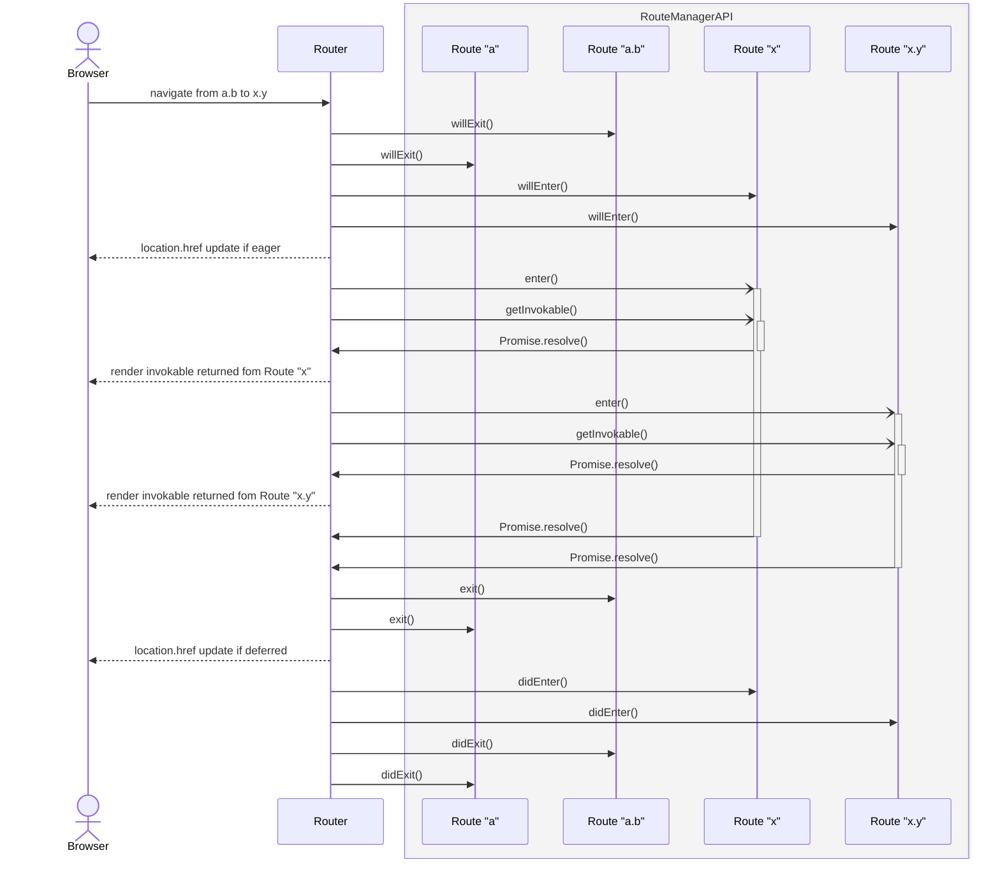
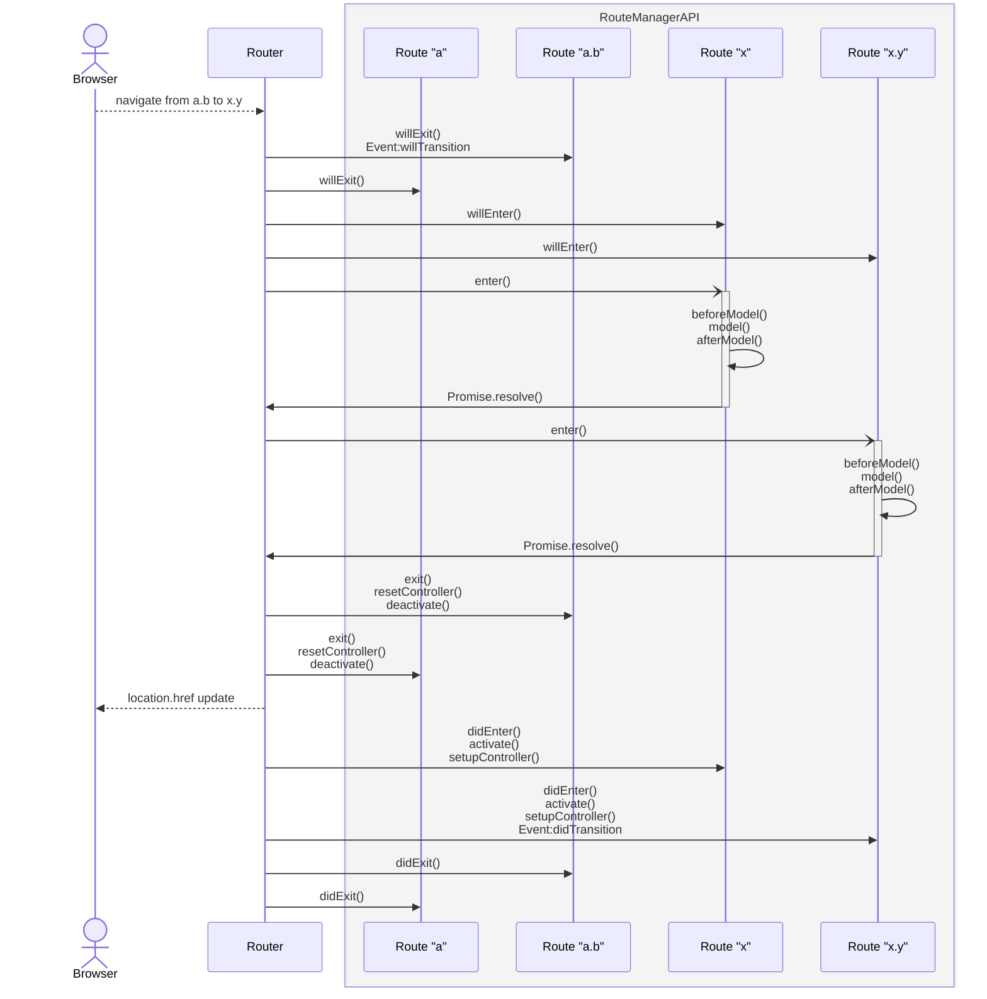

<!---
Directions for above:

stage: Leave as is
start-date: Fill in with today's date, 2032-12-01T00:00:00.000Z
release-date: Leave as is
release-versions: Leave as is
teams: Include only the [team(s)](README.md#relevant-teams) for which this RFC applies
prs:
  accepted: Fill this in with the URL for the Proposal RFC PR
project-link: Leave as is
suite: Leave as is
-->

<!-- Replace "RFC title" with the title of your RFC -->

# Route Manager API

## Summary

This RFC Defines a generic Route Manager concept that can be used to implement new Route base classes as a stepping stone towards a new router. The Route Manager API proposed in this RFC is not intended to be consumed by Ember app developers, but will allow Framework authors and addon developers to create new Route base classes.

## Motivation

The intent of this RFC is to implement a generic Route Manager concept so that we’re able to provide room for experimentation and migration to a new router solution. It aims to provide a well-defined interface between the Router and Route concepts. Well-defined in this case means that we are specifying both the API that Route managers can provide and the order that those APIs are called (i.e. the lifecycle).

This will unlock the possibility of implementing new Route base classes while also making it easier to replace the current router.

A concrete example: since it’s the Route that brings in the Controller, it will also, for example, become possible to implement a Route Manager that exposes a Routable Component without the need for a Controller.

This RFC is **not** intended to describe APIs that Ember app developers would generally use, but it describes the low-level API intended for framework developers to develop next generation routing and for the rare ecosystem developer wanting to write their own Route base classes with an accompanying Route Manager implementation.

## Detailed design

### Route Manager basics

A Route Manager always has `capabilities`, `createRoute` and a `getDestroyable` method.

```typescript
interface RouteManager {
  capabilities: Capabilities;

  // Responsible for the creation of a RouteStateBucket. Returns a RouteStateBucket, defined by the manager implementation.
  createRoute: (factory: object, args: CreateRouteArgs) => RouteStateBucket;

  // Returns the destroyable (if any) for the RouteStateBucket
  getDestroyable: (bucket: RouteStateBucket) => Destroyable | null;

  // ... see below
}

interface CreateRouteArgs {
  // By convention this is currently the dot separated route path.
  name: typeof RouteInfo.name;
}
```

Note: this does not represent the full interface, it is expanded upon further into the RFC.

#### `createRoute`

The `createRoute` method on the Route Manager is responsible for taking the Route’s factory and arguments and based on that return a `RouteStateBucket`. This is invoked by a Router.

**\*Note:** It is up to the manager to decide whether or not this method actually instantiates the factory or if that happens at a later time, depending on the specific lifecycle the manager implementation wants to provide.\*

#### `RouteStateBucket`

The `RouteStateBucket` is a stable reference provided by the manager’s `createRoute` method. All interaction through the Route Manager API will require passing this same stable reference as an argument. The shape and contents of `RouteStateBucket` is defined by the specific Route Manager implementation.

The bucket carries stable identity for a route definition. Per-navigation state lives for the lifetime of each individual render of the route, with the current router provided `RouteInfo` serving this purpose.

#### `getDestroyable`

The `getDestroyable` method takes a `RouteStateBucket` and will return the corresponding `Destroyable` if applicable.

### Determining which route manager to use

The technique used to determine the correct route manager to invoke will follow the well-established examples of manager implementations that already exist in the codebase e.g. for the Component, Modifier, or Helper Managers used by Glimmer. This method will be used by the framework for the Route Base Classes it provides as well as by non-framework code wanting to provide their own Route Manager implementation.

```typescript
// Takes a Factory function for the Manager with an Owner argument and
// the Route base object/class/function for which the manager applies.
setRouteManager: (
  createManager: (owner: Owner) => MyRouteManager,
  definition: object
) => void
```

### NavigationState interface

The NavigationState is an interface for the router to pass information to the manager methods. This interface can be extended with capabilities in the future.

```typescript
// Passed in to the lifecycle methods
interface NavigationState {
  from?: RouteInfo;
  to: RouteInfo;
}

// Classic interoperability, only provided if manager requests classicInterop capability
interface NavigationStateWithTransition = NavigationState & {
  transition: Transition;
}
```

The `RouteInfo` classes refer to the existing public API `RouteInfo` as specified in [the Ember API documentation](https://api.emberjs.com/ember/6.10/classes/routeinfo).

### NavigationActions interface

The `NavigationActions` interface defines any actions that some of the manager hooks are allowed to call. For now this is just the `cancel` action which stops the current navigation. The implementation details are left to the router, but will at least need to abort the `signal` defined in the [`AsyncNavigationState` interface](#asyncnavigationstate-interface).

```typescript
interface NavigationActions {
  // Cancels the current navigation
  cancel: () => void;
}
```

### AsyncNavigationState interface

The `AsyncNavigationState` interface allows Route Managers to have a certain amount of control over the navigation.

The `signal` is an `AbortSignal` provided by the Router which can be used to react to a cancellation of the current navigation. It can be passed to, for example, a `fetch` call.

`getAncestorPromise` allows a child-route to optionally tie in to the asynchronous lifecycle of ancestor Routes. This opens the possibility for a RouteManager implementation for parallel resolution of the asynchronous lifecycle. The Classic Route Manager will rely on this behaviour to implement the current waterfall lifecycle. The ancestor promise will resolve with the `context` for that route i.e. in the Classic Route Manager that would be the return value for the `model()` hook.

```typescript
// Exposes API used to interact with the active navigation, like awaiting ancestor's async behaviour.
interface AsyncNavigationState {
  // Signal for the current navigation
  signal: AbortSignal;

  // Retrieve the ancestor promise for an ancestor route, used to await async ancestor behaviour.
  getAncestorPromise(routeInfo: RouteInfo): ReturnType<RouteManager['enter']>;
}
```

### Route lifecycle

This RFC proposes 2 groups of hooks for lifecycle management of a Route.

- `enter` - called when a route is visited.
- `exit` - called when a route is exited.

The main lifecycle methods are accompanied by synchronous will*/did* methods. This gives the possibility of implementing lifecycle features like cancelling/preventing a route change, cleaning up after a route branch was fully exited. `enter` is promise-aware and will be awaited. This gives the option to do asynchronous work that needs to happen before rendering.

Note: `willEnter()` **must** be sync so that, in the case that the URL update is synchronous, the user-feedback of the URL update is immediate and does not feel "laggy" to the end-user.

```typescript
interface RouteManager {
  // Lifecycle hook called when the Route is about to be entered.
  willEnter: (
    bucket: RouteStateBucket,
    args: NavigationState & NavigationActions,
  ) => void;
  // Main asynchronous entry point - return value is the context (a.k.a model) for the current route
  enter: (
    bucket: RouteStateBucket,
    args: NavigationState & NavigationActions & AsyncNavigationState,
  ) => Promise<unknown>;
  // Called after all `enter` hooks for the current Route hierarchy have succesfully resolved.
  didEnter: (bucket: RouteStateBucket, args: NavigationState) => void;

  // Called when the Route is about to be exited.
  willExit: (
    bucket: RouteStateBucket,
    args: NavigationState & NavigationActions,
  ) => void;
  // Called when the Route is exited.
  exit: (bucket: RouteStateBucket, args: NavigationState) => void;
  // Called when all exiting routes have exited
  didExit: (bucket: RouteStateBucket, args: NavigationState) => void;
}
```

Note: The current Route implementation has a different behaviour depending on if you are transitioning between two routes that are different, or if you are transitioning to the route you are currently on and changing any of the params for that route. This is an **internal concern** of the Route manager and will be implemented in the Classic Route Manager, a Route Manager implementation that is designed to encapsulate the current behaviour of Ember's Routes. We do not need to provide any `update()` hooks on the Route lifecycle to cater for this.

The lifecycle of an example navigation between two routes 'a.b' and 'x.y' looks as follows:



Note: this is the full list of lifecycle events in a single transition between 'a.b' and 'x.y' i.e. the time before this sequence diagram the application will be on route 'a.b', the sequence diagram starts with the action `navigate from a.b to x.y` which can be a user action clicking a `<LinkTo>` or a `transitionTo()` event, and the time after this sequence diagram the application will be on route 'x.y'.

This sequence diagram only specifies the order of the hooks that are called as part of the Route Manager API, the dotted lines from the Router to the Browser are there for illustrative purposes only and are not specified as part of this RFC. Individual Route managers might express substates (such as loading states) as part of their own APIs, but they would have to do that within the constraints of the Route Manager API hooks.

In the above diagram the `enter()` is called before the `getInvokable()` for a given route. The promise returned from `enter()` is exposed to `getInvokable()`, so a manager may either await it (to gate rendering on data) or ignore it (to render immediately and coordinate loading inside its wrapper).

### Capabilities

Route Managers are required to have a `capabilities` property. This property must be set to the result of calling the `capabilities` function provided by Ember.

Any time the Classic Router interfaces with the RouteManager in a way we do not want in the future, we will shield this behind an optional capability. This capability or capabilities will at some point in the future be turned off by default through a deprecation.

#### Classic Router interoperability

When the `classicInterop` capability is set to `true` the Route Manager will have to provide an implementation for the methods that cross the Route Manager boundary to recreate the current Classic Router behaviour. The following list is a best-effort to find those methods, but it may need to change during implementation. The capability that opts in to these functions is not intended to be implemented by any other future Route Manager.

```typescript
// Classic Router interoperability
interface RouteManagerWithClassicInterop = RouteManager & {
  getRouteName(bucket: RouteStateBucket) => string;
  getFullRouteName(bucket: RouteStateBucket) => string;

  // Query Parameter handling
  stashNames(bucket: RouteStateBucket, routeInfo: ExtendedInternalRouteInfo<Route>, dynamicParent: ExtendedInternalRouteInfo<Route>) => void;
  qp(bucket: RouteStateBucket): it's complicated

  serializeQueryParam(bucket: RouteStateBucket, value: unknown, urlKey: string, defaultValueType: string);
  deserializeQueryParam(bucket: RouteStateBucket, value: unknown, urlKey: string, defaultValueType: string);

  // this allows for the implementation of Route.serialize()
  serializeContext(bucket: RouteStateBucket, routeInfo: RouteInfo<Route>, value: unknown) => Record<string, unknown>;

  // Actions/event handlers
  queryParamsDidChange(bucket: RouteStateBucket, changed: {}, totalPresent: unknown, removed: {}) => boolean | void;
  finalizeQueryParamChange(bucket: RouteStateBucket, params: Record<string, string | null | undefined>, finalParams: {}[], transition: Transition) => boolean | void;
}
```

The necessary state will be taken from and stored in the passed `RouteStateBucket`.

### Rendering

For the Route Manager API rendering is split into two manager-provided invokables: a per-route `invokable` from `getInvokable`, and a module-stable `wrapper` from `getRouteWrapper`. The router renders the wrapper and curries the invokable, alongside per-render context, onto it. This keeps the rendering policy in the manager while letting the framework own the curried argument conventions.

```typescript
import type { ComponentLike } from '@glint/template';

interface RouteManager<T extends ComponentLike<unknown>> = {
  getRouteWrapper(): ComponentLike<{
    Args: {
      Component: T;
      context: ReturnType<RouteManager['enter']>;
      bucket: RouteStateBucket;
    }
  }>;

  getInvokable(
    bucket: RouteStateBucket,
    enterPromise: Promise<unknown>,
  ): Promise<T>;
}
```

`getRouteWrapper` returns a component that calls the route's invokable. The router curries `@Component` (the invokable), the context, and the bucket onto it. The wrapper should be stable across renders so that the rendering layer can use identity to determine when to tear it down.

`getInvokable` returns the component for the current route. It receives the in-flight `enterPromise` so the manager can choose whether to await data before resolving, or to resolve immediately and defer loading-state handling to the wrapper. The promise is async to allow `await import()` for lazy-loaded route modules, and is never exposed elsewhere on the manager-facing API.

## How we teach this

Since this is not an Ember app developer facing feature the guides don’t need adjustment. Documentation will live in the API docs.

## Drawbacks

This introduces a new layer that isn't strictly required, but experiments would be much harder without it. Splitting the existing implementation will not be trivial to separate, but it is worth the effort long term.

## Alternatives

The manager pattern is used across the Ember codebase with success and this is just the first step for formalizing improvements to the Router, alternatives were not explored.

### Route lifecycle update hooks

A previous iteration of this RFC provided explicit `willUpdate()`, `update()`, and `didUpdate()` hooks in the Route Manager interface that were distinct to the `enter()` related hooks and would only be called when you are entering the same route you are currently on with a transition. This was added to simplify the implementation of the Classic Route Manager, which is intended to encapsulate the current behaviour of Ember's existing routes. In reality the trade-off between making the implementation easier and having a wider API surface area is most likely not worth it.

This will require the Classic Route Manager to do some more elaborate internal work to provide the same lifecycle hooks that current Routes expect, this is an intentional decision to improve the interface of the Manager API and will not have a lasting impact on Ember as the Classic Route Manager is intended to be a compatibility-layer for existing applications and will be phased out.

### Sync getInvokable()

A previous version of this RFC had a sync version of the `getInvokable()` function on the Route Manager API. This was changed to give a slightly better developer experience to allow people to absorb asynchronous imports of modules. Note: this is not intended to have any implications on the `enter()` hook and the async data loading is never intended to happen during the `getInvokable()` promise lifecycle.

We do not strictly need to have an async `getInvokable()` because you could always return a sync invokable that managed the async internally, i.e. using a resource-style pattern. As these APIs are quite low-level it doesn't really matter which way we lean on this decision since the complexity will never leak into Ember App Developer ergonomics.

### Merging enter() and getInvokable() hooks

Comments on this RFC proposed that we could unify the `enter()` and the `getInvokable()` functions. We are explicitly not merging those two functions because the `enter()` hook returns context (usually from data-loading) which is entirely separate from the concerns of `getInvokable()`.

Separate functions also allow for more flexible implementations of the manager lifecycle, for example you could have a manager that always resolves `getInvokable()` immediately and does not gate rendering on the result of `enter()`, or you could have a manager that waits for the result of `enter()` before resolving `getInvokable()`.

Also, it's worth noting that the promise returned by the `getInvokable()` is never exposed to any route via the Route Manager API, and will be an internal concern of the Router itself. The promise returned from `enter()` is exposed to child routes via the `getAncestorPromise()` function so they can await the result to get the context of parent routes.

## Unresolved questions

None beyond implementation details.

## Addenda

### #1 What Classic Routes look like implemented with the Route Manager API

The existing `@ember/route` Route base class will be referred to as Classic Route. Below is a description of how the current Classic Route implementation could be supported by the proposed Route Manager API.

#### Hooks & events

Below an example of how the Classic Route class could map to manager events. **All** the classic hooks need access to the relevant `Transition` object.

The model hooks are an RSVP Promise chain handled by router_js. We can put them in `enter` which is Promise-aware.

---

#### Switching between routes:

`willExit`:

- `willTransition` event (currently sync), bubbles through RouteInfos as long as true is returned or no handler is present. **NOTE:** these bubble.
- `routeWillChange` event (currently sync), router service event.

`enter`:

- `beforeModel` hook
- `model` hook
- `afterModel` hook

`exit`:

- `resetController` hook
- `deactivate` hook

`didEnter`:

- `activate` hook
- `setupController` hook
- `didTransition` event **NOTE:** these bubble.
- `routeDidChange` event, router service event

---

#### Updating the model for an existing route mapped to manager hooks:

- `willUpdate` (leaf-most)
  - `willTransition` event
  - `routeWillChange` event, router service
- `update`
  - `beforeModel`
  - `model`
  - `afterModel`
- `didUpdate` (leaf-most)
  - `resetController` (conditionally, if model return value changed)
  - `setupController` (conditionally, if model return value changed)
  - `didTransition` (event, leafmost)
  - `routeDidChange` event, router service

#### Mapping of existing events and methods to the new API


