<!---
Directions for above:

stage: Leave as is
start-date: Fill in with today's date, 2032-12-01T00:00:00.000Z
release-date: Leave as is
release-versions: Leave as is
teams: Include only the [team(s)](README.md#relevant-teams) for which this RFC applies
prs:
  accepted: Fill this in with the URL for the Proposal RFC PR
project-link: Leave as is
-->

# Deprecate `import Component from '@ember/component'`

## Summary

Deprecate the classic component class -- the default export of `@ember/component`.

Glimmer components ([`@glimmer/component`](https://api.emberjs.com/ember/release/modules/@glimmer%2Fcomponent)) have been the default since Octane (`ember-source@3.15`, 2019), and every feature of the classic component has a replacement that is smaller, easier to teach, and doesn't depend on the classic object model.

## Motivation

Classic components are the largest remaining consumer of everything else we've been deprecating:

- they extend `EmberObject`, requiring the [Classic Class system](https://github.com/emberjs/rfcs/pull/1117)
- they are assembled out of [Mixins](https://github.com/emberjs/rfcs/pull/1116) (`Evented`, `ActionSupport`, `TargetActionSupport`, ...)
- they are the last thing in the framework that supports two-way bindings
- their `click()` / `mouseEnter()` / etc methods require the app-wide `EventDispatcher`, which attaches delegated listeners to the root of every Ember app whether or not anything uses them

**We cannot finish removing the classic object model while the classic component still exists.**

Deleting the classic component (at the major following this deprecation) lets us also delete the `EventDispatcher`, `Ember.View`-era internals, and the component half of the two-way binding system -- some of the oldest and most expensive code in `ember-source`.

## Transition Path

### What is deprecated

Only the _default_ export of `@ember/component`. The module itself and its named exports are unaffected:

|   | export | status |
| - | ------ | ------ |
| 🌐 | `default` (the classic `Component` class) | **deprecated** |
| 🌐 | `setComponentTemplate` | stays |
| 🌐 | `getComponentTemplate` | stays |
| 🌐 | `setComponentManager` | stays |
| 🌐 | `capabilities` | stays |
| 🌐 | `@ember/component/template-only` | stays |

Since importing a module can't warn at runtime, the deprecation fires when the class is extended (via native `class extends` or `.extend()`) or instantiated:

```js
deprecate(message, false, {
  id: 'ember-component',
  until: '8.0.0',
  for: 'ember-source',
  url: 'https://deprecations.emberjs.com/id/ember-component',
  since: { available: '7.x', enabled: '7.x' }, // exact versions dependent on implementation timing
});
```

The built-in components (`<Input>`, `<Textarea>`, `<LinkTo>`) were already moved off the classic component base class in [RFC #671](https://rfcs.emberjs.com/id/0671-modernize-built-in-components-1), so they do not trigger this deprecation.

### Deprecation Guide

The guide leads with what your code should look like when you're done, because folks doing this migration have reported that the hardest part is not any individual step -- it's knowing where they're going. The steps come after.

#### The end state

Each scenario below shows a classic component and what it becomes. The "after" examples use `<template>` ([RFC #779](https://rfcs.emberjs.com/id/0779-first-class-component-templates)), but everything shown also works in loose-mode `.hbs` + `.js` colocation if you haven't adopted gjs/gts yet.

##### You only have a JS file out of habit

```js
// before: app/components/greeting.js
import Component from '@ember/component';

export default Component.extend();
```

```hbs
{{! before: app/components/greeting.hbs }}
<p>Hello, {{@name}}!</p>
```

Delete the class. A template is a component:

```gjs
// after: app/components/greeting.gjs
<template>
  <p>Hello, {{@name}}!</p>
</template>
```

##### Local state and actions

```js
// before
import Component from '@ember/component';
import { action } from '@ember/object';

export default class Toggle extends Component {
  isOn = false;

  @action
  flip() {
    this.set('isOn', !this.isOn);
  }
}
```

```gjs
// after
import Component from '@glimmer/component';
import { tracked } from '@glimmer/tracking';
import { on } from '@ember/modifier';

export default class Toggle extends Component {
  @tracked isOn = false;

  flip = () => (this.isOn = !this.isOn);

  <template>
    <button type="button" {{on "click" this.flip}}>
      {{if this.isOn "on" "off"}}
    </button>
  </template>
}
```

No more `this.set` -- assignment to a `@tracked` property is all there is.

##### The element: `tagName`, `classNames`, `attributeBindings`, `elementId`, `ariaRole`

Classic components conjure a wrapper element out of JS configuration. Glimmer components don't have a wrapper element at all -- whatever element you want, you write in the template, where it was always visible to begin with.

```js
// before
import Component from '@ember/component';

export default class UserCard extends Component {
  tagName = 'section';
  classNames = ['user-card'];
  classNameBindings = ['isSelected:selected'];
  attributeBindings = ['label:aria-label'];
  ariaRole = 'listitem';
}
```

```hbs
{{! before }}

{{yield}}
```

```gjs
// after
<template>
  <section
    class="user-card {{if @isSelected 'selected'}}"
    role="listitem"
    aria-label={{@label}}
    ...attributes
  >
    
    {{yield}}
  </section>
</template>
```

`...attributes` covers what `class` / `id` / attribute merging from the call site used to do -- and unlike the classic behavior, callers can now target it exactly where you place it.

##### DOM event methods: `click()`, `mouseEnter()`, `keyDown()`, ...

```js
// before
import Component from '@ember/component';

export default class Item extends Component {
  click(event) {
    this.select(event);
  }
}
```

```gjs
// after
import { on } from '@ember/modifier';

<template>
  <div {{on "click" @select}} ...attributes>
    {{yield}}
  </div>
</template>
```

The `{{on}}` modifier attaches a real event listener to a real element -- no `EventDispatcher`, no delegation, no guessing which element receives the event.

##### Lifecycle hooks and `this.element`

Anything that needed `didInsertElement` / `didUpdateAttrs` / `willDestroyElement` to touch the DOM becomes a modifier. Modifiers are targeted at the exact element that needs the behavior, and their cleanup is not optional-by-convention -- it's the return value.

```js
// before
import Component from '@ember/component';

export default class Chart extends Component {
  didInsertElement() {
    super.didInsertElement(...arguments);
    this.chart = renderChart(this.element, this.data);
  }

  didUpdateAttrs() {
    super.didUpdateAttrs(...arguments);
    this.chart.update(this.data);
  }

  willDestroyElement() {
    this.chart.destroy();
    super.willDestroyElement(...arguments);
  }
}
```

```gjs
// after
import { modifier } from 'ember-modifier';

const drawChart = modifier((element, [data]) => {
  let chart = renderChart(element, data);

  return () => chart.destroy();
});

<template>
  <div {{drawChart @data}} ...attributes></div>
</template>
```

For non-DOM teardown, `@glimmer/component` still has `willDestroy`, and `registerDestructor` from `@ember/destroyable` works everywhere.

##### `didReceiveAttrs` / computed properties deriving state

Derived data doesn't need a lifecycle hook or a dependent-key list. It's a getter.

```js
// before
import Component from '@ember/component';
import { computed } from '@ember/object';

export default class FullName extends Component {
  @computed('first', 'last')
  get fullName() {
    return `${this.first} ${this.last}`;
  }
}
```

```js
// after
import Component from '@glimmer/component';

export default class FullName extends Component {
  get fullName() {
    return `${this.args.first} ${this.args.last}`;
  }
}
```

If the getter is expensive, `@cached` (from `@glimmer/tracking`) memoizes it. If the getter is trivial (like this one), you likely don't need the class at all.

##### Two-way bindings

Classic components let a child `this.set()` an argument and have the write propagate into the parent. Glimmer components' `this.args` is read-only: the owner of the state changes it, and the child asks via a callback.

```js
// before: the child writes the parent's property
import Component from '@ember/component';
import { action } from '@ember/object';

export default class Counter extends Component {
  @action
  increment() {
    this.set('count', this.count + 1);
  }
}
```

```gjs
// after: the parent owns the state, the child receives a function
// parent
import Component from '@glimmer/component';
import { tracked } from '@glimmer/tracking';
import Counter from './counter';

export default class Parent extends Component {
  @tracked count = 0;

  increment = () => this.count++;

  <template>
    <Counter @count={{this.count}} @onIncrement={{this.increment}} />
  </template>
}
```

##### `positionalParams`

There is no equivalent -- angle bracket invocation has no positional arguments. Give the arguments names:

```hbs
{{! before }}
{{avatar user size}}
```

```hbs
{{! after }}
<Avatar @user={{user}} @size={{size}} />
```

#### Migrating incrementally

You do not need a flag day. Classic and Glimmer components coexist in the same app, the same route, even the same template -- migrate one component at a time, in any order.

Here is the whole path in one picture. Diamonds ask "does your code do this?", rectangles are hand-work, double-walled boxes are codemods that do the work for you. The top section runs once across the whole app; the bottom section repeats for each component, top to bottom:

```mermaid
flowchart TD
    Start(["import Component from '@ember/component'"]) --> Colocated

    subgraph once["once, app-wide"]
        Colocated{"templates in app/templates/components/,<br>or layout / layoutName?"}
        Migrator[["ember-component-template-colocation-migrator"]]
        Curlies{"invoked curly-style: {{my-component}}?"}
        Angle[["ember-angle-brackets-codemod"]]
        Implicit{"bare {{foo}} in templates instead of<br>{{this.foo}} / {{@foo}}?"}
        NoImplicit[["ember-no-implicit-this-codemod"]]
        ClassicClass{"still using .extend()?"}
        Mixins["deal with Mixins first: inline them, or<br>convert to class decorators (RFC #1116)"]
        Native[["ember-native-class-codemod"]]

        Colocated -->|yes| Migrator --> Curlies
        Colocated -->|no| Curlies
        Curlies -->|yes| Angle --> Implicit
        Curlies -->|no| Implicit
        Implicit -->|yes| NoImplicit --> ClassicClass
        Implicit -->|no| ClassicClass
        ClassicClass -->|"yes, with Mixins"| Mixins --> Native
        ClassicClass -->|yes| Native
    end

    ClassicClass -->|no| Element
    Native --> Element

    subgraph each["per component, in order -- every step ships on its own, while still classic"]
        Element{"tagName / classNames / classNameBindings /<br>attributeBindings / elementId / ariaRole?"}
        Flatten["write the element in the template,<br>move the bindings onto it, add ...attributes,<br>set tagName = ''"]
        Events{"click() / keyDown() / mouseEnter() / ...?"}
        On["{{on}} on the element, in the template"]
        Hooks{"didInsertElement / didUpdateAttrs /<br>willDestroyElement / didRender / this.element?"}
        Mod["extract a modifier (ember-modifier);<br>@ember/render-modifiers as an intermediate"]
        TwoWay{"this.set() on passed-in properties,<br>or callers reaching for {{mut}}?"}
        Ddau["the caller keeps the state and<br>passes a callback down"]
        Evented{"this.trigger() / this.on() from Evented?"}
        Cb["plain functions / callbacks (see RFC #1111)"]
        Derive{"didReceiveAttrs / observers / @computed<br>deriving data?"}
        Getter["native getters; @cached if expensive"]
        Local{"local mutable state via this.set()?"}
        Tracked["@tracked + plain assignment<br>(ember-tracked-properties-codemod)"]
        Actions{"actions hash / this.send()?"}
        Methods["@action methods, called directly"]
        Positional{"positionalParams?"}
        Named["named arguments, at every call site"]

        Element -->|yes| Flatten --> Events
        Element -->|no| Events
        Events -->|yes| On --> Hooks
        Events -->|no| Hooks
        Hooks -->|yes| Mod --> TwoWay
        Hooks -->|no| TwoWay
        TwoWay -->|yes| Ddau --> Evented
        TwoWay -->|no| Evented
        Evented -->|yes| Cb --> Derive
        Evented -->|no| Derive
        Derive -->|yes| Getter --> Local
        Derive -->|no| Local
        Local -->|yes| Tracked --> Actions
        Local -->|no| Actions
        Actions -->|yes| Methods --> Positional
        Actions -->|no| Positional
        Positional -->|yes| Named --> Swap
        Positional -->|no| Swap
    end

    Swap["swap the superclass:<br>'@ember/component' → '@glimmer/component',<br>this.foo → this.args.foo ({{@foo}} in the template),<br>init() → constructor()"]
    Gjs{"want template tag / gjs? (RFC #779)"}
    TT[["@embroider/template-tag-codemod"]]
    Done(["no more '@ember/component'"])

    Swap --> Gjs
    Gjs -->|yes| TT --> Done
    Gjs -->|no| Done
```



Within a single component, the trick is that almost every step above **works while the component is still classic**. That means each step is a small, shippable PR, and the scary-looking superclass swap is the _last_ and _smallest_ diff, not the first:

1. **Get on native classes first.** If the component is still `Component.extend({ ... })`, run [ember-native-class-codemod](https://github.com/ember-codemods/ember-native-class-codemod). Everything below assumes native class syntax.
2. **Flatten the element into the template.** Write the root element explicitly in the template, move `classNames` / `classNameBindings` / `attributeBindings` / `ariaRole` onto it, add `...attributes`, then set `tagName = ''`. Classic components fully support `tagName: ''` + splattributes, so this ships on its own.
3. **Replace event methods with `{{on}}`.** Once the element is in the template, `click()` becomes `{{on "click" this.select}}` on that element. Also shippable while classic.
4. **Move lifecycle hooks into modifiers.** [@ember/render-modifiers](https://github.com/emberjs/ember-render-modifiers) (`{{did-insert}}` / `{{did-update}}` / `{{will-destroy}}`) is the mechanical intermediate step; a purpose-built [ember-modifier](https://github.com/ember-modifier/ember-modifier) is the end state. Modifiers work on classic components' templates too.
5. **Untangle two-way bindings.** Stop `this.set()`-ing anything that was passed in; take a callback argument instead. This is the only step that changes the component's public interface, so it's the one to review carefully.
6. **Replace `@computed` with getters and local state with `@tracked`.** Tracked properties work inside classic components, so this also ships independently.
7. **Swap the superclass.** `import Component from '@ember/component'` → `import Component from '@glimmer/component'`, and argument access moves from `this.foo` to `this.args.foo` (`{{@foo}}` in the template). Because of steps 2--6, there is nothing else left in the class that needs to change.
8. **(Optional) convert to `<template>`.** See [RFC #779](https://rfcs.emberjs.com/id/0779-first-class-component-templates).

There is deliberately no single classic→glimmer codemod: steps 2, 4, and 5 involve decisions (where does `...attributes` go? what is the modifier's responsibility? who owns this state?) that a codemod would get wrong silently. The mechanical parts are covered:

- [ember-component-template-colocation-migrator](https://github.com/ember-codemods/ember-component-template-colocation-migrator)
- [ember-angle-brackets-codemod](https://github.com/ember-codemods/ember-angle-brackets-codemod)
- [ember-no-implicit-this-codemod](https://github.com/ember-codemods/ember-no-implicit-this-codemod)
- [ember-native-class-codemod](https://github.com/ember-codemods/ember-native-class-codemod)
- [ember-tracked-properties-codemod](https://github.com/ember-codemods/ember-tracked-properties-codemod)
- [@embroider/template-tag-codemod](https://github.com/embroider-build/embroider/tree/main/packages/template-tag-codemod)

### Ecosystem

- `eslint-plugin-ember` already has [`ember/no-classic-components`](https://github.com/ember-cli/eslint-plugin-ember/blob/main/docs/rules/no-classic-components.md) in its recommended config, so most apps have been told about this for years.
- The component blueprint has generated Glimmer components since Octane; no blueprint changes needed.
- Addons that ship classic components will need to migrate before the next major. Per usual, addon authors are expected to move faster than app authors, and the deprecation window exists for exactly this.
- Ember Inspector renders both component systems today; removal (at the major) only deletes code paths.
- SSR / Fastboot: no impact beyond the components themselves.

## How We Teach This

The guides have not taught classic components since Octane -- there is nothing to remove from the current guides. The work is:

- publish the deprecation guide above at [deprecations.emberjs.com](https://deprecations.emberjs.com)
- mark the class deprecated in the API docs, linking to the guide
- the [Octane vs Classic cheat sheet](https://guides.emberjs.com/release/upgrading/current-edition/) already covers most of these before/afters and should be linked from the deprecation message

## Drawbacks

This is the big one. Every long-lived Ember app has classic components, and unlike `inject`-vs-`service` there is no find-and-replace -- each component takes actual thought. Apps with hundreds of classic components will feel this deprecation more than any since Octane shipped.

The mitigations are that the deprecation window is long, every intermediate step is shippable on its own (see above), and the replacement has been the default -- with documentation, lint rules, and community experience -- for over six years.

## Alternatives

- do nothing -- we keep shipping the `EventDispatcher`, the classic class machinery, and two-way bindings to every app forever, and [#1116](https://github.com/emberjs/rfcs/pull/1116)/[#1117](https://github.com/emberjs/rfcs/pull/1117) can never complete their removals.
- extract the classic component into a userland package -- `setComponentManager` exists, so a `classic-component` package with its own component manager is _technically_ possible, and would give stuck apps an escape hatch past the major. This is compatible with (not an alternative to) this RFC, and could be community-maintained the way [ember-legacy-built-in-components](https://github.com/emberjs/ember-legacy-built-in-components) was for RFC #671. Notably though, such a package could not support the `click()`-style event methods without shipping its own event dispatcher.
- deprecate only pieces (e.g. just the event methods, just two-way bindings) -- slices the same work into more RFCs and more deprecation cycles without changing the destination.

## Unresolved questions

- Should `@ember/component/template-only` be deprecated alongside this? `<template>` makes it unnecessary, but plenty of v2 addons use it in their compiled output, so it likely wants its own RFC and timeline.
- Exact `until` / `since` versions depend on which release the deprecation lands in.
