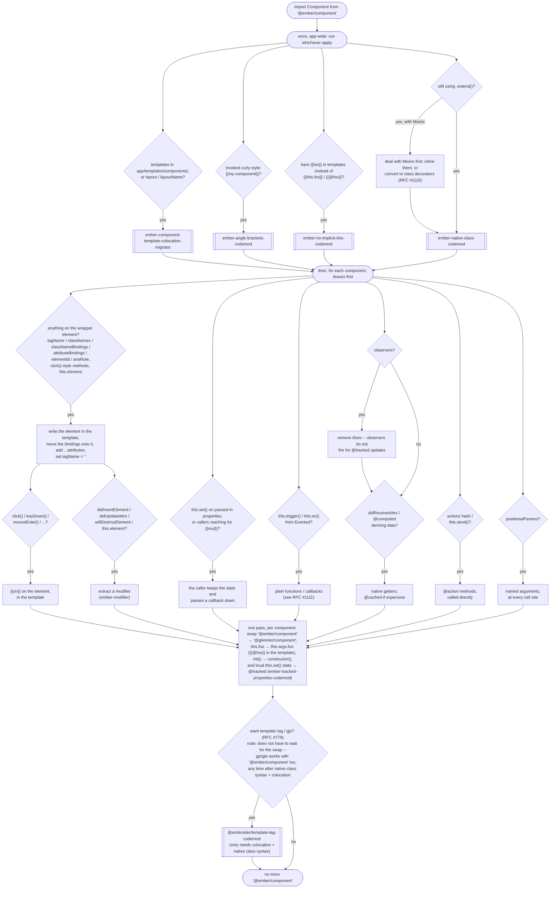

<!---
Directions for above:

stage: Leave as is
start-date: Fill in with today's date, 2032-12-01T00:00:00.000Z
release-date: Leave as is
release-versions: Leave as is
teams: Include only the [team(s)](README.md#relevant-teams) for which this RFC applies
prs:
  accepted: Fill this in with the URL for the Proposal RFC PR
project-link: Leave as is
-->

# Deprecate Classic Ember Component aka `import Component from '@ember/component'`

## Summary

Deprecate the classic component class -- the default export of `@ember/component`.

Glimmer components ([`@glimmer/component`](https://api.emberjs.com/ember/release/modules/@glimmer%2Fcomponent)) have been the default component in Ember projects since Octane (`ember-source@3.15`, 2019), and every feature of the classic component has a replacement that is smaller, easier to teach, and doesn't depend on the classic object model.

## Motivation
Classic Components have been replaced by Glimmer Components. The replacement was introduced nearly a decade ago and made default in 2019. We've known since we began designing Glimmer Components that the Classic Components had serious limitations and were difficult to teach. 

Additionally, Classic components are the largest remaining consumer of everything else we've been deprecating or working to deprecate:

- they extend `EmberObject`, requiring the [Classic Class system](https://github.com/emberjs/rfcs/pull/1117)
- they are assembled out of [Mixins](https://github.com/emberjs/rfcs/pull/1116) (`Evented`, `ActionSupport`, `TargetActionSupport`, ...)
- they are the last thing in the framework that supports two-way bindings
- their `click()` / `mouseEnter()` / etc methods require the app-wide `EventDispatcher`, which attaches delegated listeners to the root of every Ember app whether or not anything uses them

**We cannot finish removing the classic object model while the classic component still exists.**

Deleting the classic component (at the major following this deprecation) lets us also delete the `EventDispatcher`, `Ember.View`-era internals, and the component half of the two-way binding system -- some of the oldest and most expensive code in `ember-source`.

## Transition Path

### What is deprecated

Only the _default_ export of `@ember/component`. The module itself and its named exports are unaffected:

|   | export | status |
| - | ------ | ------ |
| 🌐 | `default` (the classic `Component` class) | **deprecated** |
| 🌐 | `setComponentTemplate` | stays |
| 🌐 | `getComponentTemplate` | stays |
| 🌐 | `setComponentManager` | stays |
| 🌐 | `capabilities` | stays |
| 🌐 | `@ember/component/template-only` | stays |

Since importing a module can't warn at runtime, the deprecation fires when the class is extended (via native `class extends` or `.extend()`) or instantiated:

```js
deprecate(message, false, {
  id: 'ember-component',
  until: '8.0.0',
  for: 'ember-source',
  url: 'https://deprecations.emberjs.com/id/ember-component',
  since: { available: '7.x', enabled: '7.x' }, // exact versions dependent on implementation timing
});
```

The built-in components (`<Input>`, `<Textarea>`, `<LinkTo>`) were already moved off the classic component base class in [RFC #671](https://rfcs.emberjs.com/id/0671-modernize-built-in-components-1), so they do not trigger this deprecation.

### Deprecation Guide

> [!NOTE]
> gjs / gts is supported back to 3.28, and includes `@ember/component`. This allows very zebra-striped incremental migrations, if needed.

<details><summary>You only have a JS file</summary> 

```js
// before: app/components/greeting.js
import Component from '@ember/component';

export default Component.extend();
```

```hbs
{{! before: app/components/greeting.hbs }}
<p>Hello, {{@name}}!</p>
```

Delete the class. A template is a component:

```gjs
// after: app/components/greeting.gjs
<template>
  <p>Hello, {{@name}}!</p>
</template>
```

</details>

<details><summary>Local state and actions</summary>

```js
// before
import Component from '@ember/component';
import { action } from '@ember/object';

export default class Toggle extends Component {
  isOn = false;

  @action
  flip() {
    this.set('isOn', !this.isOn);
  }
}
```

```gjs
// after
import Component from '@glimmer/component';
import { tracked } from '@glimmer/tracking';
import { on } from '@ember/modifier';

export default class Toggle extends Component {
  @tracked isOn = false;

  flip = () => (this.isOn = !this.isOn);

  <template>
    <button type="button" {{on "click" this.flip}}>
      {{if this.isOn "on" "off"}}
    </button>
  </template>
}
```

`this.set` becomes plain assignment to a `@tracked` property.

</details>

<details><summary>The element: <code>tagName</code>, <code>classNames</code>, <code>attributeBindings</code>, <code>elementId</code>, <code>ariaRole</code></summary>

Glimmer components have no wrapper element. Write the element in the template, and move each JS setting onto it as an attribute:

```js
// before
import Component from '@ember/component';

export default class UserCard extends Component {
  tagName = 'section';
  classNames = ['user-card'];
  classNameBindings = ['isSelected:selected'];
  attributeBindings = ['label:aria-label'];
  ariaRole = 'listitem';
}
```

```hbs
{{! before }}

{{yield}}
```

```gjs
// after
<template>
  <section
    class="user-card {{if @isSelected 'selected'}}"
    role="listitem"
    aria-label={{@label}}
    ...attributes
  >
    
    {{yield}}
  </section>
</template>
```

`...attributes` receives the attributes passed at the call site (`class`, `id`, `data-*`, ...); place it on the element that should receive them.

</details>

<details><summary>DOM event methods: <code>click()</code>, <code>mouseEnter()</code>, <code>keyDown()</code>, ...</summary>

```js
// before
import Component from '@ember/component';

export default class Item extends Component {
  click(event) {
    this.select(event);
  }
}
```

```gjs
// after
import { on } from '@ember/modifier';

<template>
  <div {{on "click" @select}} ...attributes>
    {{yield}}
  </div>
</template>
```

Each event method maps to `{{on}}` with the DOM event name: `click()` → `{{on "click" ...}}`, `keyDown()` → `{{on "keydown" ...}}`, `mouseEnter()` → `{{on "mouseenter" ...}}`.

</details>

<details><summary>Lifecycle hooks and <code>this.element</code></summary>

Anything that used `didInsertElement` / `didUpdateAttrs` / `willDestroyElement` to touch the DOM becomes a modifier, attached to the element it manages. Teardown is the modifier's return value.

```js
// before
import Component from '@ember/component';

export default class Chart extends Component {
  didInsertElement() {
    super.didInsertElement(...arguments);
    this.chart = renderChart(this.element, this.data);
  }

  didUpdateAttrs() {
    super.didUpdateAttrs(...arguments);
    this.chart.update(this.data);
  }

  willDestroyElement() {
    this.chart.destroy();
    super.willDestroyElement(...arguments);
  }
}
```

```gjs
// after
import { modifier } from 'ember-modifier';

const drawChart = modifier((element, [data]) => {
  let chart = renderChart(element, data);

  return () => chart.destroy();
});

<template>
  <div {{drawChart @data}} ...attributes></div>
</template>
```

For non-DOM teardown, `@glimmer/component` still has `willDestroy`, and `registerDestructor` from `@ember/destroyable` works everywhere.

</details>

<details><summary><code>didReceiveAttrs</code> / computed properties deriving state</summary>

Derived data becomes a getter:

```js
// before
import Component from '@ember/component';
import { computed } from '@ember/object';

export default class FullName extends Component {
  @computed('first', 'last')
  get fullName() {
    return `${this.first} ${this.last}`;
  }
}
```

```js
// after
import Component from '@glimmer/component';

export default class FullName extends Component {
  get fullName() {
    return `${this.args.first} ${this.args.last}`;
  }
}
```

If the getter is expensive, `@cached` (from `@glimmer/tracking`) memoizes it. If the getter only formats arguments (like this one), skip the class and put the expression in a template-only component.

</details>

<details><summary>Two-way bindings</summary>

Classic components let a child `this.set()` an argument and have the write propagate into the parent. Glimmer components' `this.args` is read-only: the owner of the state changes it, and the child asks via a callback.

```js
// before: the child writes the parent's property
import Component from '@ember/component';
import { action } from '@ember/object';

export default class Counter extends Component {
  @action
  increment() {
    this.set('count', this.count + 1);
  }
}
```

```gjs
// after: the parent owns the state, the child receives a function
// parent
import Component from '@glimmer/component';
import { tracked } from '@glimmer/tracking';
import Counter from './counter';

export default class Parent extends Component {
  @tracked count = 0;

  increment = () => this.count++;

  <template>
    <Counter @count={{this.count}} @onIncrement={{this.increment}} />
  </template>
}
```

</details>

<details><summary><code>positionalParams</code></summary>

Angle bracket invocation has no positional arguments. Give the arguments names:

```hbs
{{! before }}
{{avatar user size}}
```

```hbs
{{! after }}
<Avatar @user={{user}} @size={{size}} />
```

</details>

#### Migrating incrementally

You do not need a flag day. Classic and Glimmer components coexist in the same app, the same route, even the same template -- migrate one component at a time, in any order.

Here is the whole path in one picture. Diamonds ask "does your code do this?" -- a "no" means there is nothing to do on that branch. Rectangles are hand-work, double-walled boxes are codemods that do the work for you. When several branches leave the same node, they are independent: do them in any order, or in parallel across a team. The only arrows that mean "must happen first" are the ones you see:



"Leaves first": computed properties cannot depend on native getters or tracked data, so convert components that do not feed data into still-unconverted parents, then work up the tree.

Longer walkthroughs of the same migration:

- the official [Octane upgrade guide](https://guides.emberjs.com/v5.12.0/upgrading/current-edition/) -- recommends starting with components that have no two-way bindings, computed properties, or observers
- [Chris Krycho's phased migration guides](https://github.com/chriskrycho/octane-migration-guides) -- source of the leaves-first rule and of doing `@tracked` with the superclass swap
- the Ember Atlas recommended migration order (preserved in [Melanie Sumner's slides](https://noti.st/melsumner/Hl16PZ/slides)) -- source of "observers go before `@tracked`"
- community walkthroughs from [Lighthouse](https://dev.to/lighthouse-intelligence/the-road-from-ember-classic-to-glimmer-components-4hlc) and [Isaac Lee](https://crunchingnumbers.live/2019/12/23/rewriting-apps-in-ember-octane/)

Every step ships on its own, while the component is still classic. The numbering is a sensible default, not a dependency list. The only hard edges:

- step 2 before steps 3 and 4 (the element has to exist in the template before things can attach to it)
- everything before step 7 (the swap)

1. **Get on native classes.**
    - still `Component.extend({ ... })`? run [ember-native-class-codemod](https://github.com/ember-codemods/ember-native-class-codemod)
    - everything below assumes native class syntax
2. **Flatten the element into the template.**
    - write the root element in the template
    - move `classNames` / `classNameBindings` / `attributeBindings` / `ariaRole` onto it
    - add `...attributes`
    - set `tagName = ''` (classic components fully support `tagName: ''` + splattributes)
3. **Replace event methods with `{{on}}`.**
    - `click()` → `{{on "click" this.select}}` on the element from step 2
4. **Move lifecycle hooks into modifiers.**
    - end state: a purpose-built [ember-modifier](https://github.com/ember-modifier/ember-modifier)
    - optional intermediate: [@ember/render-modifiers](https://github.com/emberjs/ember-render-modifiers) (`{{did-insert}}` / `{{did-update}}` / `{{will-destroy}}`) -- a migration tool only, not recommended for applications (see its README); skippable entirely
    - modifiers work on classic components' templates too
5. **Untangle two-way bindings.**
    - stop `this.set()`-ing anything that was passed in; take a callback argument instead
    - the only step that changes the component's public interface -- review carefully
6. **Replace `@computed` with getters.**
    - getters work inside classic components
    - observers first: they do not fire for `@tracked` updates, so remove them before anything they watch becomes tracked
7. **Swap the superclass, and adopt `@tracked` in the same pass.**
    - `import Component from '@ember/component'` → `import Component from '@glimmer/component'`
    - `this.foo` → `this.args.foo` (`{{@foo}}` in the template)
    - `init()` → `constructor()`
    - local mutable state → `@tracked` with plain assignment ([ember-tracked-properties-codemod](https://github.com/ember-codemods/ember-tracked-properties-codemod))
    - go leaves-first: a computed property in a not-yet-converted parent cannot depend on this component's new native getters
    - after steps 2--6, nothing else in the class needs to change
8. **(Optional) convert to `<template>`.** ([RFC #779](https://rfcs.emberjs.com/id/0779-first-class-component-templates))
    - [@embroider/template-tag-codemod](https://github.com/embroider-build/embroider/tree/main/packages/template-tag-codemod) does it mechanically; it skips components that are not colocated + native-class
    - works with classic components (`<template>` compiles to `setComponentTemplate(...)`), so this is available any time after step 1 -- no need to wait for the swap

There is no single classic→glimmer codemod; steps 2, 4, and 5 require per-component decisions. The mechanical parts are covered by:

- [ember-component-template-colocation-migrator](https://github.com/ember-codemods/ember-component-template-colocation-migrator)
- [ember-angle-brackets-codemod](https://github.com/ember-codemods/ember-angle-brackets-codemod)
- [ember-no-implicit-this-codemod](https://github.com/ember-codemods/ember-no-implicit-this-codemod)
- [ember-native-class-codemod](https://github.com/ember-codemods/ember-native-class-codemod)
- [ember-tracked-properties-codemod](https://github.com/ember-codemods/ember-tracked-properties-codemod)
- [@embroider/template-tag-codemod](https://github.com/embroider-build/embroider/tree/main/packages/template-tag-codemod)

### Ecosystem

- `eslint-plugin-ember` already has [`ember/no-classic-components`](https://github.com/ember-cli/eslint-plugin-ember/blob/main/docs/rules/no-classic-components.md) in its recommended config.
- The component blueprint has generated Glimmer components since Octane; no blueprint changes needed.
- Addons that ship classic components will need to migrate before the next major. Per usual, addon authors are expected to move faster than app authors, and the deprecation window exists for exactly this.
- Ember Inspector renders both component systems today; removal (at the major) only deletes code paths.
- SSR / Fastboot: no impact beyond the components themselves.

## How We Teach This

The guides have not taught classic components since Octane -- there is nothing to remove from the current guides. The work is:

- publish the deprecation guide above at [deprecations.emberjs.com](https://deprecations.emberjs.com)
- mark the class deprecated in the API docs, linking to the guide
- the [Octane vs Classic cheat sheet](https://guides.emberjs.com/release/upgrading/current-edition/) already covers most of these before/afters and should be linked from the deprecation message

## Drawbacks

This is the big one. Every long-lived Ember app has classic components, and unlike `inject`-vs-`service` there is no find-and-replace -- each component takes actual thought. Apps with hundreds of classic components will feel this deprecation more than any since Octane shipped.

The mitigations are that the deprecation window is long, every intermediate step is shippable on its own (see above), and the replacement has been the default -- with documentation, lint rules, and community experience -- for over six years.

## Alternatives

- do nothing -- we keep shipping the `EventDispatcher`, the classic class machinery, and two-way bindings to every app forever, and [#1116](https://github.com/emberjs/rfcs/pull/1116)/[#1117](https://github.com/emberjs/rfcs/pull/1117) can never complete their removals.
- extract the classic component into a userland package -- `setComponentManager` exists, so a `classic-component` package with its own component manager is _technically_ possible, and would give stuck apps an escape hatch past the major. This is compatible with (not an alternative to) this RFC, and could be community-maintained the way [ember-legacy-built-in-components](https://github.com/emberjs/ember-legacy-built-in-components) was for RFC #671. Notably though, such a package could not support the `click()`-style event methods without shipping its own event dispatcher.
- deprecate only pieces (e.g. just the event methods, just two-way bindings) -- slices the same work into more RFCs and more deprecation cycles without changing the destination.

## Unresolved questions

n/a
